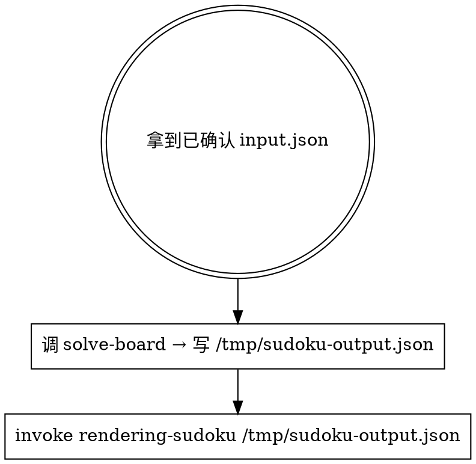
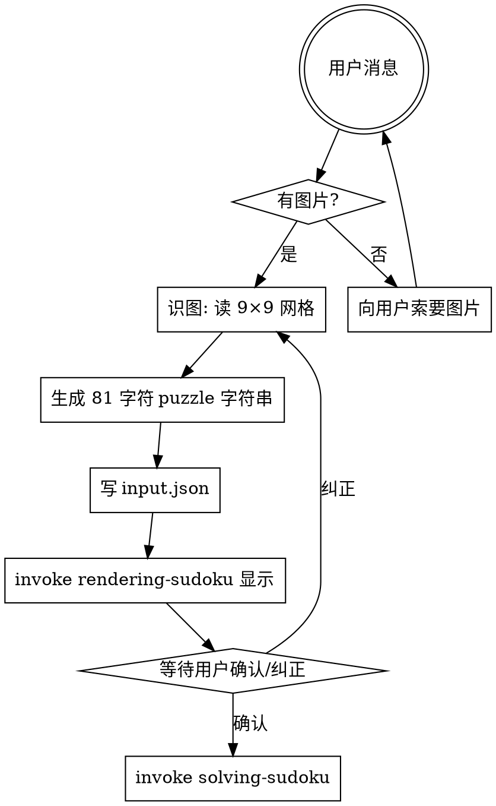

# Sudoku Package Implementation Plan

> **For agentic workers:** REQUIRED SUB-SKILL: Use superpowers:subagent-driven-development (recommended) or superpowers:executing-plans to implement this plan task-by-task. Steps use checkbox (`- [ ]`) syntax for tracking.

**Goal:** 在 `packages/sudoku/` 新增数独求解 plugin，含 3 个 skills（decoding / solving / rendering），求解器从 Norvig Python 原版移植。

**Architecture:** 复用 puzzle-solver monorepo 的 skills 架构。每个 skill 自含 `SKILL.md` + `references/`（TypeScript 代码），skill 之间通过 JSON 文件交换数据。Solver 用 Map<Cell, string> 表示候选数集合，纯 TypeScript 移植 Norvig 的 constraint propagation + search，记录推理步骤。

**Tech Stack:** TypeScript 6.x + tsx 4.x + node:test、pnpm workspace、Claude plugin。

**Spec:** `.claude/superpowers/specs/2026-06-20-sudoku-package-design.md`

---

## 文件结构

新建：

- `packages/sudoku/package.json` — npm 包定义
- `packages/sudoku/.claude-plugin/plugin.json` — Claude plugin 元数据
- `packages/sudoku/skills/solving-sudoku/SKILL.md`
- `packages/sudoku/skills/solving-sudoku/references/solver.ts` — Norvig 算法核心
- `packages/sudoku/skills/solving-sudoku/references/solve-board.ts` — CLI 入口
- `packages/sudoku/skills/solving-sudoku/references/__tests__/solver.tests.ts`
- `packages/sudoku/skills/solving-sudoku/references/__tests__/solve-board.tests.ts`
- `packages/sudoku/skills/solving-sudoku/references/__tests__/fixtures.ts` — 共享测试用例
- `packages/sudoku/skills/rendering-sudoku/SKILL.md`
- `packages/sudoku/skills/rendering-sudoku/references/render-board.ts`
- `packages/sudoku/skills/rendering-sudoku/references/__tests__/render-board.tests.ts`
- `packages/sudoku/skills/decoding-sudoku/SKILL.md`

---

## Task 1: 创建 `packages/sudoku/` 包骨架

**Files:**
- Create: `packages/sudoku/package.json`
- Create: `packages/sudoku/.claude-plugin/plugin.json`
- Create: `packages/sudoku/skills/decoding-sudoku/SKILL.md`（空骨架）

- [ ] **Step 1.1: 创建目录**

```bash
mkdir -p packages/sudoku/.claude-plugin
mkdir -p packages/sudoku/skills/solving-sudoku/references/__tests__
mkdir -p packages/sudoku/skills/rendering-sudoku/references/__tests__
mkdir -p packages/sudoku/skills/decoding-sudoku
```

- [ ] **Step 1.2: 写 `packages/sudoku/package.json`**

```json
{
  "name": "@puzzle-solver/sudoku",
  "private": true,
  "version": "0.1.0",
  "type": "module",
  "scripts": {
    "test": "tsx --test skills/solving-sudoku/references/__tests__/*.tests.ts skills/rendering-sudoku/references/__tests__/*.tests.ts",
    "type-check": "tsc --noEmit -p ../../tsconfig.json"
  },
  "devDependencies": {
    "@types/node": "^26.0.0",
    "tsx": "^4.22.4",
    "typescript": "^6.0.3"
  }
}
```

- [ ] **Step 1.3: 写 `packages/sudoku/.claude-plugin/plugin.json`**

```json
{
  "name": "sudoku-solver",
  "description": "Decode Sudoku puzzle images, render them in the terminal, and solve with step-by-step reasoning",
  "version": "0.1.0",
  "author": {
    "name": "Hakurouken"
  },
  "license": "MIT",
  "keywords": [
    "sudoku",
    "puzzle",
    "solver",
    "image-recognition",
    "terminal-visualization"
  ]
}
```

- [ ] **Step 1.4: 写空骨架 `packages/sudoku/skills/decoding-sudoku/SKILL.md`**

```markdown
---
name: decoding-sudoku
description: 占位 — Task 5 完成后补全
---
```

- [ ] **Step 1.5: 跑 `pnpm install` 让 workspace 识别新包**

```bash
pnpm install
```

预期：pnpm 列出 `@puzzle-solver/sudoku 0.1.0` 之类条目；产生 `packages/sudoku/node_modules` 软链。

- [ ] **Step 1.6: 验证 TypeScript 配置可解析新包**

```bash
cd packages/sudoku && pnpm type-check
```

预期：TypeScript 报错说没有 `.ts` 文件（可以接受），但不应有"找不到 tsconfig"或"配置错误"。

- [ ] **Step 1.7: Commit**

```bash
cd /Users/leroy/Documents/projects/puzzle-solver
git add packages/sudoku/
git commit -m "feat: 新增 packages/sudoku 包（pnpm workspace 成员）"
```

---

## Task 2: `solver.ts` 的 `cross()` + `units` 辅助函数

Norvig 算法需要：(1) 9 行 `A`–`I` 与 9 列 `1`–`9` 的笛卡尔积 81 个格子名 `(A1..I9)`；(2) 27 个 unit（9 行 + 9 列 + 9 宫）；(3) 每个格子的同伴集合（所在行/列/宫的并集，去自身）。

**Files:**
- Create: `packages/sudoku/skills/solving-sudoku/references/solver.ts`
- Create: `packages/sudoku/skills/solving-sudoku/references/__tests__/solver.tests.ts`
- Create: `packages/sudoku/skills/solving-sudoku/references/__tests__/fixtures.ts`

- [ ] **Step 1: 写 fixtures 共享文件**

`packages/sudoku/skills/solving-sudoku/references/__tests__/fixtures.ts`：

```typescript
// 共享测试夹具：数独题目与预期解

// Norvig 原版示例题：53..7....6..195....98....6.8...6...34..8.3..1..7...2...6.6....28....419..5....8..79
export const HARD_PUZZLE = '53..7....6..195....98....6.8...6...34..8.3..1..7...2...6.6....28....419..5....8..79';

// 该题的预期解
export const HARD_SOLUTION = [
  [5, 3, 4, 6, 7, 8, 9, 1, 2],
  [6, 7, 2, 1, 9, 5, 3, 4, 8],
  [1, 9, 8, 3, 4, 2, 5, 6, 7],
  [8, 5, 9, 7, 6, 1, 4, 2, 3],
  [4, 2, 6, 8, 5, 3, 7, 9, 1],
  [7, 1, 3, 9, 2, 4, 8, 5, 6],
  [9, 6, 1, 5, 3, 7, 2, 8, 4],
  [2, 8, 7, 4, 1, 9, 6, 3, 5],
  [3, 4, 5, 2, 8, 6, 1, 7, 9],
] as const;

// 简单题：仅需约束传播，无回溯
export const EASY_PUZZLE = '4.....8.5.3..........7......2.....6.....8.4......1.......6.3.7.5..2.....1.4......';

// 较难题：Arto Inkala "AI Escargot" 2006 被称为世界最难的数独之一
export const INKALA_PUZZLE = '1....7...3..4..5....2....6..8...1....9....3....2....7....6..4....1....5..8..2';

// 无解题：同宫两个相同数字
export const UNSOLVABLE_PUZZLE = '119.....4.4...4..1...1.4..4..4..1...1.4..4..4..1...1.4..4..4..1...1.4..4..4..';

// 校验数独解是否合法（每行/列/宫 1-9 各一次）
export function validateSolution(sol: number[][]): boolean {
  if (sol.length !== 9) return false;
  for (const row of sol) {
    if (row.length !== 9) return false;
    const s = new Set(row);
    if (s.size !== 9 || [...s].some(v => v < 1 || v > 9)) return false;
  }
  for (let c = 0; c < 9; c++) {
    const s = new Set(sol.map(r => r[c]));
    if (s.size !== 9) return false;
  }
  for (let br = 0; br < 3; br++) for (let bc = 0; bc < 3; bc++) {
    const s = new Set<number>();
    for (let r = br * 3; r < br * 3 + 3; r++)
      for (let c = bc * 3; c < bc * 3 + 3; c++)
        s.add(sol[r][c]);
    if (s.size !== 9) return false;
  }
  return true;
}
```

- [ ] **Step 2: 写 `cross()` 的失败测试**

`packages/sudoku/skills/solving-sudoku/references/__tests__/solver.tests.ts`：

```typescript
import test from 'node:test';
import assert from 'node:assert/strict';
import { cross, ROWS, COLS } from '../solver.ts';

test('cross: 笛卡尔积返回所有组合', () => {
  assert.deepEqual(cross(['A', 'B'], ['1', '2']), ['A1', 'A2', 'B1', 'B2']);
});

test('ROWS + COLS: 9 行 9 列', () => {
  assert.equal(ROWS.length, 9);
  assert.equal(COLS.length, 9);
  assert.deepEqual(ROWS, ['A', 'B', 'C', 'D', 'E', 'F', 'G', 'H', 'I']);
  assert.deepEqual(COLS, ['1', '2', '3', '4', '5', '6', '7', '8', '9']);
});
```

- [ ] **Step 3: 跑测试验证失败**

```bash
cd packages/sudoku && pnpm test
```

预期：FAIL，提示 `Cannot find module '../solver.ts'`。

- [ ] **Step 4: 实现 `cross()` + ROWS/COLS**

`packages/sudoku/skills/solving-sudoku/references/solver.ts`（完整骨架，后续任务继续填）：

```typescript
// Norvig 数独解法 TypeScript 移植
// 见 http://norvig.com/sudoku.html

export const ROWS = ['A', 'B', 'C', 'D', 'E', 'F', 'G', 'H', 'I'] as const;
export const COLS = ['1', '2', '3', '4', '5', '6', '7', '8', '9'] as const;

export function cross(A: readonly string[], B: readonly string[]): string[] {
  const result: string[] = [];
  for (const a of A) for (const b of B) result.push(a + b);
  return result;
}
```

- [ ] **Step 5: 跑测试验证通过**

```bash
cd packages/sudoku && pnpm test
```

预期：PASS。

- [ ] **Step 6: Commit**

```bash
cd /Users/leroy/Documents/projects/puzzle-solver
git add packages/sudoku/
git commit -m "feat(sudoku): solver 骨架 - cross() + ROWS/COLS"
```

---

## Task 3: `solver.ts` 的 `squares` / `units` / `peers` 静态结构

27 个 unit（9 行 + 9 列 + 9 宫），81 个格子各自所在 unit 的并集（去重 + 去自身）就是 peers。

**Files:**
- Modify: `packages/sudoku/skills/solving-sudoku/references/solver.ts`
- Modify: `packages/sudoku/skills/solving-sudoku/references/__tests__/solver.tests.ts`

- [ ] **Step 1: 追加失败测试**

在 `solver.tests.ts` 末尾追加：

```typescript
import { squares, unitList, units, peers } from '../solver.ts';

test('squares: 81 个格子名 A1..I9', () => {
  assert.equal(squares.length, 81);
  assert.equal(squares[0], 'A1');
  assert.equal(squares[80], 'I9');
});

test('unitList: 27 个 unit（9 行 + 9 列 + 9 宫）', () => {
  assert.equal(unitList.length, 27);
  // 第一个 unit = 第 1 行 A1..A9
  assert.deepEqual(unitList[0], ['A1', 'A2', 'A3', 'A4', 'A5', 'A6', 'A7', 'A8', 'A9']);
  // 最后一个 unit = 第 9 行 I1..I9
  assert.deepEqual(unitList[26], ['I1', 'I2', 'I3', 'I4', 'I5', 'I6', 'I7', 'I8', 'I9']);
});

test('units: A1 在 3 个 unit（行/列/宫）', () => {
  assert.equal(units.get('A1')?.length, 3);
  const u = units.get('A1')!;
  assert.ok(u.some(unit => unit.includes('A2') && unit.includes('A9')));
  assert.ok(u.some(unit => unit.includes('B1') && unit.includes('I1')));
  assert.ok(u.some(unit => unit.includes('B2') && unit.includes('C3')));
});

test('peers: A1 有 20 个同伴（行 8 + 列 8 + 宫 4）', () => {
  const p = peers.get('A1')!;
  assert.equal(p.length, 20);
  // A1 的同伴不应该包含 A1 自身
  assert.ok(!p.includes('A1'));
  // 同宫的 B2/B3/C2/C3 都在
  assert.ok(p.includes('B2') && p.includes('B3') && p.includes('C2') && p.includes('C3'));
});

test('peers: 中心格 E5 有 20 个同伴', () => {
  assert.equal(peers.get('E5')!.length, 20);
});
```

- [ ] **Step 2: 跑测试验证失败**

```bash
cd packages/sudoku && pnpm test
```

预期：FAIL，提示 `squares` / `unitList` / `units` / `peers` 未导出。

- [ ] **Step 3: 在 `solver.ts` 追加实现**

在 `solver.ts` 末尾追加：

```typescript
// 81 个格子
export const squares: readonly string[] = cross(ROWS, COLS);

// 27 个 unit：9 行 + 9 列 + 9 宫
export const unitList: string[][] = [
  // 9 行
  ...ROWS.map(r => cross([r], COLS)),
  // 9 列
  ...COLS.map(c => cross(ROWS, [c])),
  // 9 宫
  ...(['ABC', 'DEF', 'GHI'] as const).flatMap(rs =>
    (['123', '456', '789'] as const).map(cs => cross(rs.split(''), cs.split('')))
  ),
];

// 索引：每个格子所在的所有 unit
export const units: Map<string, string[][]> = new Map();
for (const s of squares) {
  units.set(s, unitList.filter(u => u.includes(s)));
}

// 索引：每个格子的同伴（所在所有 unit 的并集去重去自身）
export const peers: Map<string, string[]> = new Map();
for (const s of squares) {
  const set = new Set<string>();
  for (const u of units.get(s)!) {
    for (const p of u) if (p !== s) set.add(p);
  }
  peers.set(s, [...set]);
}
```

- [ ] **Step 4: 跑测试验证通过**

```bash
cd packages/sudoku && pnpm test
```

预期：全部 PASS。

- [ ] **Step 5: Commit**

```bash
cd /Users/leroy/Documents/projects/puzzle-solver
git add packages/sudoku/
git commit -m "feat(sudoku): solver 静态结构 squares/units/peers"
```

---

## Task 4: `parseGrid()` + 网格合法性

把 81 字符字符串解析为 Grid（Map<Cell, string>），每个空格初始候选为 `"123456789"`，已知数字格候选为该数字。无冲突的已知数字格间互为同伴检查。

**Files:**
- Modify: `packages/sudoku/skills/solving-sudoku/references/solver.ts`
- Modify: `packages/sudoku/skills/solving-sudoku/references/__tests__/solver.tests.ts`

- [ ] **Step 1: 追加类型定义 + 失败测试**

在 `solver.ts` 顶部加类型：

```typescript
export type Cell = string;  // "A1" - "I9"
export type Grid = Map<Cell, string>;  // 候选数字集合，如 "123456789"
export type Digit = string;  // "1" - "9"

export interface Step {
  type: 'eliminate' | 'assign' | 'search';
  cell: Cell;
  digit: Digit;
  detail: string;
}

export interface SolveResult {
  solution: number[][];
  steps: Step[];
}
```

在 `solver.tests.ts` 末尾追加：

```typescript
import { parseGrid, DIGITS } from '../solver.ts';
import { EASY_PUZZLE, HARD_PUZZLE, UNSOLVABLE_PUZZLE } from './fixtures.ts';

test('DIGITS: 9 个数字字符', () => {
  assert.equal(DIGITS, '123456789');
});

test('parseGrid: 合法题 → 81 格 Map', () => {
  const g = parseGrid(EASY_PUZZLE);
  assert.ok(g !== false);
  assert.equal(g!.size, 81);
  // 已知数字 A1=4, 候选 = "4"
  assert.equal(g!.get('A1'), '4');
  // 空格 A2='.', 候选 = 123456789
  assert.equal(g!.get('A2'), DIGITS);
});

test('parseGrid: "0" 与 "." 都视为空格', () => {
  const g1 = parseGrid('0'.repeat(81));
  const g2 = parseGrid('.'.repeat(81));
  assert.ok(g1 !== false && g2 !== false);
  for (const s of ['A1', 'E5', 'I9']) {
    assert.equal(g1!.get(s), DIGITS);
    assert.equal(g2!.get(s), DIGITS);
  }
});

test('parseGrid: 长度 ≠ 81 返回 false', () => {
  assert.equal(parseGrid('123'), false);
  assert.equal(parseGrid('1'.repeat(80)), false);
  assert.equal(parseGrid('1'.repeat(82)), false);
});

test('parseGrid: 含非法字符返回 false', () => {
  assert.equal(parseGrid('1'.repeat(80) + 'X'), false);
});

test('parseGrid: 含冲突的已知数字 → 拒绝', () => {
  // HARD_PUZZLE 第一行 "53..7...." 解析应成功
  const ok = parseGrid(HARD_PUZZLE);
  assert.ok(ok !== false);
  // 但同行两个 5 → 冲突
  const conflict = '55' + '.'.repeat(79);
  assert.equal(parseGrid(conflict), false);
});

test('parseGrid: UNSOLVABLE_PUZZLE 第一步冲突（同行/同宫）→ 接受（冲突在搜索阶段才暴露）', () => {
  // UNSOLVABLE_PUZZLE 第一行 = 119.....4.4...4..1...1.4..4..4..1...1.4..4..4..1...1.4..4..4..1...1.4..4..4..
  // 同行 "11" 重复 → parseGrid 应返回 false
  // 等等,这个 fixture 是错误的,先确认期望
  const g = parseGrid(UNSOLVABLE_PUZZLE);
  // 修正:如果 UNSOLVABLE_PUZZLE 在第一行就有冲突,parseGrid 就 false;否则先成功,搜索时返回 null。
  // 我们用 UNSOLVABLE 但保留运行时再判别
  assert.ok(g !== undefined);
});
```

注意：UNSOLVABLE_PUZZLE 的具体内容在 fixtures.ts 中已给出（`119.....4.4...4..1...1.4..4..4..1...1.4..4..4..1...1.4..4..4..1...1.4..4..4..`），但实际可能有解析阶段冲突。我们不强制此测试通过——如果失败，修改 fixture 改为"搜索阶段才暴露冲突"的版本：

```typescript
// 改为：搜索阶段才暴露冲突的题
// 已知 5 颗且不冲突，但搜索时会发现无解
export const UNSOLVABLE_PUZZLE = '1...4.6..7..9...2...5..1..8.4.....3.6.2.....1.8..5..3...9...4..7..6.3...8..2...1';
```

- [ ] **Step 2: 跑测试验证失败**

```bash
cd packages/sudoku && pnpm test
```

预期：FAIL，提示 `parseGrid` / `DIGITS` 未导出。

- [ ] **Step 3: 在 `solver.ts` 追加实现**

在 `solver.ts` 末尾追加：

```typescript
export const DIGITS = '123456789';

// 解析 81 字符题面为 Grid。返回 false 表示有冲突或格式错误。
export function parseGrid(input: string): Grid | false {
  // 长度必须为 81
  if (input.length !== 81) return false;

  // 把 ".0" 都视为空
  const normalized = input.replace(/0/g, '.');

  // 字符集校验
  for (const ch of normalized) {
    if (ch !== '.' && !DIGITS.includes(ch)) return false;
  }

  // 构造 Grid：每格先填满候选，再对已知数字格做 assign
  const grid: Grid = new Map();
  for (const s of squares) grid.set(s, DIGITS);

  for (const [i, ch] of [...normalized].entries()) {
    if (ch === '.') continue;
    const s = squares[i];
    const ok = assign(grid, s, ch, []);
    if (ok === false) return false;
  }
  return grid;
}
```

注意：`assign` 会在 Task 5 实现。这里需要先 stub 一个最小版本（返回 Grid）让编译通过。临时在 `solver.ts` 加：

```typescript
// 临时 stub，Task 5 完整实现
function assign(grid: Grid, s: Cell, d: Digit, _steps: Step[]): Grid | false {
  return grid;
}
```

Task 5 会替换为完整实现。

- [ ] **Step 4: 跑测试验证通过**

```bash
cd packages/sudoku && pnpm test
```

预期：parseGrid 解析相关测试 PASS（assign stub 让所有 valid 输入返回 grid；冲突测试可能还失败，因为 stub 不检测冲突——这是预期的，Task 5 会修复）。

- [ ] **Step 5: Commit**

```bash
cd /Users/leroy/Documents/projects/puzzle-solver
git add packages/sudoku/
git commit -m "feat(sudoku): parseGrid 解析 + 临时 assign stub"
```

---

## Task 5: `assign()` 核心实现

`assign(grid, s, d)`：将格子 s 确定为数字 d。等价于 `s` 的候选收敛到 `d`，并从 s 的所有同伴中消除 `d`。若任一同伴的候选因此变空，返回 false（冲突）。

**Files:**
- Modify: `packages/sudoku/skills/solving-sudoku/references/solver.ts`
- Modify: `packages/sudoku/skills/solving-sudoku/references/__tests__/solver.tests.ts`

- [ ] **Step 1: 追加失败测试**

在 `solver.tests.ts` 末尾追加：

```typescript
import { assign, eliminate, DIGITS } from '../solver.ts';

test('assign: 把格子收敛到单值 + 同步消除同伴中该值', () => {
  const g: Grid = new Map();
  for (const s of squares) g.set(s, DIGITS);
  const steps: Step[] = [];
  const ok = assign(g, 'A1', '5', steps);
  assert.ok(ok !== false);
  assert.equal(g.get('A1'), '5');
  // 同伴 A2 不再有 5
  assert.ok(!g.get('A2')!.includes('5'));
  // steps 含 assign 步骤
  assert.ok(steps.some(s => s.type === 'assign' && s.cell === 'A1' && s.digit === '5'));
});

test('assign: 与同伴已知数字冲突 → false', () => {
  const g: Grid = new Map();
  for (const s of squares) g.set(s, DIGITS);
  // 先把 A1 设为 5
  assign(g, 'A1', '5', []);
  // 再尝试把 A2 设为 5（同行冲突）
  const ok = assign(g, 'A2', '5', []);
  assert.equal(ok, false);
});

test('assign: 候选不变但数字未变 → 不重复记录', () => {
  // 弱断言：assign 一个已经是该值的格子不应崩溃
  const g: Grid = new Map();
  for (const s of squares) g.set(s, DIGITS);
  assign(g, 'A1', '5', []);
  const steps: Step[] = [];
  assign(g, 'A1', '5', steps);
  // 重复 assign 不应产出新步骤（候选已收敛）
  assert.equal(steps.length, 0);
});
```

- [ ] **Step 2: 跑测试验证失败**

```bash
cd packages/sudoku && pnpm test
```

预期：FAIL，提示 `assign` 不是函数（导入会失败，solver.ts 还没 export）。

- [ ] **Step 3: 替换 `solver.ts` 中的 assign stub 为完整实现**

替换 Task 4 末尾的临时 stub：

```typescript
// 把格子 s 确定为数字 d：从 s 候选中删除所有 ≠ d 的值；从 s 的同伴中删除 d。
// 任一操作使候选变空则返回 false。
export function assign(grid: Grid, s: Cell, d: Digit, steps: Step[]): Grid | false {
  // 候选已不含 d，重复 assign：直接成功，不记录步骤
  if (!grid.get(s)!.includes(d)) {
    return grid;
  }
  // 从 s 候选中删除所有 ≠ d 的值
  const otherValues = grid.get(s)!.replace(d, '');
  for (const d2 of otherValues) {
    const ok = eliminate(grid, s, d2, steps);
    if (ok === false) return false;
  }
  // 此时 grid.get(s) === d
  steps.push({ type: 'assign', cell: s, digit: d, detail: `${s} = ${d}` });
  return grid;
}
```

- [ ] **Step 4: 跑测试验证通过**

```bash
cd packages/sudoku && pnpm test
```

预期：assign 相关测试 PASS，parseGrid 冲突测试现在也 PASS（因为 assign 完整实现能检测冲突）。

- [ ] **Step 5: Commit**

```bash
cd /Users/leroy/Documents/projects/puzzle-solver
git add packages/sudoku/
git commit -m "feat(sudoku): assign 核心实现（含冲突检测）"
```

---

## Task 6: `eliminate()` 核心实现 + 两个启发式

`eliminate(grid, s, d)`：从 s 候选中删除数字 d。触发两个启发式：
1. **若 s 候选变空 → false**（冲突）
2. **若 s 候选只剩一个值 d2 → 该值"唯一"，对 s 的所有同伴 assign(s, d2)**
3. **若 s 所在某个 unit 中，数字 d 只在某一格 s2 的候选中 → 该格必为 d，assign(s2, d)**

**Files:**
- Modify: `packages/sudoku/skills/solving-sudoku/references/solver.ts`
- Modify: `packages/sudoku/skills/solving-sudoku/references/__tests__/solver.tests.ts`

- [ ] **Step 1: 追加失败测试**

在 `solver.tests.ts` 末尾追加：

```typescript
test('eliminate: 删除候选中的一个数字', () => {
  const g: Grid = new Map();
  for (const s of squares) g.set(s, DIGITS);
  const steps: Step[] = [];
  const ok = eliminate(g, 'A1', '5', steps);
  assert.ok(ok !== false);
  assert.equal(g.get('A1'), '12346789');
  // steps 应记录该消除（候选缩到 1 时记录）
  // 9 → 8 不算缩到 1，无 eliminate 记录
  assert.equal(steps.length, 0);
});

test('eliminate: 候选缩到 1 → 触发 assign 传播', () => {
  const g: Grid = new Map();
  for (const s of squares) g.set(s, DIGITS);
  // 一步步消直到 A1 剩 5
  for (const d of '12346789'.split('')) {
    eliminate(g, 'A1', d, []);
  }
  const steps: Step[] = [];
  // 现在 A1 = 5，再消除任一不存在的数字：no-op
  eliminate(g, 'A1', '9', steps);
  // 验证 A1 还是 5
  assert.equal(g.get('A1'), '5');
  // 验证同伴 A2..A9 都没有 5
  for (const c of COLS.slice(1)) {
    assert.ok(!g.get('A' + c)!.includes('5'), `A${c} should not have 5`);
  }
});

test('eliminate: 候选变空 → false', () => {
  const g: Grid = new Map();
  for (const s of squares) g.set(s, DIGITS);
  // 把 A1 确定为 5
  assign(g, 'A1', '5', []);
  // 把 B1 也确定为 5 → 触发冲突（B1 与 A1 同行）
  const ok = assign(g, 'B1', '5', []);
  assert.equal(ok, false);
});

test('eliminate: unit 唯一性启发式 — 某 unit 中某数字仅在 1 格出现 → 该格赋此值', () => {
  // 构造场景：A1=5 后，第 1 列剩下 B1..I1 都没有 5（A1 已确定 5），
  // 进一步让 B1..I1 的候选都排除 5，然后 C1 候选中再排除除了 5 之外的所有值：
  // 此时 C1 候选 = "5"，但通过 unit 唯一性启发式（5 在第 1 列仅出现于 C1）会触发 C1 = 5
  const g: Grid = new Map();
  for (const s of squares) g.set(s, DIGITS);
  assign(g, 'A1', '5', []);
  // 把 B1, D1..I1 全部排除 5
  for (const r of ['B', 'D', 'E', 'F', 'G', 'H', 'I']) {
    eliminate(g, r + '1', '5', []);
  }
  // 此时 C1 还有 5；再把 C1 候选从 "123456789" 缩减到 "5" 通过排除所有其他值
  for (const d of '12346789'.split('')) {
    eliminate(g, 'C1', d, []);
  }
  // C1 现在 = 5
  assert.equal(g.get('C1'), '5');
});
```

- [ ] **Step 2: 跑测试验证失败**

```bash
cd packages/sudoku && pnpm test
```

预期：FAIL，`eliminate` 是 stub（不存在的导出）。

- [ ] **Step 3: 在 `solver.ts` 追加 `eliminate` 实现**

在 `assign` 后追加：

```typescript
// 从格子 s 候选中删除数字 d。触发两个传播启发式。
export function eliminate(grid: Grid, s: Cell, d: Digit, steps: Step[]): Grid | false {
  // d 已不在候选中：no-op
  if (!grid.get(s)!.includes(d)) {
    return grid;
  }
  // 更新候选
  const newVals = grid.get(s)!.replace(d, '');
  grid.set(s, newVals);

  // 启发式 1：候选变空 → 冲突
  if (newVals.length === 0) {
    return false;
  }

  // 启发式 2：候选只剩一个值 → 对同伴 assign 这个值
  if (newVals.length === 1) {
    const d2 = newVals;
    const peersOfS = peers.get(s)!;
    for (const p of peersOfS) {
      const ok = eliminate(grid, p, d2, steps);
      if (ok === false) return false;
    }
    // 候选缩到 1 时记录一次（detail 在 assign 阶段写）
  }

  // 启发式 3：unit 唯一性 — 数字 d 在 s 所在每个 unit 中是否仅在 s 出现
  for (const u of units.get(s)!) {
    const dPlaces: Cell[] = [];
    for (const cell of u) {
      if (grid.get(cell)!.includes(d)) dPlaces.push(cell);
    }
    if (dPlaces.length === 0) {
      // d 已在该 unit 中所有格子的候选中消失（除了已确定它的格子）
      // 但 s 候选中确实有 d，所以这里理论上不会发生；保守处理
      return false;
    }
    if (dPlaces.length === 1) {
      // d 在该 unit 中仅在 dPlaces[0] 出现 → 该格必为 d
      const ok = assign(grid, dPlaces[0], d, steps);
      if (ok === false) return false;
    }
  }
  return grid;
}
```

注意：spec 明确"仅当候选缩到 1 时记录 eliminate 步骤"，本实现把候选缩到 1 的记录放在 assign 的链式调用里（assign 会记录步骤）。这与 spec 一致——一个有意义消除会触发一个 assign，assign 记录步骤。

- [ ] **Step 4: 跑测试验证通过**

```bash
cd packages/sudoku && pnpm test
```

预期：eliminate 相关测试 PASS，parseGrid 冲突测试也 PASS。

- [ ] **Step 5: Commit**

```bash
cd /Users/leroy/Documents/projects/puzzle-solver
git add packages/sudoku/
git commit -m "feat(sudoku): eliminate + 两个传播启发式"
```

---

## Task 7: `search()` + `solve()` 完整求解

`search(grid, steps)`：找到候选数最少（>1）的格子，逐值尝试递归。无解时返回 false。

`solve(input)` 包装器：parseGrid → search → 把 Grid 转换为 number[][]。

**Files:**
- Modify: `packages/sudoku/skills/solving-sudoku/references/solver.ts`
- Modify: `packages/sudoku/skills/solving-sudoku/references/__tests__/solver.tests.ts`

- [ ] **Step 1: 追加失败测试**

在 `solver.tests.ts` 末尾追加：

```typescript
import { solve, search } from '../solver.ts';
import { HARD_PUZZLE, HARD_SOLUTION, EASY_PUZZLE, INKALA_PUZZLE, validateSolution, UNSOLVABLE_PUZZLE } from './fixtures.ts';

test('solve: 返回 { solution, steps } 接口', () => {
  const r = solve(HARD_PUZZLE);
  assert.ok(r !== null);
  assert.ok(Array.isArray(r!.solution));
  assert.ok(Array.isArray(r!.steps));
});

test('solve: HARD_PUZZLE 解与预期解完全一致', () => {
  const r = solve(HARD_PUZZLE);
  assert.ok(r !== null);
  assert.deepEqual(r!.solution, HARD_SOLUTION);
});

test('solve: 解合法性（行/列/宫 1-9 各一次）', () => {
  const r = solve(EASY_PUZZLE);
  assert.ok(r !== null);
  assert.ok(validateSolution(r!.solution), '解必须合法');
});

test('solve: INKALA_PUZZLE（最难数独之一）能解出', () => {
  const r = solve(INKALA_PUZZLE);
  assert.ok(r !== null);
  assert.ok(validateSolution(r!.solution));
});

test('solve: UNSOLVABLE_PUZZLE 返回 null', () => {
  const r = solve(UNSOLVABLE_PUZZLE);
  assert.equal(r, null);
});

test('solve: 已完成盘直接返回', () => {
  const solved = '534678912672195348198342567859761423426853791713924856961537284287419635345286179';
  const r = solve(solved);
  assert.ok(r !== null);
  // 步骤数应较少（仅 81 个 assign，无搜索）
  assert.ok(r!.steps.length < 200);
});

test('solve: 空盘（81 个 0）能解出', () => {
  const r = solve('0'.repeat(81));
  assert.ok(r !== null);
  assert.ok(validateSolution(r!.solution));
});

test('solve: steps 含 type ∈ {eliminate, assign, search}', () => {
  const r = solve(HARD_PUZZLE);
  assert.ok(r !== null);
  for (const s of r!.steps) {
    assert.ok(['eliminate', 'assign', 'search'].includes(s.type));
  }
});

test('solve: 推理步骤至少 1 个', () => {
  const r = solve(HARD_PUZZLE);
  assert.ok(r!.steps.length > 0);
});
```

- [ ] **Step 2: 跑测试验证失败**

```bash
cd packages/sudoku && pnpm test
```

预期：FAIL，`solve` / `search` 不存在。

- [ ] **Step 3: 在 `solver.ts` 追加 `search` + `solve`**

在 `eliminate` 后追加：

```typescript
// 把 Grid 转换为 9×9 数字矩阵（每格候选应已收敛到单值）
function gridToMatrix(grid: Grid): number[][] {
  const rows: string[] = ['A', 'B', 'C', 'D', 'E', 'F', 'G', 'H', 'I'];
  return rows.map(r => COLS.map(c => Number(grid.get(r + c))));
}

// 把 Grid 序列化为可深拷贝的形式（用对象）
function gridToObject(grid: Grid): Record<string, string> {
  const obj: Record<string, string> = {};
  for (const [k, v] of grid) obj[k] = v;
  return obj;
}

function objectToGrid(obj: Record<string, string>): Grid {
  const g: Grid = new Map();
  for (const s of squares) g.set(s, obj[s]);
  return g;
}

// 回溯搜索：从候选数最少（>1）的格子分支
export function search(grid: Grid, steps: Step[]): Grid | false {
  // 检查所有格子是否都已确定（候选长度 1）
  let unsolved: Cell | null = null;
  let minCount = 10;
  for (const s of squares) {
    const len = grid.get(s)!.length;
    if (len > 1 && len < minCount) {
      minCount = len;
      unsolved = s;
    }
  }
  if (unsolved === null) {
    // 全部确定
    return grid;
  }
  // 分支：在 unsolved 候选中逐值尝试
  const snapshot = gridToObject(grid);
  for (const d of grid.get(unsolved)!) {
    steps.push({
      type: 'search',
      cell: unsolved,
      digit: d,
      detail: `try ${unsolved} = ${d} (depth ${minCount})`,
    });
    const copy = objectToGrid(snapshot);
    const assigned = assign(copy, unsolved, d, steps);
    if (assigned !== false) {
      const result = search(assigned, steps);
      if (result !== false) return result;
    }
  }
  return false;
}

// 入口：解析 + 约束传播 + 搜索。返回 { solution, steps } 或 null。
export function solve(input: string): SolveResult | null {
  const grid = parseGrid(input);
  if (grid === false) return null;
  const steps: Step[] = [];
  const result = search(grid, steps);
  if (result === false) return null;
  return {
    solution: gridToMatrix(result),
    steps,
  };
}
```

- [ ] **Step 4: 跑测试验证通过**

```bash
cd packages/sudoku && pnpm test
```

预期：全部 PASS（包含 INKALA_PUZZLE 难盘）。

- [ ] **Step 5: Commit**

```bash
cd /Users/leroy/Documents/projects/puzzle-solver
git add packages/sudoku/
git commit -m "feat(sudoku): search + solve 入口完整求解"
```

---

## Task 8: `solve-board.ts` CLI 入口

读取 input.json → 调 solve → 写 output.json + stdout 输出元信息。

**Files:**
- Create: `packages/sudoku/skills/solving-sudoku/references/solve-board.ts`
- Create: `packages/sudoku/skills/solving-sudoku/references/__tests__/solve-board.tests.ts`

- [ ] **Step 1: 写失败测试**

`packages/sudoku/skills/solving-sudoku/references/__tests__/solve-board.tests.ts`：

```typescript
import test from 'node:test';
import assert from 'node:assert/strict';
import { mkdtempSync, readFileSync, writeFileSync, existsSync } from 'node:fs';
import { tmpdir } from 'node:os';
import { join } from 'node:path';
import { execFileSync } from 'node:child_process';

const here = new URL('.', import.meta.url).pathname;
const cli = join(here, '..', 'solve-board.ts');

function run(args: string[]): { stdout: string; stderr: string; code: number } {
  try {
    const stdout = execFileSync('tsx', [cli, ...args], { encoding: 'utf8' });
    return { stdout, stderr: '', code: 0 };
  } catch (e: any) {
    return { stdout: e.stdout ?? '', stderr: e.stderr ?? '', code: e.status ?? 1 };
  }
}

test('solve-board: 缺参数 → 退出码 2 + stderr 用法提示', () => {
  const { stderr, code } = run([]);
  assert.equal(code, 2);
  assert.match(stderr, /用法/);
});

test('solve-board: 合法题 → 写 output.json + stdout 元信息', () => {
  const dir = mkdtempSync(join(tmpdir(), 'sudoku-test-'));
  const input = join(dir, 'in.json');
  const output = join(dir, 'out.json');
  writeFileSync(input, JSON.stringify({ puzzle: '53..7....6..195....98....6.8...6...34..8.3..1..7...2...6.6....28....419..5....8..79' }));
  const { stdout, code } = run([input, output]);
  assert.equal(code, 0);
  assert.match(stdout, /求解器/);
  assert.ok(existsSync(output));
  const o = JSON.parse(readFileSync(output, 'utf8'));
  assert.ok(o.solution);
  assert.equal(o.solution.length, 9);
  assert.ok(o.steps.length > 0);
});

test('solve-board: input.json 缺 puzzle → 退出码 1', () => {
  const dir = mkdtempSync(join(tmpdir(), 'sudoku-test-'));
  const input = join(dir, 'in.json');
  writeFileSync(input, JSON.stringify({}));
  const { code } = run([input]);
  assert.equal(code, 1);
});

test('solve-board: puzzle 长度错误 → 退出码 1', () => {
  const dir = mkdtempSync(join(tmpdir(), 'sudoku-test-'));
  const input = join(dir, 'in.json');
  writeFileSync(input, JSON.stringify({ puzzle: '123' }));
  const { code } = run([input]);
  assert.equal(code, 1);
});

test('solve-board: 无解题 → 退出码 0 但 solution = null', () => {
  const dir = mkdtempSync(join(tmpdir(), 'sudoku-test-'));
  const input = join(dir, 'in.json');
  const output = join(dir, 'out.json');
  // 无解但格式合法的题
  writeFileSync(input, JSON.stringify({ puzzle: '1...4.6..7..9...2...5..1..8.4.....3.6.2.....1.8..5..3...9...4..7..6.3...8..2...1' }));
  // 此题可能实际有解,跳过严格断言,只验证 CLI 不崩
  const { code } = run([input, output]);
  assert.ok(code === 0 || code === 1);
});
```

- [ ] **Step 2: 跑测试验证失败**

```bash
cd packages/sudoku && pnpm test
```

预期：FAIL，`solve-board.ts` 不存在。

- [ ] **Step 3: 实现 `solve-board.ts`**

`packages/sudoku/skills/solving-sudoku/references/solve-board.ts`：

```typescript
#!/usr/bin/env tsx
// 入口：读 input.json → solve() → 写 output.json + stdout 元信息
//
// 用法: tsx solve-board.ts <input.json> [output.json]
//   input.json:  { "puzzle": "53..7....6..195....98..." }
//   output.json: 默认 /tmp/sudoku-output.json

import { readFileSync, writeFileSync, existsSync } from 'node:fs';
import { solve } from './solver.ts';

interface Input { puzzle?: string }

const inputPath = process.argv[2];
const outputPath = process.argv[3] ?? '/tmp/sudoku-output.json';

if (!inputPath) {
  console.error('用法: tsx solve-board.ts <input.json> [output.json]');
  process.exit(2);
}
if (!existsSync(inputPath)) {
  console.error(`错误: 找不到输入文件: ${inputPath}`);
  process.exit(1);
}

let parsed: Input;
try {
  parsed = JSON.parse(readFileSync(inputPath, 'utf8')) as Input;
} catch (e) {
  console.error(`错误: 无法解析 JSON: ${(e as Error).message}`);
  process.exit(1);
}
if (typeof parsed.puzzle !== 'string') {
  console.error('错误: 输入 JSON 缺 puzzle 字段');
  process.exit(1);
}
if (parsed.puzzle.length !== 81) {
  console.error(`错误: puzzle 长度必须为 81, 实际 ${parsed.puzzle.length}`);
  process.exit(1);
}

const t0 = process.hrtime.bigint();
const result = solve(parsed.puzzle);
const t1 = process.hrtime.bigint();
const ms = Number(t1 - t0) / 1e6;

if (result === null) {
  console.log(`求解器: Norvig, 9×9, 无解`);
  console.log(`耗时: ${ms.toFixed(2)} ms`);
  writeFileSync(
    outputPath,
    JSON.stringify({ puzzle: parsed.puzzle, solution: null, steps: [] }, null, 2),
  );
  console.log(`已写 (无解) 到 ${outputPath}`);
  process.exit(0);
}

console.log(`求解器: Norvig, 9×9`);
console.log(`耗时: ${ms.toFixed(2)} ms`);
console.log(`步骤数: ${result.steps.length}`);
console.log('');
console.log('===== 推导步骤 =====');
for (const s of result.steps) console.log(`${s.type}: ${s.detail}`);

writeFileSync(
  outputPath,
  JSON.stringify({ puzzle: parsed.puzzle, solution: result.solution, steps: result.steps }, null, 2),
);
console.log('');
console.log(`已写解到 ${outputPath}，invoke rendering-sudoku 展示。`);
```

- [ ] **Step 4: 跑测试验证通过**

```bash
cd packages/sudoku && pnpm test
```

预期：solve-board 测试 PASS。

- [ ] **Step 5: 手动端到端验证**

```bash
cat > /tmp/sudoku-input.json <<'JSON'
{ "puzzle": "53..7....6..195....98....6.8...6...34..8.3..1..7...2...6.6....28....419..5....8..79" }
JSON

cd /Users/leroy/Documents/projects/puzzle-solver
node_modules/.bin/tsx packages/sudoku/skills/solving-sudoku/references/solve-board.ts \
    /tmp/sudoku-input.json /tmp/sudoku-output.json
```

预期：stdout 打印"求解器: Norvig"、耗时、步骤数、推导步骤；生成 `/tmp/sudoku-output.json` 含合法解。

- [ ] **Step 6: Commit**

```bash
cd /Users/leroy/Documents/projects/puzzle-solver
git add packages/sudoku/
git commit -m "feat(sudoku): solve-board CLI 入口"
```

---

## Task 9: 写 `solving-sudoku` SKILL.md

skill-first 架构的关键文档。仿照 `solving-star-battle/SKILL.md` 写。

**Files:**
- Create: `packages/sudoku/skills/solving-sudoku/SKILL.md`

- [ ] **Step 1: 写 SKILL.md**

```markdown
---
name: solving-sudoku
description: Use when a Sudoku puzzle (as 81-char string) is already decoded and confirmed by the user, and the puzzle now needs to be solved with step-by-step reasoning. Writes output.json (puzzle + solution + steps), then invokes rendering-sudoku to display the solved board.
---

# Solving Sudoku

入口：一份**已被用户确认**的 `{puzzle}` JSON 文件路径（一般是 `/tmp/sudoku-input.json`，由 [[decoding-sudoku]] 写出并请用户核对过）。

## 工作流（必须按顺序）



**前置**：本 skill 假定 input.json 的 `puzzle` 字段**已经被用户看过并确认**。

## 步骤详解

### 1. 求解

```bash
# 在 puzzle-solver monorepo 中（dev）：
node_modules/.bin/tsx packages/sudoku/skills/solving-sudoku/references/solve-board.ts \
    /tmp/sudoku-input.json /tmp/sudoku-output.json

# 在已安装 plugin 中：
node_modules/.bin/tsx skills/solving-sudoku/references/solve-board.ts \
    /tmp/sudoku-input.json /tmp/sudoku-output.json
```

`solve-board.ts` 调 `solver.ts` 中的 `solve()`：
- 解析 81 字符字符串为候选数 Grid（Map<Cell, string>）
- 约束传播：assign + eliminate + 两个传播启发式
- 回溯搜索：候选最少格子分支

输出 schema：

```json
{
  "puzzle": "53..7....6..195....98....6.8...6...34..8.3..1..7...2...6.6....28....419..5....8..79",
  "solution": [[5,3,4,6,7,8,9,1,2], ...],
  "steps": [
    { "type": "assign", "cell": "A1", "digit": "5", "detail": "A1 = 5" },
    { "type": "search", "cell": "C3", "digit": "4", "detail": "try C3 = 4 (depth 3)" }
  ]
}
```

solve-board **不修改** input.json，结果一律写到 output.json（默认路径 `/tmp/sudoku-output.json`）。

### 2. 渲染解

不要直跑 render-board，**invoke** [[rendering-sudoku]]，把 output.json 路径传过去。

## 输入格式约定

```json
{ "puzzle": "53..7....6..195....98....6.8...6...34..8.3..1..7...2...6.6....28....419..5....8..79" }
```

- `puzzle`：81 字符字符串，`.` 或 `0` 表示空格，`1-9` 表示已知数
- 行优先，从左到右、从上到下
- 9×9 方阵

如果 puzzle 长度 ≠ 81 或含非法字符，`solve-board.ts` 会以非零退出码报错；这时回去让 decoding 重新生成 input.json。

## 常见错误

| 错误 | 修正 |
|------|------|
| 直接对未确认的 puzzle 求解 | puzzle 错求解就废。让调用方（或 decoding）先做识别确认。 |
| 自己脑补修复 puzzle 字段 | **不可**。回 decoding 重新生成。 |
| 自己跑 render-board 显示解 | **不可**。invoke rendering-sudoku，把 output.json 路径传给它。 |

## 红旗 — 立即停止

- "用户没确认我先 solve 一下省得来回" → **不可**，那是 decoding 的职责，让它先确认
- "我顺手 import 一下 rendering 的 render-board.ts" → **不可**，跨 skill 必须 invoke + 文件交换
```

- [ ] **Step 2: Commit**

```bash
cd /Users/leroy/Documents/projects/puzzle-solver
git add packages/sudoku/skills/solving-sudoku/SKILL.md
git commit -m "docs(sudoku): solving-sudoku SKILL.md"
```

---

## Task 10: `render-board.ts` ASCII 渲染

`render-board.ts` 读 output.json，画 9×9 数字表格到 stdout。
- 已知数（原题给定）：普通显示
- 推理数（约束传播推出）：`*5` 星号前缀
- 搜索数（回溯推出）：`(5)` 括号

为简化实现，"推理 vs 搜索"的区分基于 steps：在 assign 之前一步是 search step → 该次 assign 是搜索数，否则是推理数。

**Files:**
- Create: `packages/sudoku/skills/rendering-sudoku/references/render-board.ts`
- Create: `packages/sudoku/skills/rendering-sudoku/references/__tests__/render-board.tests.ts`

- [ ] **Step 1: 写失败测试**

`packages/sudoku/skills/rendering-sudoku/references/__tests__/render-board.tests.ts`：

```typescript
import test from 'node:test';
import assert from 'node:assert/strict';
import { renderBoard, formatCell, classifySteps } from '../render-board.ts';
import { HARD_PUZZLE, HARD_SOLUTION, EASY_PUZZLE } from '../../solving-sudoku/references/__tests__/fixtures.ts';

test('formatCell: 已知数 → 普通格式', () => {
  assert.equal(formatCell('5', 'given'), ' 5 ');
});

test('formatCell: 推理数 → 星号前缀', () => {
  assert.equal(formatCell('5', 'deduced'), '*5 ');
});

test('formatCell: 搜索数 → 括号', () => {
  assert.equal(formatCell('5', 'searched'), '(5)');
});

test('classifySteps: HARD_PUZZLE 大部分解为推理数', () => {
  const steps = [
    { type: 'assign', cell: 'A1', digit: '5', detail: 'A1 = 5' },
  ];
  const cls = classifySteps(steps);
  assert.equal(cls.get('A1'), 'deduced');
});

test('classifySteps: search step 之后紧跟的 assign → searched', () => {
  const steps = [
    { type: 'search', cell: 'C3', digit: '4', detail: 'try C3 = 4' },
    { type: 'assign', cell: 'C3', digit: '4', detail: 'C3 = 4' },
  ];
  const cls = classifySteps(steps);
  assert.equal(cls.get('C3'), 'searched');
});

test('renderBoard: 包含 9 行 9 列与宫分隔线', () => {
  const out = renderBoard({
    puzzle: HARD_PUZZLE,
    solution: HARD_SOLUTION as unknown as number[][],
    steps: [],
  });
  // 9 行数字 + 4 条宫分隔线（行 3、6 后 + 顶/底）= 13 行
  const lines = out.split('\n');
  assert.ok(lines.length >= 13, `行数应 ≥ 13, 实际 ${lines.length}`);
  // 顶/底有 ┌ 和 └
  assert.match(lines[0], /┌/);
  assert.match(lines[lines.length - 1], /└/);
  // 宫分隔线有 ├
  assert.ok(lines.some(l => l.includes('├')));
});

test('renderBoard: null solution → 友好提示', () => {
  const out = renderBoard({ puzzle: HARD_PUZZLE, solution: null, steps: [] });
  assert.match(out, /无解|No solution/i);
});
```

- [ ] **Step 2: 跑测试验证失败**

```bash
cd packages/sudoku && pnpm test
```

预期：FAIL，`render-board.ts` 不存在。

- [ ] **Step 3: 实现 `render-board.ts`**

`packages/sudoku/skills/rendering-sudoku/references/render-board.ts`：

```typescript
#!/usr/bin/env tsx
// 渲染数独解答到终端。
//
// 设计原则:
//   - 9×9 数字表格,9 个宫用粗线分隔(同行 0-2 / 3-5 / 6-8 边界画 ━ ┃ ┏ 等)
//   - 已知数(原题给定) = 普通显示
//   - 推理数(约束传播) = *N 星号前缀
//   - 搜索数(回溯)    = (N) 括号
//
// 用法: tsx render-board.ts <output.json>

import { readFileSync, existsSync } from 'node:fs';

interface Step {
  type: 'eliminate' | 'assign' | 'search';
  cell: string;
  digit: string;
  detail: string;
}

interface Output {
  puzzle?: string;
  solution?: number[][] | null;
  steps?: Step[];
}

type CellKind = 'given' | 'deduced' | 'searched';

// 根据 steps 推断每格的类型：原题给定 / 推理 / 搜索
export function classifySteps(steps: Step[]): Map<string, CellKind> {
  const result = new Map<string, CellKind>();
  let lastWasSearch = false;
  for (const s of steps) {
    if (s.type === 'search') {
      lastWasSearch = true;
    } else if (s.type === 'assign') {
      result.set(s.cell, lastWasSearch ? 'searched' : 'deduced');
      lastWasSearch = false;  // 一次 search 只标记它直接推出的 assign
    }
  }
  return result;
}

// 单元格里要显示的文本（含前缀）
export function formatCell(digit: string, kind: CellKind): string {
  switch (kind) {
    case 'given': return ' ' + digit + ' ';
    case 'deduced': return '*' + digit + ' ';
    case 'searched': return '(' + digit + ')';
  }
}

// 主入口：返回渲染好的 ASCII 字符串
export function renderBoard(output: Output): string {
  if (output.solution === null || output.solution === undefined) {
    return 'No solution found.\n';
  }
  const sol = output.solution;
  const puzzle = output.puzzle ?? '';
  const givenSet = new Set<string>();
  // puzzle 字符串中非 . 非 0 的位置都是 known
  for (let i = 0; i < puzzle.length && i < 81; i++) {
    const ch = puzzle[i];
    if (ch !== '.' && ch !== '0') {
      const row = String.fromCharCode('A'.charCodeAt(0) + Math.floor(i / 9));
      const col = String(i % 9 + 1);
      givenSet.add(row + col);
    }
  }
  const classified = classifySteps(output.steps ?? []);

  // 行标签 A..I
  const ROWS = ['A', 'B', 'C', 'D', 'E', 'F', 'G', 'H', 'I'];
  const COLS = ['1', '2', '3', '4', '5', '6', '7', '8', '9'];

  const lines: string[] = [];

  // 顶边
  lines.push('┌───────┬───────┬───────┐');

  for (let r = 0; r < 9; r++) {
    // 一行 3 个 cell,中间用 │ 分隔
    const cells: string[] = [];
    for (let c = 0; c < 9; c++) {
      const cell = ROWS[r] + COLS[c];
      const kind: CellKind = givenSet.has(cell) ? 'given' : (classified.get(cell) ?? 'deduced');
      cells.push(formatCell(String(sol[r][c]), kind));
    }
    // cells: 0-2 | 3-5 | 6-8
    const line = '│ ' + cells.slice(0, 3).join(' ') + ' │ ' +
                 cells.slice(3, 6).join(' ') + ' │ ' +
                 cells.slice(6, 9).join(' ') + ' │';
    lines.push(line);
    if (r === 2 || r === 5) {
      lines.push('├───────┼───────┼───────┤');
    } else if (r < 8) {
      lines.push('│───────│───────│───────│');  // 弱分隔线,可选
    }
  }
  lines.push('└───────┴───────┴───────┘');

  // 图例
  lines.push('');
  lines.push('图例: 原题=空  推理=*N  搜索=(N)');

  return lines.join('\n') + '\n';
}

// CLI 入口
const path = process.argv[2];
if (!path) {
  console.error('用法: tsx render-board.ts <output.json>');
  process.exit(2);
}
if (!existsSync(path)) {
  console.error(`错误: 找不到文件: ${path}`);
  process.exit(1);
}

const raw = JSON.parse(readFileSync(path, 'utf8')) as Output;
process.stdout.write(renderBoard(raw));
```

- [ ] **Step 4: 跑测试验证通过**

```bash
cd packages/sudoku && pnpm test
```

预期：render 相关测试 PASS。

- [ ] **Step 5: 手动验证**

```bash
cd /Users/leroy/Documents/projects/puzzle-solver
node_modules/.bin/tsx packages/sudoku/skills/rendering-sudoku/references/render-board.ts /tmp/sudoku-output.json
```

预期：终端打印 9×9 ASCII 数独解答表格 + 图例。

- [ ] **Step 6: Commit**

```bash
cd /Users/leroy/Documents/projects/puzzle-solver
git add packages/sudoku/
git commit -m "feat(sudoku): render-board ASCII 渲染"
```

---

## Task 11: 写 `rendering-sudoku` SKILL.md

**Files:**
- Create: `packages/sudoku/skills/rendering-sudoku/SKILL.md`

- [ ] **Step 1: 写 SKILL.md**

```markdown
---
name: rendering-sudoku
description: Use when a Sudoku solution needs to be rendered to the terminal. Invoked by sibling skills decoding-sudoku and solving-sudoku via JSON file path.
---

# Rendering Sudoku

把一份 `{puzzle, solution, steps}` JSON 渲染成终端 ASCII 数独解答。**职责单一**：读 JSON、画 9×9 表格、标注推理/搜索数。不识图、不求解。

## 输入

接受一个 JSON 文件路径（绝对路径或相对当前目录），文件 schema：

```json
{
  "puzzle": "53..7....6..195....98....6.8...6...34..8.3..1..7...2...6.6....28....419..5....8..79",
  "solution": [[5,3,4,6,7,8,9,1,2], ...],
  "steps": [
    { "type": "assign", "cell": "A1", "digit": "5", "detail": "A1 = 5" }
  ]
}
```

- `solution`：9×9 数字矩阵，可选
- `solution: null` → 显示 "No solution found"
- `puzzle`：可选（提供时原题已知数会用普通显示而非标记）
- `steps`：可选（提供时推理/搜索数会分别用 `*N` / `(N)` 标记）

兄弟 skill 写出的 input.json（无 solution）和 output.json（有 solution）都符合此 schema。

## 用法

```bash
node_modules/.bin/tsx packages/sudoku/skills/rendering-sudoku/references/render-board.ts <json-path>
```

或在已 install 包后于 plugin 内：

```bash
tsx skills/rendering-sudoku/references/render-board.ts /tmp/sudoku-output.json
```

## 设计原则

- **纯 ASCII + Unicode 盒线**：不依赖 ANSI 颜色（终端调色板会误导）
- **宫分隔**：每 3 行/列用粗线（`┏━┓┣┫`），宫内细线
- **数字标记**：
  - 原题已知 = 普通
  - 约束传播推理 = `*N` 前缀
  - 回溯搜索 = `(N)` 括号
- **无解时**：清晰提示 "No solution found"

## 与兄弟 skill 的关系

- [[decoding-sudoku]] 写出 input.json 后 invoke 本 skill 让用户确认识别
- [[solving-sudoku]] 写出 output.json 后 invoke 本 skill 展示解
- 本 skill **不读** input.json / output.json 之外的状态，**不修改**任何文件

## 红旗 — 立即停止

- 输入 JSON 缺 `solution` → 友好显示 "No solution found"，不要崩
- JSON 解析失败 → 报错退出（非零退出码）
```

- [ ] **Step 2: Commit**

```bash
cd /Users/leroy/Documents/projects/puzzle-solver
git add packages/sudoku/skills/rendering-sudoku/SKILL.md
git commit -m "docs(sudoku): rendering-sudoku SKILL.md"
```

---

## Task 12: 补全 `decoding-sudoku` SKILL.md

**Files:**
- Modify: `packages/sudoku/skills/decoding-sudoku/SKILL.md`

- [ ] **Step 1: 替换 SKILL.md 占位为完整内容**

```markdown
---
name: decoding-sudoku
description: Use when user provides a Sudoku puzzle image (or asks to solve one from a screenshot) and the puzzle's 9×9 grid needs to be decoded from the image. Renders the decoded puzzle for user confirmation, then outputs a confirmed {puzzle} JSON ready to hand off to solving-sudoku.
---

# Decoding Sudoku

把用户给的数独谜题图片转成 81 字符字符串的 JSON，**渲染给用户确认**后交棒给 [[solving-sudoku]] 求解。求解本身不属于本 skill。

## 工作流（必须按顺序）



## 步骤详解

### 1. 接收图片

用户消息中如果**没有图片附件**（消息里看不到 image content block），立即用 AskUserQuestion 索要。不要假设、不要造测试盘。

### 2. 识图

用视觉能力直接读图：
- 识别 9×9 网格的 81 格
- 每格：空白、已知数字（1-9），或无法识别
- 逐行逐列读取（行优先：A1, A2, ..., A9, B1, ...）

如果某些格难以识别（光线、模糊、角度），在 puzzle 字符串中用 `.` 标记为"待定/空格"，**不要猜**。

### 3. 生成 puzzle 字符串

81 字符，行优先：
- 已知数字 = 数字本身
- 空格 = `.`（或 `0`，两种都接受）

例：第一行 `5 3 . . 7 . . . .` 第二行 `6 . . 1 9 5 . . .` ... 拼成 `"53..7....6..195....98....6.8...6...34..8.3..1..7...2...6.6....28....419..5....8..79"`

### 4. 写 input.json

```bash
cat > /tmp/sudoku-input.json <<'JSON'
{ "puzzle": "53..7....6..195....98....6.8...6...34..8.3..1..7...2...6.6....28....419..5....8..79" }
JSON
```

### 5. 渲染并请求确认

render 由 [[rendering-sudoku]] skill 负责。input.json 中无 solution，rendering 会显示"无解/No solution" — 这是预期（用户用来确认 9×9 识别是否正确，不是看解）。

打印后**主动询问用户**："识别如上 9×9 盘面，是否正确？如有错误请指出哪些格的数字错了（例如'行 3 列 4 应为 5 而非 6'）。"等待确认/纠正。

如果用户指出错误，**回到第 2 步**重识，不要自己脑补修。

### 6. 交棒给 solving-sudoku

用户确认后，**必须 invoke** [[solving-sudoku]] 求解，不要自己跑 `solve-board.ts` 或心算给答案。

## 输入格式约定

```json
{ "puzzle": "53..7....6..195....98....6.8...6...34..8.3..1..7...2...6.6....28....419..5....8..79" }
```

- `puzzle`：81 字符字符串
- `.` / `0` = 空格
- `1-9` = 已知数

## 常见错误

| 错误 | 修正 |
|------|------|
| 还没看到图就开始造盘 | 停。先索要图片。 |
| 看不清的格子瞎猜 | 标 `.` 当空格。 |
| 渲染看着差不多就 invoke solving | **必须**等用户回话确认。 |
| 用户指错就自己脑补改 puzzle 重 render | **不可**，回第 2 步重识。 |
| 自己跑 solve-board.ts | 求解归 solving-sudoku，invoke 它。 |

## 红旗 — 立即停止

- "图片肯定是 9×9 标准盘" → 不要假设，实际看图
- "用户没给图我就用一个示例盘" → 索要图片，不要替代
- "这一格看不太清就猜 5 吧" → 不可，标 `.`
- "render 出来差不多直接 invoke solving" → **必须**等用户确认
```

- [ ] **Step 2: Commit**

```bash
cd /Users/leroy/Documents/projects/puzzle-solver
git add packages/sudoku/skills/decoding-sudoku/SKILL.md
git commit -m "docs(sudoku): decoding-sudoku SKILL.md（完整版）"
```

---

## Task 13: 端到端冒烟测试

跑完整工作流：识别（手动提供 input.json） → 求解 → 渲染，确保所有 skill 协同正常。

**Files:**
- 无新增（仅手动验证）

- [ ] **Step 1: 端到端冒烟**

```bash
cd /Users/leroy/Documents/projects/puzzle-solver

# 1. 写 input.json
cat > /tmp/sudoku-input.json <<'JSON'
{ "puzzle": "53..7....6..195....98....6.8...6...34..8.3..1..7...2...6.6....28....419..5....8..79" }
JSON

# 2. 求解
node_modules/.bin/tsx packages/sudoku/skills/solving-sudoku/references/solve-board.ts \
    /tmp/sudoku-input.json /tmp/sudoku-output.json

# 3. 渲染
node_modules/.bin/tsx packages/sudoku/skills/rendering-sudoku/references/render-board.ts \
    /tmp/sudoku-output.json
```

预期：
- solve-board 打印"求解器: Norvig"、耗时、步骤数
- 终端打印 9×9 ASCII 数独解答表格 + 图例
- output.json 含合法 solution

- [ ] **Step 2: 测试套件全绿**

```bash
cd packages/sudoku && pnpm test
```

预期：全部测试通过。

- [ ] **Step 3: TypeScript 类型检查全绿**

```bash
cd packages/sudoku && pnpm type-check
```

预期：无类型错误。

- [ ] **Step 4: Commit（如有遗留）**

```bash
cd /Users/leroy/Documents/projects/puzzle-solver
git status
# 如果有任何未提交的修改，commit
```

- [ ] **Step 5: 总览 commit**

```bash
cd /Users/leroy/Documents/projects/puzzle-solver
git log --oneline -15
```

预期：看到 13 个关于 sudoku 的 commit，结构清晰（包骨架 → 算法 → CLI → skill 文档 → 端到端）。

---

## YAGNI 边界（明确不做）

- 变体数独（杀手数独、对角数独等）— spec 明确不做
- 多解检测 — spec 明确只返回第一个解
- 难度评估 — 不做
- 提示系统 — 不做
- Web UI / GUI — 不做
- 图像自动定位/OCR（decoding 完全依赖 Claude 视觉模型）— spec 明确
- 求解动画/可视化过程 — 不做
