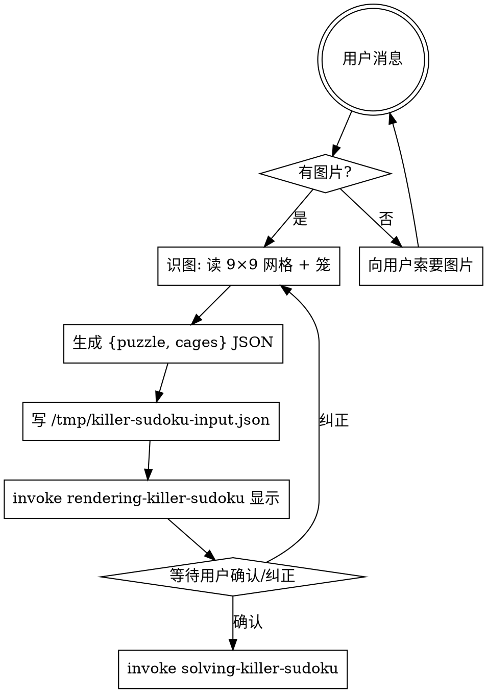
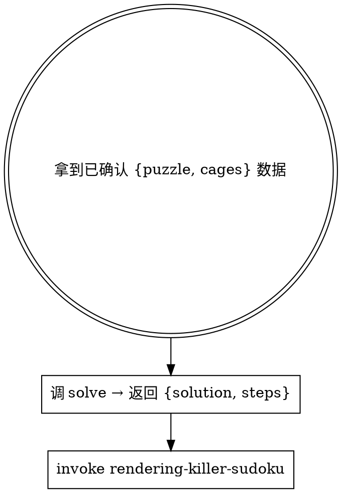

# Killer Sudoku Skills 中文重写设计

## 目标

将 `packages/killer-sudoku/skills/` 下 3 个 SKILL.md 从英文重写为中文，对齐 `packages/sudoku/skills/` 的中文 skill 风格和结构。

## 范围

| Skill | 当前 | 重写后 |
|-------|------|--------|
| `decoding-killer-sudoku/SKILL.md` | 49 行英文，结构简单 | ~100 行中文，含工作流图、步骤详解、常见错误表、红旗 |
| `solving-killer-sudoku/SKILL.md` | 73 行英文，含算法描述 | ~120 行中文，含工作流图、步骤详解、常见错误表、红旗 |
| `rendering-killer-sudoku/SKILL.md` | 60 行英文，含边框约定 | ~100 行中文，含常见错误表、红旗、兄弟 skill 关系 |

**不修改**：references/*.ts 实现代码（已为中文注释）。

## 追加：rendering SVG 增强（2026-06-23）

中文重写完成后，`rendering-killer-sudoku` 追加了 **SVG 图像渲染** 能力（修改了 `references/render-board.ts` 及其测试）：

- 新增 `renderSvg()`：默认输出 SVG，复刻参考图样式——内缩虚线笼框、嵌入笼框左上角缺口的小字 sum、粗线分宫
- CLI 默认写 SVG 文件并报路径，`-o` 指定路径，`--text` 切回终端文本
- 终端文本渲染同步升级为「双行格」（sum 行 + 数字行）+ 三种线型（粗/虚/细）
- 详见下方 `rendering-killer-sudoku` 章节

## 结构约定（对齐 sudoku package）

每个 SKILL.md 必须包含：

1. **标题**（`# 中文名（英文名）`）
2. **简介**（1-2 句）
3. **工作流图**（dot graph）
4. **步骤详解**（每步具体操作）
5. **输入/输出格式约定**（JSON schema）
6. **常见错误表格**（`| 错误 | 修正 |`）
7. **红旗 — 立即停止**
8. **与兄弟 skill 的关系**（仅 rendering 需要）

Killer Sudoku 特有内容保留：笼识别、笼边界渲染、笼组合过滤、45 法则、单格笼赋值。

---

## decoding-killer-sudoku

### 元数据

```yaml
name: decoding-killer-sudoku
description: Use when user provides a Killer Sudoku puzzle image and the puzzle's grid + cages need to be decoded from the image. Renders the decoded puzzle for user confirmation, then outputs JSON ready to hand off to solving-killer-sudoku.
```

### 标题

`# Decoding Killer Sudoku（解码 Killer Sudoku）`

### 简介

把用户给的 Killer Sudoku 谜题图片转成 `{puzzle, cages}` JSON，渲染给用户确认后交棒给 [[solving-killer-sudoku]] 求解。求解本身不属于本 skill。

### 工作流



### 步骤详解

#### 1. 接收图片

用户消息中如果没有图片附件，立即用 AskUserQuestion 索要。

#### 2. 识图

用视觉能力直接读图：
- 识别 9×9 网格的 81 格：每格是空白、已知数字（1-9），或无法识别
- 识别笼（cage）：虚线/实线边界围成的格组，通常用虚线标出
- 读取每个笼左上角的 sum 值（小号数字）
- 逐行逐列读取（行优先：A1, A2, ..., A9, B1, ...）

无法识别的格子用 `0` 标记为"空格"，不要猜测。

笼边界的识别需特别小心：
- 笼边界是虚线，可能跨宫
- 必须确保所有 81 格被覆盖且无重复

#### 3. 生成 JSON

```json
{
  "puzzle": [[0, 0, ...], ...],
  "cages": [
    { "cells": [[0, 0], [0, 1]], "sum": 10 },
    ...
  ]
}
```

- `puzzle`：9×9 `number[][]`，`0` = 空格，`1-9` = 已知数
- `cages`：笼列表，`cells` 为 0-indexed `[row, col]` 数组，`sum` 为笼目标和

#### 4. 写 input.json

```bash
cat > /tmp/killer-sudoku-input.json <<'JSON'
{ "puzzle": [...], "cages": [...] }
JSON
```

#### 5. 渲染并请求确认

render 由 [[rendering-killer-sudoku]] skill 负责。打印棋盘和笼列表后主动询问用户："识别如上盘面和笼定义，是否正确？如有错误请指出（例如'行 3 列 4 应为 5 而非 6'或'笼 2 的 sum 应为 15'）。"

如果用户指出错误，回到第 2 步重识，不要自己脑补修正。

#### 6. 交棒给 solving-killer-sudoku

用户确认后，必须 invoke [[solving-killer-sudoku]] 求解。

### 输入格式约定

```json
{
  "puzzle": [[0, 0, 0, 0, 0, 0, 0, 0, 0], ...],
  "cages": [
    { "cells": [[0, 0], [0, 1]], "sum": 3 }
  ]
}
```

- `puzzle`：9×9 二维数字数组（`number[][]`）
- `cages`：笼数组，每个笼含 `cells`（`[row, col][]`）和 `sum`（`number`）
- `cells` 中坐标 0-indexed

### 验证清单

- [ ] 网格是 9×9
- [ ] 所有值 0-9
- [ ] 81 格全部被笼覆盖，无重复
- [ ] 每个笼有合法 sum 值（不小于笼内最小组合和）
- [ ] 笼格坐标在网格范围内

### 常见错误

| 错误 | 修正 |
|------|------|
| 没图就开始造盘 | 停。先索要图片。 |
| 看不清的格子瞎猜 | 标 0 当空格。 |
| 笼边界遗漏或重复覆盖 | 验证全覆盖 + 无重复。 |
| 渲染看着差不多就 invoke solving | 必须等用户回话确认。 |
| 用户指错就自己脑补改 JSON | 不可，回第 2 步重识。 |
| 自己跑 solve-board.ts | 求解归 solving-killer-sudoku，invoke 它。 |

### 红旗 — 立即停止

- "图片肯定是 Killer Sudoku 标准盘" → 不要假设，实际看图
- "用户没给图我就用一个示例盘" → 索要图片，不要替代
- "这个格的数字看不太清就猜 5 吧" → 不可，标 0
- "render 出来差不多直接 invoke solving" → 必须等用户确认
- 笼覆盖验证不通过 → 重新识图，不要强行修补

---

## solving-killer-sudoku

### 元数据

```yaml
name: solving-killer-sudoku
description: Use when a Killer Sudoku puzzle (as a 9×9 grid + cages) is already decoded and confirmed by the user, and the puzzle now needs to be solved with step-by-step reasoning. Writes output.json (puzzle + cages + solution + steps), then invokes rendering-killer-sudoku to display the solved board.
```

### 标题

`# Solving Killer Sudoku（求解 Killer Sudoku）`

### 简介

入口：一份已被用户确认的 `{puzzle, cages}` JSON 数据对象（由 [[decoding-killer-sudoku]] 识图生成并请用户核对过）。CLI 和程序化两种用法都接受同一数据。

### 工作流



前置：本 skill 假定 `puzzle` 和 `cages` 数据已经被用户看过并确认。

### 步骤详解

#### 1. 求解

CLI（通过文件路径传输数据）：
```bash
# 在 puzzle-solver monorepo 中（dev）：
node --experimental-strip-types packages/killer-sudoku/skills/solving-killer-sudoku/references/solve-board.ts \
    /tmp/killer-sudoku-input.json

# 在已安装 plugin 中：
node --experimental-strip-types skills/solving-killer-sudoku/references/solve-board.ts \
    /tmp/killer-sudoku-input.json
```

程序化：
```ts
import { solve } from './solver.ts'
const result = solve({ puzzle, cages })
// result: { solution: number[][], steps: Step[] } | null
```

输入数据 `{puzzle, cages}` 直接传入 `solve()`，文件路径仅是 CLI 的数据传输方式。

`solve-board.ts` 调 `solver.ts` 中的 `solve()`：

1. **parse**：验证 9×9 puzzle + cages 全覆盖无重复
2. **初始化**：每格候选数 "123456789"
3. **预填线索**：
   - puzzle 中的已知数 → assign
   - 单格笼（`cells.length === 1`）→ 直接赋值 `cage.sum`
4. **约束传播**（Norvig 风格）：assign / eliminate / naked single / hidden single
5. **笼约束**：
   - 组合过滤：枚举笼的合法数字组合，过滤不可能候选
   - 45 法则：行/列/宫总和 45，跨笼推导孤立格
6. **MRV 回溯搜索**：候选最少格优先分支

输出（`SolveResult` 对象）：
- `solution`：9×9 数字矩阵，无解时为 `null`
- `steps`：求解步骤数组

```json
{
  "puzzle": [[0, 0, ...], ...],
  "cages": [{ "cells": [[0, 0], [0, 1]], "sum": 10 }, ...],
  "solution": [[1, 2, 3, ...], ...] | null,
  "steps": [
    { "type": "assign", "cell": "A1", "digit": "5", "detail": "赋值 A1=5" },
    { "type": "eliminate", "cell": "B1", "digit": "5", "detail": "消除 B1=5" },
    { "type": "cage-combo", "cage": 0, "detail": "笼 0 组合过滤 → 消除 C1=9" },
    { "type": "rule-of-45", "cell": "D4", "digit": "3", "detail": "45 法则：笼 2 跨出 1 格 → D4=3" },
    { "type": "search", "detail": "搜索 C3（2 候选）" }
  ]
}
```

solve-board（CLI 入口）将结果序列化写入 `/tmp/killer-sudoku-output.json`，不修改输入文件。

**退出码**：0 = 成功（含无解），1 = 输入错误。

#### 2. 渲染解

不要直跑 render-board，invoke [[rendering-killer-sudoku]]，把 `{puzzle, cages, solution}` 数据对象传过去。

### 输入格式约定

```json
{
  "puzzle": [[0, 0, ...], ...],
  "cages": [
    { "cells": [[0, 0], [0, 1]], "sum": 10 },
    ...
  ]
}
```

- `puzzle`：9×9 二维数字数组，`number[][]`
- `cages`：笼数组，每个笼含 `cells` 和 `sum`
- 单格笼 `cells: [[r, c]]` 即直接赋值 `puzzle[r][c] = sum`

如果 puzzle 不是 9×9 或含越界值，或 cages 未全覆盖，`solve-board.ts` 以非零退出码报错。

### Step 类型

| type | 含义 | detail 示例 |
|------|------|------------|
| `assign` | 格被赋值为特定数字 | `赋值 A1=5` |
| `eliminate` | 数字从格的候选删除 | `消除 B1=5` |
| `cage-combo` | 笼组合过滤触发 | `笼 0 组合过滤 → 消除 C1=9` |
| `rule-of-45` | 45 法则推导 | `45 法则：笼 2 跨出 1 格 → D4=3` |
| `search` | 回溯搜索分支 | `搜索 C3（2 候选）` |

### 常见错误

| 错误 | 修正 |
|------|------|
| 直接对未确认的 puzzle 求解 | puzzle/cages 错求解就废。让 decoding 先识别确认。 |
| 自己脑补修复 puzzle 或 cages | 不可。回 decoding 重新生成。 |
| 自己跑 render-board 显示解 | 不可。invoke rendering-killer-sudoku。 |
| 单格笼 sum 非法（<1 或 >9） | parse 阶段 reject。 |

### 红旗 — 立即停止

- "用户没确认我先 solve 试试省得来回" → 不可，那是 decoding 的职责
- "我顺手 import 一下 rendering 的 render-board.ts" → 不可，跨 skill 必须 invoke
- puzzle 或 cages 验证失败 → 停下来让 decoding 重做，不要自己修

---

## rendering-killer-sudoku

### 元数据

```yaml
name: rendering-killer-sudoku
description: Use when a Killer Sudoku puzzle or solution needs to be rendered as an image (SVG) or terminal text. Invoked by sibling skills decoding-killer-sudoku and solving-killer-sudoku.
```

### 标题

`# Rendering Killer Sudoku（渲染 Killer Sudoku）`

### 简介

把 `{puzzle, cages, solution?}` 数据渲染成图像或文本。**默认输出 SVG**——精确复刻 Killer Sudoku 图形样式：内缩虚线笼框、嵌入左上角的小字 sum、粗线分宫；同时保留终端 Unicode 文本输出（`--text`）。职责单一：接收数据、画棋盘和笼边界。不识图、不求解。

### 输入

数据对象：

```json
{
  "puzzle": [[0, 0, ...], ...],
  "cages": [
    { "cells": [[0, 0], [0, 1]], "sum": 10 },
    ...
  ],
  "solution": [[1, 2, 3, ...], ...]
}
```

- `puzzle`：9×9 `number[][]`，`0` = 空格
- `cages`：笼定义（用于绘制笼边界和笼列表）
- `solution`：可选 9×9 数字矩阵，存在则优先渲染
- 其他字段（如 `steps`）会被忽略
- `puzzle` 与 `solution` 都没有 → 友好显示 "No solution found"

### 用法

CLI（通过文件路径传输数据）：
```bash
# 默认渲染 SVG，写到输入 json 同目录（.svg），并打印路径
node --experimental-strip-types render-board.ts /tmp/killer-sudoku-output.json
# 指定输出路径
node --experimental-strip-types render-board.ts input.json -o /tmp/board.svg
# 终端文本渲染（旧行为）
node --experimental-strip-types render-board.ts input.json --text
```

程序化：
```ts
import { renderSvg, renderBoard, renderCages } from './render-board.ts'
const svg = renderSvg({ puzzle, cages, solution })   // SVG 字符串
const board = renderBoard({ puzzle, cages, solution })// 终端文本
const cageList = renderCages({ puzzle, cages })       // 笼列表文本
```

macOS 下可用 `qlmanage -t -s 580 -o <dir> board.svg` 把 SVG 转成 PNG 预览。

### 输出格式

#### SVG（默认）

矢量绘制，纯字符串拼接、无外部依赖：

- **内缩虚线笼框**：笼边界向格内偏移 `PAD` 像素绘制，浮在格子内部、比实线网格小一圈，两者分层互不重叠
- **嵌入式 sum**：sum 小字移到笼框左上角点，笼框 top 边右移、left 边下移留出缺口，数字嵌在虚线断口处、与虚线重叠（复刻参考图）。缺口宽度随 sum 位数自适应
- **数字**：格子居中
- **粗线**（width 3）：3×3 宫边界 + 外框；**细线**（width 1）：单格网格
- 配色 `#344861`（深）/ `#cdd5e0`（浅网格）/ `#5b6b84`（虚线笼框）

#### 终端文本（--text）

每格占 **2 行 × 5 字符**：上行左上角放笼 sum（仅锚点格），下行居中放数字。
```
┏━━━━━┯━━━━━┯━━━━━┳━━━━━┯ ...
┃16   ╎18   │     ┃11   ╎ ...   ← sum 行（左上角小字）
┃  9  ╎  6  │  4  ┃  2  ╎ ...   ← 数字行（居中）
┠─────┼─────┼╌╌╌╌╌╂╌╌╌╌╌┼ ...   ← 行间分隔
...
┗━━━━━┷━━━━━┷━━━━━┻━━━━━┷ ...
```

笼列表（`renderCages`）：
```
Cages:
  Cage 0: A1,A2 (2 cells, sum=3)
  Cage 1: A3,B3 (2 cells, sum=15)
  ...
```

### 边框约定

**SVG**：实线网格（细线单格 / 粗线分宫）与内缩虚线笼框分层绘制，互不重叠；sum 嵌在笼框左上角缺口。

**终端文本（--text）**：
- **粗线**（━ ┃ ┏ ┓ ┳ ┻ ┣ ┫）：3×3 宫边界
- **虚线**（╌ ╎）：笼边界
- **细线**（─ │）：同一笼内部相邻格之间
- **交叉点**（┼ ╂ ┿ ╋）：粗细只取决于是否落在宫行/列上

### 锚点格约定

笼的 sum 标注在「锚点格」——即该笼中行列字典序最小（最左上）的格子。SVG 嵌在其笼框左上角，终端文本放其格左上角。

### 设计原则

- 默认 SVG 输出：矢量绘制、纯字符串拼接、无外部依赖（与 sudoku/star-battle 一致的"无 native 库"原则）
- SVG 用分层绘制实现"内缩虚线笼框 + 嵌入式 sum"，复刻 Killer Sudoku 图形样式
- 终端文本（--text）纯 Unicode、无 ANSI 颜色（终端调色板差异会误导）
- 笼列表用标准坐标 A1-I9（A=第 0 行，1=第 0 列）

### 与兄弟 skill 的关系

- [[decoding-killer-sudoku]] 写出 input.json 后 invoke 本 skill 让用户确认识别结果
- [[solving-killer-sudoku]] 写出 output.json 后 invoke 本 skill 展示解
- 本 skill 不读传入数据之外的状态，不修改任何文件

### 常见错误

| 错误 | 修正 |
|------|------|
| puzzle 和 solution 都没有 | 友好显示 "No solution found" |
| JSON 解析失败 | 报错非零退出 |
| 笼边界检测遗漏 | 验证所有相邻格对的笼归属 |
| 直接 import solver 的函数 | 本 skill 只渲染，求解归 solving |

### 红旗 — 立即停止

- 输入 JSON 既无 `puzzle` 也无 `solution` → 友好显示 "No solution found"，不要崩溃
- 尝试自己求解 → 求解归 solving-killer-sudoku，invoke 它
- 尝试识图或修改数据 → 本 skill 只渲染，不修改
