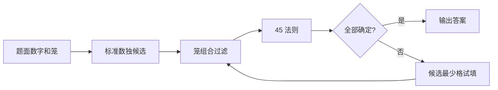
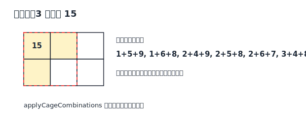

# Killer Sudoku 策略说明

本页面向一般解谜玩家，说明 Killer Sudoku 的目标、本 solver 实际使用的策略，以及人类常见但当前 solver 没有显式实现的技巧。

## 1. 问题定义

Killer Sudoku 仍然遵守标准数独规则：每一行、每一列、每一个 `3 x 3` 宫都包含 `1-9` 各一次。同时，棋盘被虚线分成若干笼，每个笼给出一个总和；同一笼内数字相加必须等于这个总和。常见规则下，同一笼内不能重复数字，因为它们也受数独行、列、宫约束限制。

## 2. Solver 使用的策略

### 标准数独传播

solver 先使用标准数独的候选逻辑：确定一个数字后，从同行、同列、同宫的同伴格中删除这个数字；出现裸单数或隐藏单数时继续传播。

### 笼组合过滤

对每个笼，solver 用 `applyCageCombinations` 枚举“笼大小 + 笼总和”对应的合法数字组合，再删除不可能出现在任何合法组合里的候选。

### 单格笼直接赋值

如果一个笼只有一格，那么这个格的值就是笼总和。solver 在解析题面时会直接处理这种线索。

### 45 法则

一行、一列或一宫的数字总和都是 `45`。如果一个 house 内大部分笼已经完全落在里面，只有某个跨界笼在里面留下一个未知格，solver 用 `applyRuleOf45` 推出这个格的数字。

### 最小候选搜索

当候选过滤和 45 法则都推不动时，solver 使用 `search`：选择候选数最少的格试填，遇到冲突就回退。

## 3. 人类常用但当前未显式实现的策略

- Innies / Outies：用一个区域内外跨界格的差值快速定位数字。
- 多 house 45 法则：同时组合多行、多列或多宫推导更大的跨界关系。
- 笼内排列分析：不仅看组合，也看具体数字在笼形状中的可放位置。
- Killer cage pair / cage split：把相邻笼、拆分笼或互补笼作为整体分析。
- 同和笼模式：利用常见总和和格数的固定组合快速排除候选。
- 数独高级候选技巧：如指向数、鱼形、链、唯一矩形等。

这些技巧没有作为独立人类步骤输出；solver 主要显式使用笼组合、45 法则、基础数独传播和回溯搜索。
