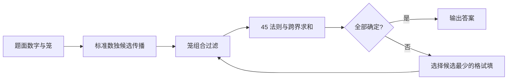

# Killer Sudoku 策略说明

## 1. 问题定义

Killer Sudoku 同时使用标准数独和笼（cage）约束：每一行、每一列、每一个 `3 × 3` 宫都包含 `1–9` 各一次；每个虚线笼内的数字之和必须等于笼角标出的总和。通常还单独规定同一笼内不得重复数字，即使笼中的两个格不在同一行、列或宫中；当前 Solver 也按这一常见规则生成无重复组合。

题面有时还给少量已知数字，但很多 Killer Sudoku 只给笼和。下文用 house 泛指一行、一列或一宫，用 `r4c7` 表示第 4 行第 7 列。



## 2. 策略详解

### 2.1 标准数独传播（Sudoku Constraint Propagation）

Solver 对应函数为 `assign` 与 `eliminate`。

Killer Sudoku 的笼并不会取代标准数独规则。确定 `r3c4 = 7` 后，仍要从第 3 行、第 4 列和所在宫的其他格删除 `7`；某格只剩一个候选时形成裸单数，某数字在一个 house 中只剩一个位置时形成隐藏单数。

笼约束和数独约束会反复接力。笼和先把某格从 `{1,2,3,4,5,6,7,8,9}` 缩到 `{2,4}`，同行的已知 `2` 再把它压成 `4`；这个 `4` 又会缩减其他笼的可行组合。解题时不应把“算笼”和“做数独”分成两个互不往来的阶段。

候选对、宫线交互、鱼形、翼与链等高级数独技巧仍然有效。它们的完整原理见 [Sudoku 策略说明](../../sudoku/docs/strategies.md)；在 Killer 盘面中，笼信息往往会先制造出更容易识别的候选结构。

### 2.2 单格笼（Single-Cell Cage）

Solver 由 `parse` 直接处理单格笼。

若一个笼只包含一格，笼和就是该格的值。例如 `r2c8` 单独构成总和为 `6` 的笼，可立即写入 `6`，再传播其行、列、宫约束。

单格笼本质上等同于标准数独的已知数。检查时仍要确认总和在 `1–9` 之间，且不会与现有已知数冲突。

### 2.3 笼和极值（Minimum and Maximum Cage Sums）

Solver 没有独立的极值函数；这一限制由 `enumerateCombinations` 生成的无重复数字组合体现。

一个 `n` 格笼的最小可能和是 `1+2+…+n`，最大可能和是 `9+8+…+(10-n)`。因此两格笼不可能小于 `3` 或大于 `17`，三格笼不可能小于 `6` 或大于 `24`。接近极值的笼通常组合很少，是开局最值得扫描的位置。

极值还能快速发现矛盾。例如三格笼已经确定含 `8、9`，第三格至少为 `1`，所以总和不能小于 `18`；若题面或当前虚拟笼要求和为 `17`，此前推理必有错误。极值只给上下界，不一定告诉数字的具体集合。

### 2.4 固定组合与组合表（Fixed Combinations and Combination Tables）

Solver 没有独立的固定组合函数；`enumerateCombinations` 生成组合表，`applyCageCombinations` 使用该表过滤候选。

接近极值的笼常只有一个数字集合。例如两格和为 `3` 只能是 `{1,2}`，两格和为 `17` 只能是 `{8,9}`；三格和为 `7` 只能是 `{1,2,4}`。固定组合并不立即决定数字在笼内的排列，但已经能从每格删除组合外的所有候选。

对于两格和为 `10`，合法无重复组合是 `{1,9}`、`{2,8}`、`{3,7}`、`{4,6}`。若其中一格因同行已有 `9、8、7` 而只能是 `{1,2,3,4,6}`，仍需结合另一格的候选逐对检查，不能只看笼内所有数字的大并集。


常用笼和的完整组合可参看 [SudokuWiki 的 Killer Combinations](https://www.sudokuwiki.org/Killer_Combinations)。

### 2.5 笼组合过滤（Cage Combination Filtering）

Solver 对应函数为 `applyCageCombinations`，其中 `hasValidAssignment` 检查一个数字组合是否至少存在一种符合当前候选的排列。

组合过滤分两步。先按“格数 + 总和 + 不重复”列出数字集合，再剔除已经无法分配到笼内各格的集合。一个三格和 `15` 的笼原本允许 `{1,5,9}`、`{1,6,8}`、`{2,4,9}`、`{2,5,8}`、`{2,6,7}`、`{3,4,8}`、`{3,5,7}`、`{4,5,6}`；若其中一格已经确定为 `9`，不含 `9` 的组合全部失效，笼只剩 `{1,5,9}` 与 `{2,4,9}`。

当前 Solver 会把所有仍可行组合中的数字取并集，并从整个笼删除并集之外的候选。它还会用当前各格候选确认组合至少能排列一次，但不会进一步计算“某个数字只能去笼中哪一格”的逐格位置交集。因此人类做出的更细位置排除不应误标为 Solver 已实现步骤。

### 2.6 笼内排列与位置分析（Cage Placement Analysis）

同一个数字组合可能有多种排列，但行、列、宫会禁止其中一部分。继续上例，若笼组合只剩 `{1,5,9}`，而 `9` 在同一宫中只能放到笼的第三格，那么第三格就是 `9`；前两格则形成 `{1,5}` 对，并可在共同 house 中排除 `1、5`。

实用做法是把“笼允许哪些数字”和“每个数字能落在哪些格”分开记录。前者是组合层，后者是排列层。当所有合法排列都在某格放同一数字时，该格可直接确定；当某数字在所有排列中都只落在同一行时，还能触发宫线或笼—house 交互。

这种位置级推理比只背组合表更强，也更容易出错。必须保留全部仍合法排列，不能因为某种排列看起来不顺眼就提前删除。

### 2.7 45 法则（Rule of 45）

Solver 对应函数为 `applyRuleOf45`。

标准数独每个 house 都含 `1–9`，所以总和恒为：

```text
1 + 2 + 3 + 4 + 5 + 6 + 7 + 8 + 9 = 45
```

若一行内完整笼的总和为 `41`，剩下唯一一个未计入的格就必须是 `4`。如果未计入的是两格，它们的和是 `4`，于是只能是 `{1,3}`。45 法则的核心不是某种固定笼形，而是给选定 house 画一条边界，比较边界内格子的固定总和 `45` 与笼和怎样跨越这条边界。

当前 Solver 实现的是较窄但可直接赋值的一类：逐行、逐列、逐宫统计完整落在其中的笼；当目标跨界笼在 house 内只留一格，且其他跨界笼位于 house 内的格都已经确定时，算出这个单格并赋值。它不会把任意多个未知跨界格自动建立成新的虚拟笼。

### 2.8 Innies 与 Outies（内格与外格）

Solver 仅由 `applyRuleOf45` 覆盖可直接赋值的单 innie 情形。

Innies/Outies 是 45 法则的边界语言。选定一个 house 后，属于跨界笼且位于边界内的格叫 innies，位于边界外的格叫 outies。不同资料有时从笼或 house 的视角使用名称，计算前最好先明确自己的边界。

设一个宫内完整笼总和为 `38`，另外只有两个 innies 未被完整笼覆盖，那么两格和为 `45-38=7`。若它们不能重复，候选组合是 `{1,6}`、`{2,5}`、`{3,4}`。若其中一格同行已有 `1、2、3`，便能继续缩减。

Outie 计算则把跨界笼总和纳入一边。例如覆盖一个完整宫的相关笼和合计为 `52`，其中只有一个格伸到宫外，而宫内总和必须是 `45`，这个 outie 就是 `52-45=7`。多个 innies/outies 不一定直接给出单值，但会形成一个很有用的虚拟笼。

更多边界画法和多格例子见 [SudokuWiki 的 Innies and Outies](https://www.sudokuwiki.org/Innies_and_Outies)。

### 2.9 多 house 的 45 法则（Multiple-House 45 Rule）

一行总和是 `45`，两行是 `90`，三个宫是 `135`。把多个不重叠 house 合并成更大边界后，仍可用“边界总和减完整笼和”计算跨界格。

例如前两行总和为 `90`。若完整落在两行内的笼合计 `84`，仅有两个 innies 没被完整笼覆盖，那么两格和为 `6`。这个边界可能比逐行分析更干净，因为原先跨越第一、第二行的笼在合并后变成完整笼，不再制造额外未知量。

选择边界的原则是让跨界格尽量少，而不是一味扩大范围。边界越大，参与的笼越多，人工加减也越容易出错。画线、标记已计入的笼并复算一次，通常比心算可靠。

### 2.10 笼—house 重叠（Cage-Unit Overlap）

若一个笼的某部分位于同一 house，可以比较“这部分必须使用的数字”和 house 中其他格的候选。比如一个三格笼的组合已经锁定为 `{2,4,8}`，其中两格位于第 3 行，第三格不在第 3 行；若第三格不可能是 `8`，那么第 3 行内的两格必有一个是 `8`，该行其他格便可删除 `8`。

反方向也同样有用：若某数字在一个 house 中只能出现在某个笼与该 house 的交集里，那么这个笼位于 house 外的格不能使用该数字。这与标准数独的指向数、宫线删减相似，只是“宫”被任意形状的笼替代。

判断时要精确说明锁定了多少个数字、多少个位置。仅知道“笼碰到这一行”并不足以产生排除；必须证明相关数字一定由交集承担。

图解案例可参看 [SudokuWiki 的 Cage Unit Overlap](https://www.sudokuwiki.org/Cage_Unit_Overlap)。

### 2.11 笼拆分与虚拟笼（Cage Splitting and Pseudo-Cages）

已知一个笼总和和其中部分格的和值，就能把剩余格视为新笼。若五格和 `23` 的笼中，有两格因 45 法则得知和为 `9`，其余三格就构成和 `14` 的虚拟笼。拆分后的格数更少，组合表通常更有约束力。

也可以把多个相邻笼相加，再减去已知或已成组的部分，构造并不印在题面上的 pseudo-cage。虚拟笼不一定空间连续；它只是一个被证明具有固定总和的格集合。

拆分时必须防止重复计数。同一格若同时出现在相加的两个表达式中，需要明确抵消或保留几次。把等式写出来比只圈区域安全：

```text
剩余三格和 = 原笼 23 − 已知两格和 9 = 14
```

多 house 下的拆分实例见 [SudokuWiki 的 Cage Splitting](https://www.sudokuwiki.org/Cage_Splitting)。

### 2.12 笼对（Cage Pairs）

两个笼或虚拟笼若在同一组 house 中共享紧密的候选关系，可以把它们作为一对分析。例如两个两格笼都只可能是 `{1,9}` 或 `{4,6}`，且它们在同一行中共同占据四格；两笼不能选相同数字集合，否则该行会重复，所以必有一个使用 `{1,9}`、另一个使用 `{4,6}`。若其中一个笼后来排除了 `1`，它便只能取 `{4,6}`，另一个随即锁定 `{1,9}`。

“Killer cage pair”在不同社区不是完全统一的形式化名称。可靠证明不应止于“这两个笼看起来成对”，而要明确写出固定总和、无重复条件以及行列宫造成的可见关系。

### 2.13 互补笼（Complementary Cages）

两个格集合若刚好覆盖同一个 house 的互补部分，可以直接比较它们的和。例如某行中一个完整五格集合和为 `31`，其余四格必和 `14`。即使后四格跨越多个印刷笼，把它们作为整体仍能限制候选。

互补关系也可跨多个 house：两行总和是 `90`，已知其中一个格集合和为 `68`，其补集就和为 `22`。前提是两个集合无遗漏、无重叠；边界画错一格，整个等式都会失效。

### 2.14 同和关系（Equal-Sum Cage Relations）

同和笼也能产生对应关系。若两个不重叠的两格笼都和为 `10`，且一个笼因 house 限制只能用 `{1,9}` 或 `{4,6}`，另一个笼排除了 `1、9`，它就只能是 `{4,6}`；随后第一个笼不能简单据此排除 `{4,6}`，除非两个笼之间还共享行、列或宫。相同总和本身只说明组合目录相同，不自动形成互斥。

同和关系最适合做候选目录的对照，而不是直接抄写答案。只有额外的数独可见性、笼内位置或互补等式把两边连接起来时，才能从一个笼对另一个笼做排除。

### 2.15 最小剩余值搜索（Minimum Remaining Values Search）

Solver 对应函数为 `search`。

当标准传播、笼组合与已实现的 45 法则都没有进展时，Solver 选择候选最少的格逐个试填。每次假设后重新执行数独传播、笼组合过滤和 45 法则；若某格无候选、某 house 缺少数字位置，或某笼没有合法组合，就回退尝试下一候选。

候选最少优先能尽早暴露矛盾，但搜索步骤本身不是一条适合人类抄写的简短技巧。人类更常用局部矛盾试探：只追踪一两个候选，找到可解释的冲突后返回原局面，而不是展开完整搜索树。

## 3. 延伸变体

较少作为入门独立章节的名称包括：innies-minus-outies、多边界重叠、虚拟 house、笼内隐藏子集、笼内必含数字、笼和互补链、重叠虚拟笼、无候选记号解法（no-candidate solving）以及把标准数独的 AIC、ALS、鱼形应用到笼约束后的混合链。它们大多可以还原为“总和等式 + 不重复 + 标准数独可见性”；可从 [SudokuWiki 的 Killer 专题条目](https://www.sudokuwiki.org/Killer_Combinations) 继续按名称查找。

## 4. 参考资料

- [SudokuWiki：Killer Combinations](https://www.sudokuwiki.org/Killer_Combinations)——无重复笼组合与常见组合表。
- [SudokuWiki：Innies and Outies](https://www.sudokuwiki.org/Innies_and_Outies)——45 法则的跨界分析。
- [SudokuWiki：Cage Unit Overlap](https://www.sudokuwiki.org/Cage_Unit_Overlap)——笼与行、列、宫交集的候选锁定。
- [SudokuWiki：Cage Splitting](https://www.sudokuwiki.org/Cage_Splitting)——拆分笼与多 house 边界。
