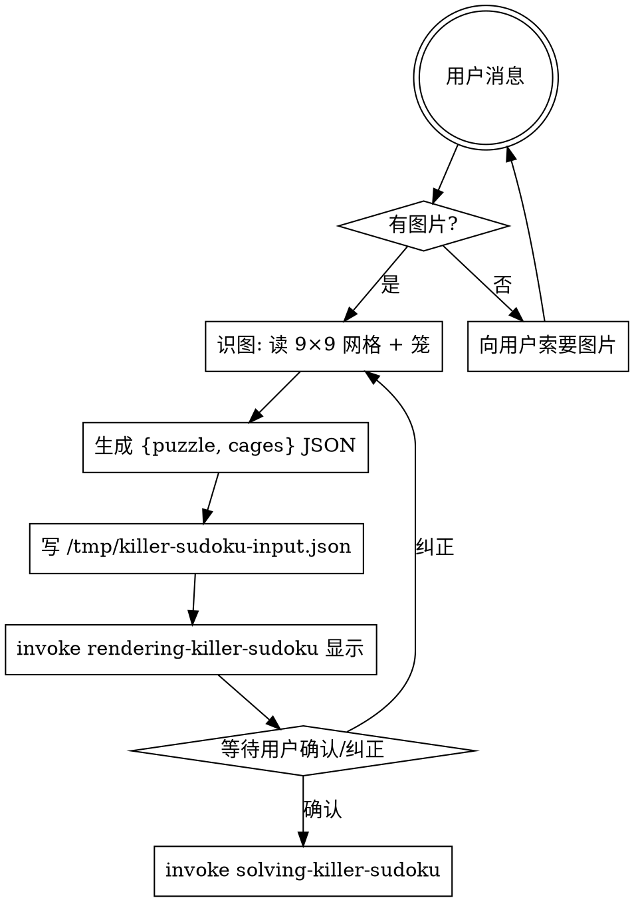

# Decoding Killer Sudoku（解码 Killer Sudoku）

把用户给的 Killer Sudoku 谜题图片转成 `{puzzle, cages}` JSON，渲染给用户确认后交棒给 [[solving-killer-sudoku]] 求解。求解本身不属于本 skill。

## 工作流（必须按顺序）



## 步骤详解

### 1. 接收图片

用户消息中如果**没有图片附件**（消息里看不到 image content block），立即用 AskUserQuestion 索要。不要假设、不要造测试盘。

### 2. 识图

用视觉能力直接读图：
- 识别 9×9 网格的 81 格：每格是空白、已知数字（1-9），或无法识别
- 识别笼（cage）：虚线/实线边界围成的格组，通常用虚线标出
- 读取每个笼左上角的 sum 值（小号数字）
- 逐行逐列读取（行优先：A1, A2, ..., A9, B1, ...）

无法识别的格子用 `0` 标记为"空格"，**不要猜测**。

笼边界的识别需特别小心：
- 笼边界是虚线，可能跨宫
- 必须确保所有 81 格被覆盖且无重复

### 3. 生成 JSON

```json
{
  "puzzle": [[0, 0, ...], ...],
  "cages": [
    { "cells": [[0, 0], [0, 1]], "sum": 10 },
    ...
  ]
}
```

- `puzzle`：9×9 `number[][]`，`0` = 空格，`1-9` = 已知数
- `cages`：笼列表，`cells` 为 0-indexed `[row, col]` 数组，`sum` 为笼目标和

### 4. 写 input.json

```bash
cat > /tmp/killer-sudoku-input.json <<'JSON'
{ "puzzle": [...], "cages": [...] }
JSON
```

### 5. 渲染并请求确认

render 由 [[rendering-killer-sudoku]] skill 负责。打印棋盘和笼列表后**主动询问用户**："识别如上盘面和笼定义，是否正确？如有错误请指出（例如'行 3 列 4 应为 5 而非 6'或'笼 2 的 sum 应为 15'）。"

如果用户指出错误，**回到第 2 步**重识，不要自己脑补修正。

### 6. 交棒给 solving-killer-sudoku

用户确认后，**必须 invoke** [[solving-killer-sudoku]] 求解，不要自己跑 `solve-board.ts`。

## 输入格式约定

```json
{
  "puzzle": [[0, 0, 0, 0, 0, 0, 0, 0, 0], ...],
  "cages": [
    { "cells": [[0, 0], [0, 1]], "sum": 3 }
  ]
}
```

- `puzzle`：9×9 二维数字数组（`number[][]`）
- `cages`：笼数组，每个笼含 `cells`（`[row, col][]`）和 `sum`（`number`）
- `cells` 中坐标 0-indexed

## 验证清单

- [ ] 网格是 9×9
- [ ] 所有值 0-9
- [ ] 81 格全部被笼覆盖，无重复
- [ ] 每个笼有合法 sum 值（不小于笼内最小组合和）
- [ ] 笼格坐标在网格范围内

## 常见错误

| 错误 | 修正 |
|------|------|
| 没图就开始造盘 | 停。先索要图片。 |
| 看不清的格子瞎猜 | 标 0 当空格。 |
| 笼边界遗漏或重复覆盖 | 验证全覆盖 + 无重复。 |
| 渲染看着差不多就 invoke solving | **必须**等用户回话确认。 |
| 用户指错就自己脑补改 JSON | **不可**，回第 2 步重识。 |
| 自己跑 solve-board.ts | 求解归 solving-killer-sudoku，invoke 它。 |

## 红旗 — 立即停止

- "图片肯定是 Killer Sudoku 标准盘" → 不要假设，实际看图
- "用户没给图我就用一个示例盘" → 索要图片，不要替代
- "这个格的数字看不太清就猜 5 吧" → 不可，标 0
- "render 出来差不多直接 invoke solving" → **必须**等用户确认
- 笼覆盖验证不通过 → 重新识图，不要强行修补
