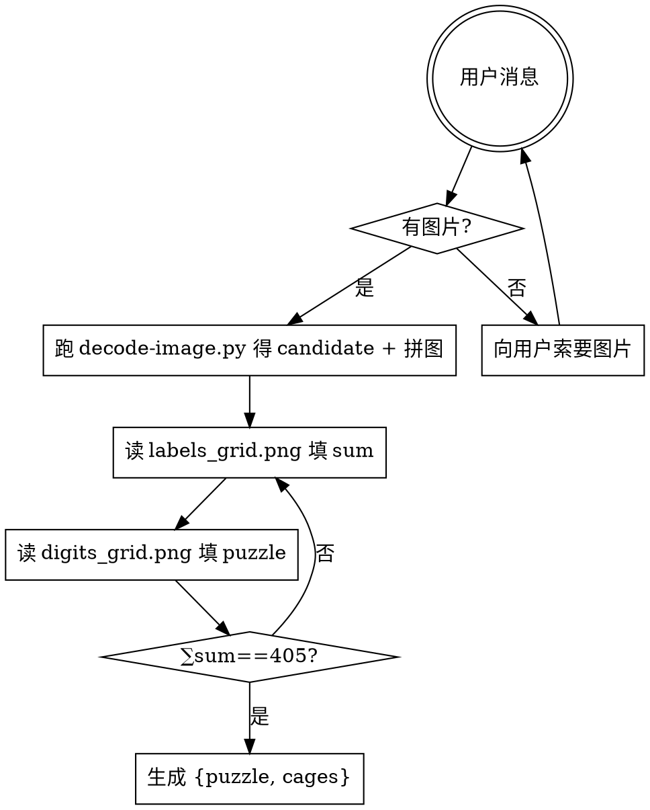

# Decoding Killer Sudoku（解码 Killer Sudoku）

把用户给的 Killer Sudoku 谜题图片转成 `{puzzle, cages}` JSON。确认、求解和最终展示由 `solve-killer-sudoku` 编排；本 skill 只负责解码。

## 工作流



## 步骤

### 1. 接收图片

用户消息中如果没有图片附件，直接向用户索要图片并等待回复。不要假设、不要造测试盘。

### 2. 识图（快速通道，推荐）

跑脚本，一次拿到 sum 拼图、9×9 数字拼图和笼分组骨架：

```bash
pnpm --dir <repo-root> run runtime:check -- killer-sudoku
<package-root>/.venv/bin/python <skill-dir>/references/decode-image.py <image_path> --outdir /tmp/ks-decode
```

`<repo-root>`、`<package-root>` 和 `<skill-dir>` 必须解析为真实绝对路径，不依赖当前工作目录。初始化脚本只使用项目内 `.venv`，不会调用系统 `pip`。

产物（`/tmp/ks-decode/`）：

- `candidate.json`：`{puzzle: 全 0, cages: [{cells, sum: null}, ...]}`，笼分组由 flood-fill 自动生成。
- `labels_grid.png`：一次读全部 anchor 的 sum 数字。
- `digits_grid.png`：一次读全部 81 格的数字（空格留空）。
- `debug/`：per-cell 原始切片，可在 sum/digit 有歧义时定点放大。

agent 只需两步填数值：

1. 读 `labels_grid.png`，把每个 anchor 的 sum 填回 `candidate.json` 对应 cage。
2. 读 `digits_grid.png`，把已知数字填回 `candidate.json` 的 `puzzle`（空格保 0）。

自检：

- `∑cage.sum == 405`（数独总和 45×9）。
- 81 格恰被笼覆盖一次（脚本已验证）。

自检不过 → 有 sum 读错，回 `labels_grid.png` 复查，或看 `debug/label_R_C.png` 定点放大。不要脑补修正。

脚本仅依赖项目 `uv.lock` 精确锁定的 Pillow。识图管线：暗行/暗列扫描定 grid → 内缩 dashed line 扫描定笼边界 → flood-fill 分组。

### 2b. 识图（慢通道，fallback）

脚本失败或环境无 Python 时才用。用视觉能力直接读图：

- 识别 9×9 网格的 81 格：每格是空白、已知数字（1-9），或无法识别。
- 识别笼（cage）：虚线边界围成的格组。
- 读取每个笼锚点格左上角的 sum 值（小号数字）。
- 逐行逐列读取（行优先：A1, A2, ..., A9, B1, ...）。

无法识别的格子用 `0` 标记为空格，不要猜测。

三种线型区分：

| 线型 | 粗细 | 语义 |
|------|------|------|
| 实线粗（≈3px） | 粗 | 3×3 宫边界 + 外框 |
| 实线细（≈1px） | 细 | 单格网格（宫内相邻格） |
| 虚线（dashed） | 中 | 笼边界 |

只有虚线才是笼边界。粗实线是宫边界，与笼无关；笼可跨宫。

其他视觉元素：

- 浅蓝底色（highlight）不是笼边界，仅为示例/装饰，忽略。
- 深蓝底色的加粗单元格是已知数字格，仍属于某个笼。

锚点约定：sum 小数字必然位于笼锚点格的左上角。锚点 = 该笼中「行索引最小；行相同则列索引最小」的格。

### 3. 输出解码数据

```json
{
  "puzzle": [[0, 0, 0, 0, 0, 0, 0, 0, 0]],
  "cages": [
    { "cells": [[0, 0], [0, 1]], "sum": 3 }
  ]
}
```

- `puzzle`：9×9 `number[][]`，`0` = 空格，`1-9` = 已知数。
- `cages`：笼列表，`cells` 为 0-indexed `[row, col]` 数组，`sum` 为笼目标和。
- 数据可通过内存、stdin 或调用方选择的文件传递；不要要求固定文件名或 `/tmp` 路径。

## 验证清单

- [ ] 网格是 9×9。
- [ ] 所有值 0-9。
- [ ] 81 格全部被笼覆盖，无重复。
- [ ] 每个笼有合法 sum 值（不小于笼内最小组合和）。
- [ ] 笼格坐标在网格范围内。
- [ ] `∑cage.sum == 405`。
- [ ] 每个笼的锚点 = cells 中字典序最小的 `[row, col]`。
- [ ] 笼边界只走虚线，未把粗实线（宫界）当笼界。

## 常见错误

| 错误 | 修正 |
|------|------|
| 没图就开始造盘 | 停。先索要图片。 |
| 跳过 decode-image.py 直接肉眼扫 81 格 | 走快速通道；慢通道只在脚本失败时用。 |
| 看不清的格子瞎猜 | 标 0 当空格；或看 `debug/digit_R_C.png` 定点放大。 |
| 笼边界遗漏或重复覆盖 | 验证全覆盖 + 无重复。 |
| 把粗实线（宫界）当笼界 | 只有虚线才是笼界；笼可跨宫。 |
| 把浅蓝底色格当笼分组 | 底色只是装饰；只看虚线。 |
| ∑sum ≠ 405 | 漏笼或错读 sum，回第 2 步。 |
| sum 定位在非锚点格 | sum 只出现在锚点左上角。 |
| 解码后继续求解 | 停。本 skill 只输出 `{puzzle, cages}`；完整链路归 `solve-killer-sudoku`。 |
| 用 solver 反推识别结果 | 不可。解码只看图片。 |

## 红旗

- “图片肯定是 Killer Sudoku 标准盘” → 不要假设，实际看图。
- “用户没给图我就用一个示例盘” → 索要图片，不要替代。
- “这个格的数字看不太清就猜 5 吧” → 不可，标 0。
- 笼覆盖验证不通过 → 重新识图，不要强行修补。
