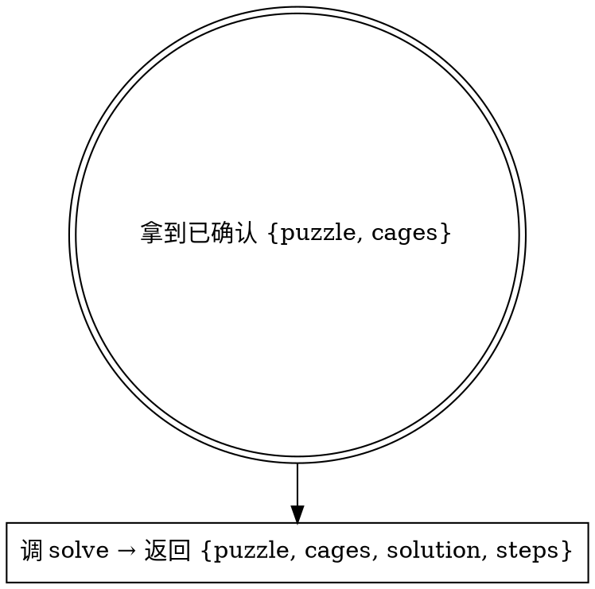

# Resolve Killer Sudoku（解析 Killer Sudoku 结果）

入口：一份调用方保证已确认的 `{puzzle, cages}` 数据对象。CLI 和程序化两种用法都接受同一数据；传输方式不作强制。

## 工作流



**前置**：本 skill 假定调用方已经确认 `puzzle` 和 `cages` 正确。

## 解析

CLI（通过 stdin 传输 JSON 数据）：

```bash
pnpm --dir <repo-root> run runtime:check -- killer-sudoku
pnpm --dir <package-root> exec node --import tsx <skill-dir>/references/solve-board.ts \
  < "$INPUT_JSON"

# 也可用 heredoc 直接内嵌数据：
pnpm --dir <package-root> exec node --import tsx <skill-dir>/references/solve-board.ts <<'JSON'
{ "puzzle": [...], "cages": [...] }
JSON
```

`<repo-root>`、`<package-root>` 和 `<skill-dir>` 必须解析为真实绝对路径，不依赖当前工作目录。

程序化：

```ts
import { solve } from './solver.ts'
const result = solve({ puzzle, cages })
// result: { solution: number[][], steps: Step[] } | null
```

CLI 从 stdin 读 `{puzzle, cages}` JSON 并调 `solve()`。未指定输出路径时把结果 JSON 写到 stdout；只有显式提供位置参数时才写文件。

`solve-board.ts` 调 `solver.ts` 中的 `solve()`：

1. parse：验证 9×9 puzzle + cages 全覆盖无重复。
2. 初始化：每格候选数 `"123456789"`。
3. 预填线索：puzzle 中的已知数 → assign；单格笼 → 直接赋值 `cage.sum`。
4. 约束传播：assign / eliminate / naked single / hidden single。
5. 笼约束：组合过滤、45 法则。
6. MRV 回溯搜索：候选最少格优先分支。

输出：

```json
{
  "puzzle": [[0, 0, 0, 0, 0, 0, 0, 0, 0]],
  "cages": [{ "cells": [[0, 0], [0, 1]], "sum": 10 }],
  "solution": [[1, 2, 3, 4, 5, 6, 7, 8, 9]],
  "steps": [
    { "type": "assign", "cell": "A1", "digit": "5", "detail": "赋值 A1=5" },
    { "type": "cage-combo", "cage": 0, "detail": "笼 0 组合过滤" },
    { "type": "rule-of-45", "cell": "D4", "digit": "3", "detail": "45 法则" },
    { "type": "search", "detail": "搜索 C3（2 候选）" }
  ]
}
```

`solve-board` 从 stdin 读入并返回序列化结果，不修改任何输入。skill 契约只约束结果 schema，不约束存储位置。

退出码：0 = 成功（含无解），1 = 输入错误。

## 输入契约

```json
{
  "puzzle": [[0, 0, 0, 0, 0, 0, 0, 0, 0]],
  "cages": [
    { "cells": [[0, 0], [0, 1]], "sum": 10 }
  ]
}
```

- `puzzle`：9×9 二维数字数组，`number[][]`。
- `cages`：笼数组，每个笼含 `cells` 和 `sum`。
- 单格笼 `cells: [[r, c]]` 即直接赋值 `puzzle[r][c] = sum`。

如果 puzzle 不是 9×9 或含越界值，或 cages 未全覆盖，`solve-board.ts` 以非零退出码报错。

## Step 类型

| type | 含义 | detail 示例 |
|------|------|------------|
| `assign` | 格被赋值为特定数字 | `赋值 A1=5` |
| `eliminate` | 数字从格的候选删除 | `消除 B1=5` |
| `cage-combo` | 笼组合过滤触发 | `笼 0 组合过滤 → 消除 C1=9` |
| `rule-of-45` | 45 法则推导 | `45 法则：笼 2 跨出 1 格 → D4=3` |
| `search` | 回溯搜索分支 | `搜索 C3（2 候选）` |

## 常见错误

| 错误 | 修正 |
|------|------|
| 直接对未确认的 puzzle/cages 求解 | 输入错求解就废。调用方必须先确认。 |
| 自己脑补修复 puzzle 或 cages | 不可。返回错误，让调用方修正输入。 |
| 产出结果后继续渲染 | 不可。本 skill 只输出结构化结果，展示由 `solve-killer-sudoku` 或调用方负责。 |
| 单格笼 sum 非法（<1 或 >9） | parse 阶段 reject。 |

## 红旗

- “用户没确认我先 solve 试试省得来回” → 不可，调用方必须先确认。
- “我顺手 render 一下” → 不可，本 skill 只产出结构化结果。
- puzzle 或 cages 验证失败 → 停下来让调用方修正，不要自己修。
