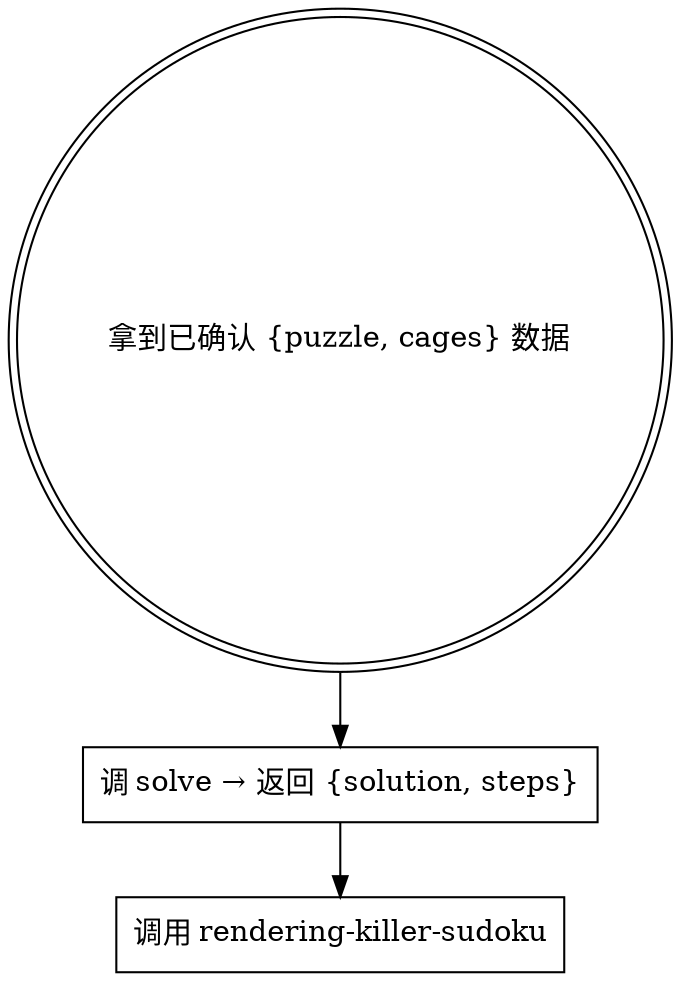

# Solving Killer Sudoku（求解 Killer Sudoku）

入口：一份经过 `decoding-killer-sudoku → rendering-killer-sudoku` 且**已被用户确认**的 `{puzzle, cages}` 数据对象。CLI 和程序化两种用法都接受同一数据；传输方式不作强制。

## 工作流（必须按顺序）



**前置**：本 skill 假定 `puzzle` 和 `cages` 数据**已经被用户看过并确认**。

## 步骤详解

### 1. 求解

CLI（通过 stdin 传输 JSON 数据）：

```bash
node <repo-root>/scripts/ensure-runtime.mjs killer-sudoku
pnpm --dir <package-root> exec node --import tsx <skill-dir>/references/solve-board.ts \
  < "$INPUT_JSON"

# 也可用 heredoc 直接内嵌数据：
pnpm --dir <package-root> exec node --import tsx <skill-dir>/references/solve-board.ts <<'JSON'
{ "puzzle": [...], "cages": [...] }
JSON
```

`<repo-root>`、`<package-root>` 和 `<skill-dir>` 必须解析为真实绝对路径，不依赖当前工作目录。

程序化：

```ts
import { solve } from './solver.ts'
const result = solve({ puzzle, cages })
// result: { solution: number[][], steps: Step[] } | null
```

CLI 从 stdin 读 `{puzzle, cages}` JSON 并调 `solve()`。未指定输出路径时把结果 JSON 写到 stdout；只有显式提供位置参数时才写文件。

`solve-board.ts` 调 `solver.ts` 中的 `solve()`：

1. **parse**：验证 9×9 puzzle + cages 全覆盖无重复
2. **初始化**：每格候选数 "123456789"
3. **预填线索**：
   - puzzle 中的已知数 → assign
   - 单格笼（`cells.length === 1`）→ 直接赋值 `cage.sum`
4. **约束传播**（Norvig 风格）：assign / eliminate / naked single / hidden single
5. **笼约束**：
   - 组合过滤：枚举笼的合法数字组合，过滤不可能候选
   - 45 法则：行/列/宫总和 45，跨笼推导孤立格
6. **MRV 回溯搜索**：候选最少格优先分支

输出（`SolveResult` 对象）：
- `solution`：9×9 数字矩阵，无解时为 `null`
- `steps`：求解步骤数组

```json
{
  "puzzle": [[0, 0, ...], ...],
  "cages": [{ "cells": [[0, 0], [0, 1]], "sum": 10 }, ...],
  "solution": [[1, 2, 3, ...], ...] | null,
  "steps": [
    { "type": "assign", "cell": "A1", "digit": "5", "detail": "赋值 A1=5" },
    { "type": "eliminate", "cell": "B1", "digit": "5", "detail": "消除 B1=5" },
    { "type": "cage-combo", "cage": 0, "detail": "笼 0 组合过滤 → 消除 C1=9" },
    { "type": "rule-of-45", "cell": "D4", "digit": "3", "detail": "45 法则：笼 2 跨出 1 格 → D4=3" },
    { "type": "search", "detail": "搜索 C3（2 候选）" }
  ]
}
```

`solve-board`（CLI 入口）从 stdin 读入并返回序列化结果，**不修改**任何输入。skill 契约只约束结果 schema，不约束存储位置。

**退出码**：0 = 成功（含无解），1 = 输入错误。

### 2. 渲染解

需要展示最终解时，调用项目级 `rendering-killer-sudoku` skill，把 `{puzzle, cages, solution, steps}` 数据对象传过去；不要要求中间结果先写到固定文件。

## 输入格式约定

```json
{
  "puzzle": [[0, 0, ...], ...],
  "cages": [
    { "cells": [[0, 0], [0, 1]], "sum": 10 },
    ...
  ]
}
```

- `puzzle`：9×9 二维数字数组，`number[][]`
- `cages`：笼数组，每个笼含 `cells` 和 `sum`
- 单格笼 `cells: [[r, c]]` 即直接赋值 `puzzle[r][c] = sum`

如果 puzzle 不是 9×9 或含越界值，或 cages 未全覆盖，`solve-board.ts` 以非零退出码报错。

## Step 类型

| type | 含义 | detail 示例 |
|------|------|------------|
| `assign` | 格被赋值为特定数字 | `赋值 A1=5` |
| `eliminate` | 数字从格的候选删除 | `消除 B1=5` |
| `cage-combo` | 笼组合过滤触发 | `笼 0 组合过滤 → 消除 C1=9` |
| `rule-of-45` | 45 法则推导 | `45 法则：笼 2 跨出 1 格 → D4=3` |
| `search` | 回溯搜索分支 | `搜索 C3（2 候选）` |

## 常见错误

| 错误 | 修正 |
|------|------|
| 直接对未确认的 puzzle 求解 | puzzle/cages 错求解就废。让 decoding 先识别确认。 |
| 自己脑补修复 puzzle 或 cages | **不可**。回 decoding 重新生成。 |
| 自己跑 render-board 显示解 | **不可**。调用 rendering-killer-sudoku。 |
| 单格笼 sum 非法（<1 或 >9） | parse 阶段 reject。 |

## 红旗 — 立即停止

- "用户没确认我先 solve 试试省得来回" → **不可**，那是 decoding 的职责
- "我顺手 import 一下 rendering 的 render-board.ts" → **不可**，跨 skill 必须调用 skill
- puzzle 或 cages 验证失败 → 停下来让 decoding 重做，不要自己修
