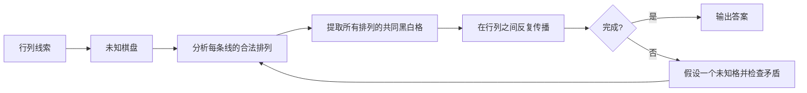

# Nonogram 策略说明

## 1. 问题定义

Nonogram 又叫数织、Picross 或 Pic-a-Pix。每一行和每一列都有一组线索数字，依次表示这条线上连续黑格块的长度；相邻黑块之间至少隔一个白格。目标是把每格确定为黑格或白格，使所有行列线索同时成立。

例如长度为 10 的线索 `[3,2]` 表示先出现连续 3 个黑格，至少隔 1 个白格，再出现连续 2 个黑格。空线索 `[]` 表示整条线都是白格。下文用 `#` 表示黑格、`.` 表示白格、`?` 表示未知格。



## 2. 策略详解

### 2.1 恰好填满（Exact Fit）

Solver 没有独立的恰好填满函数；这一推理由 `analyzeLine` 统一完成。

一组线索占用的最小长度等于所有黑块长度之和，再加上相邻黑块之间必需的白格数。例如 `[3,2,1]` 的最小长度是 `3+2+1+2=8`。若线长也恰好是 8，就没有任何滑动空间：

```text
线索 [3,2,1]，线长 8
###.##.#
```

所有黑格和分隔白格都可直接确定。

这是最基础的“计空间”方法。每次白格把线切短，或某个黑块被绑定到特定区间后，都应重新计算剩余线索的最小长度；原本有余量的局部区间可能变成恰好填满。

### 2.2 空线（Empty Line）

Solver 没有独立的空线函数；这一推理由 `analyzeLine` 统一完成。

若线索为空 `[]`，这条线没有任何黑块，所有格都可直接标白。类似地，一条线的所有线索块都已完整定位后，其余未知格也必须标白，因为再出现一个黑格就会制造额外黑块或让既有黑块超长。

空线看似简单，却常在小图或题面边缘一次性为许多交叉线提供边界。标白后应立即重查穿过这些格的另一方向，而不是把它当作无需传播的完成标记。

### 2.3 重叠法（Overlap）

Solver 没有独立的重叠法函数；`analyzeLine` 会找出所有合法排列，并把每种排列都为黑的格确定下来。

把同一黑块放到允许的最左位置和最右位置，两种极端位置共同覆盖的格，无论怎样移动都必须为黑。长度 7 的线放一个长度 5 的块：

```text
最左：#####..
最右：..#####
重叠：??###??
```

所以中间三格必黑。单块在线长 `n` 中长度为 `k` 时，若 `2k>n`，初始重叠长度是 `2k-n`；但这只是空白棋盘上的快捷公式。已有黑白格、多个线索块和区间边界会改变每个块的最早、最晚位置，应按当前状态重新判断。

多个块时必须比较“同一个线索块”的极端位置。不同块偶然覆盖同一格，并不能证明该格必黑。

完整盘面中的重叠推进可参看 [Conceptis 的 Pic-a-Pix 分步教程](https://www.conceptispuzzles.com/index.aspx?uri=puzzle%2Fpic-a-pix%2Ftechniques)。


### 2.4 完成块与标白（Completed Runs and Punctuating）

Solver 没有独立的完成块函数；黑块两侧的必需白格由 `analyzeLine` 的合法排列约束统一处理。

当一个连续黑段已经确定对应长度为 `k` 的线索，并且黑段长度恰为 `k`，它的两端若仍在线内就必须是白格，否则黑段会继续增长。例如线索含一个 `3`，局部状态为 `?###?`，可立即写成 `.###.`。

同样地，若所有线索块都已完成，整条线剩余未知格都应标白。标白不是收尾装饰，而是新的边界：它会缩短其他未完成块的活动区间，并向交叉方向传播信息。

有些资料把“及时封住已完成黑块”称为 Punctuating。人工解题最常见的遗漏之一，就是填了黑格却没有立即标出可以确定的白格，导致后续看不见分段和重叠。

### 2.5 边缘推进（Edge Logic）

Solver 没有独立的边缘推进函数；这一结论由 `analyzeLine` 统一覆盖。

线索块的顺序固定，所以最左侧黑块必须对应第一个线索，最右侧黑块必须对应最后一个线索。若线索 `[4,2]` 的左端在第 6 格前已有白格形成边界，那么长度 4 的首块只能放在前 5 格；把它推到最左和最右后，重叠位置便可确定为黑。

已有白格可以成为新的局部边缘。如果前面的线索已经在白格左侧完成，右侧区间便可用下一个线索重新从边界计数。边缘推进的价值在于先绑定线索顺序，再缩小某个块的活动范围；如果还不能确认已知黑格属于首块还是后续块，就不能强行从边缘延伸。

### 2.6 胶水法（Glue）

Solver 没有独立的胶水函数；这一结论由 `analyzeLine` 统一覆盖。

靠近边缘的已知黑格只能属于最前或最后若干线索块。若一条长度 10 的线只有线索 `[5]`，且第 3 格已黑，那么这个长度 5 的块最晚也必须覆盖第 3 格；无论块从第 1、2 或 3 格开始，第 3–5 格都必黑：

```text
当前：??#???????
推出：??###?????
```

“胶水”这个名字强调已知黑格会把同一线索块向外黏合、延伸。使用前必须先确认该黑格属于哪个线索块；若它仍可能属于相邻两个不同线索，贸然延伸会把两个合法分支错误地粘在一起。

Glue、Forcing 等传统名称的更多例子见 [Nonogram 解题技巧目录](https://en.wikipedia.org/wiki/Nonogram#Solution_techniques)。

### 2.7 分段分析（Segmentation）

Solver 没有独立的分段函数；`analyzeLine` 把已知白格作为不可跨越位置，只保留能在各区间中容纳线索的排列。

白格把一条线切成若干独立区间。若某区间最长只有 2 格，它就不可能容纳剩余的长度 3 黑块；该区间要么留给较短线索，要么全部为白。反过来，如果某个长块只有一个区间放得下，它就被强制分配到该区间。

例如线索 `[3,2]`，当前状态为：

```text
???.??.????
```

前三格区间最多恰好容纳长度 3，第二个两格区间可以容纳长度 2，末尾四格也可容纳任一块。不能仅按区间长度贪心决定归属；还要保持线索顺序，并确认剩余区间足以容纳剩余块。可靠方法是同时从左、右推导每个线索块的最早和最晚位置。

### 2.8 强制空格（Forcing Spaces）

Solver 没有独立的强制空格函数；这一推理由 `analyzeLine` 统一完成。

当两个白格之间的缝隙比任何尚未分配的线索都短时，这段缝隙不能容纳黑块，可以全部标白。例如剩余线索只有 `[3,4]`，某个被白格夹住的区间仅有 2 格，那么两格都必白。

也可能只有某个线索被迫离开这个区间，而较短线索仍能进入。使用时要比较区间长度与每一个尚未绑定的线索，并保持它们的先后顺序；不能因为区间放不下最长块，就一律清空仍可容纳短块的空间。

### 2.9 连接与分裂（Joining and Splitting）

Solver 没有独立的连接/分裂函数；`analyzeLine` 通过完整合法排列同时判断两段黑格能否属于同一线索块。

若两个已知黑段之间只有少量未知格，需要问：把它们连接后是否会超过某个线索长度？若会，中间至少有一个白格。反过来，若把它们分开后，两段都短到无法匹配任何剩余线索，或剩余空间不足以容纳两个块，那么中间格必须填黑，把它们连成同一块。

例如剩余线索只有 `[5]`，局部为 `##?##`。两段若分开就会形成两个黑块，与单一线索矛盾；中间格必黑，得到 `#####`。若剩余线索只有 `[2,2]`，同样的 `##?##` 中间格反而必白，得到 `##.##`。

复杂局面中，某段黑格可能尚不能绑定到特定线索。此时应保留连接和分裂两种可能，只提取两者共同结论。

### 2.10 逐线合法排列与共同结论（Line Enumeration and Consensus）

Solver 对应函数为 `analyzeLine`。

前面的人工技巧都可以统一为一个更一般的问题：在保持线索顺序、块间至少一白、并兼容当前黑白格的前提下，这条线还有哪些合法排列？如果某位置在所有排列中都是黑格，就确定为黑；如果在所有排列中都是白格，就确定为白；两种状态都出现则暂时未知。

例如某条 5 格线的剩余合法排列只有：

```text
##.#.
##..#
```

前两格在所有排列中都黑，第 3 格在所有排列中都白，第 4、5 格则各有黑白两种可能。因此共同结论是 `##.??`。

当前实现并非先生成完整字符串列表，而是建立“位置 + 已使用线索编号”的状态转移，计算哪些状态可从起点到达、又能走到终点。这种动态规划能得到每格是否可能为黑、是否可能为白，而不必重复枚举大量相似前缀。若没有任何路径到终点，这条线与当前棋盘矛盾。

### 2.11 行列反复传播（Row/Column Propagation）

Solver 对应函数为 `propagate`。

一条行线推出的新黑白格，同时也是各条交叉列的新条件；列的结论又会反过来限制行。因此数织不是把每行独立解完再处理列，而是在两个方向之间反复扫描，直到一整轮没有新增信息。

一个黑格可能让列中的某个块产生重叠；新重叠填出的黑格又可能使另一行的块完成并封边。这样的级联是数织最主要的推进方式。人工解题可以在每次落子后优先检查所有穿过该格的线，或使用“脏行/脏列”标记避免重复扫描没有变化的线。

传播停住不代表题目无解，只表示当前逐线共同结论已达到不动点。更强的跨线试探或搜索可能仍能推进。

### 2.12 矛盾试探与分支搜索（Contradiction Probing and Branch Search）

Solver 在 `solve` 内通过 `selectBranch` 选择未知格，并由局部递归函数 `explore` 搜索黑、白两个分支。

矛盾试探先暂时假设某格为黑或白，再执行正常行列传播。如果某条线无合法排列，则该假设错误，原格必须取另一状态。人类通常选择约束最紧、容易在几步内产生结论的格，并把假设链与正式落子明确区分。

Solver 会系统尝试两个分支。`selectBranch` 偏向选择所在行与列未知格总数较少的格，希望尽快触发约束；每个分支都继续传播和递归。搜索节点达到上限时，结果是“不确定”而不是擅自判断无解。

为了检测多解，找到第一组完整答案后还要回溯寻找第二组。零组解表示不可满足，一组表示在已探索空间内唯一，两组即可证明题面至少多解。图片轮廓或对称性不能替代这项逻辑检查。

### 2.13 图案与对称性观察（Pattern and Symmetry as Heuristics）

大图常画出人物、文字或对称图形，人眼可能从轮廓猜到某些格。但图像主题不是普通 Nonogram 的正式约束；作者完全可以设计不对称细节、留白或抽象图案。

因此图案识别只适合帮助选择“下一条值得检查的线”，不能直接证明某格黑白。任何最终落子仍应能还原为线索顺序、区间容量、合法排列交集或矛盾排除。

## 3. 延伸变体

不同社区对线性技巧命名并不完全统一，常见名称还有：Mercury、Punctuating、Simple Spaces、Forcing、Glue、Joining and Splitting、Anchoring、Edge Overlap、Reverse Splitting、Probing Sequences、Line Solving by Dynamic Programming。许多名称只是“枚举合法排列并取共同结论”的人工快捷视角，而非额外规则；传统名称可在 [Nonogram 解题技巧目录](https://en.wikipedia.org/wiki/Nonogram#Solution_techniques) 中继续查找。

彩色 Nonogram 还需区分颜色：相邻的不同色块可以不隔白格，同色块仍需分隔；本文与当前 Solver 只讨论黑白版本。

## 4. 参考资料

- [Conceptis：Pic-a-Pix Nonogram Techniques](https://www.conceptispuzzles.com/index.aspx?uri=puzzle%2Fpic-a-pix%2Ftechniques)——完整实例中的重叠、封边与行列传播。
- [Nonogram（Wikipedia）解题技巧章节](https://en.wikipedia.org/wiki/Nonogram#Solution_techniques)——Glue、Forcing、Joining and Splitting、Mercury 等名称与例子。
- [Probing Sequences for Nonograms](https://theses.liacs.nl/pdf/2021-2022-WensveenR.pdf)——逐线动态规划与试探序列的算法视角。
