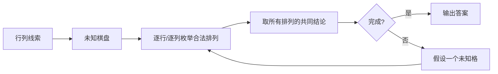
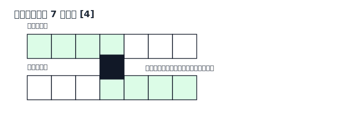

# Nonogram 策略说明

本页面向一般解谜玩家，说明 Nonogram 的目标、本 solver 实际使用的策略，以及人类常见但当前 solver 没有显式实现的技巧。

## 1. 问题定义

Nonogram 又叫数织。每一行和每一列都有一组线索数字，表示这一条线上连续黑格块的长度。多个数字表示多个黑格块，块与块之间至少隔一个白格。目标是把每格确定为黑格或白格，使所有行列线索同时满足。

## 2. Solver 使用的策略

### 逐线合法排列

solver 的核心是 `analyzeLine`：对某一行或某一列，根据当前已知黑白格，找出所有仍合法的线索排列。

### 共同黑格 / 共同白格

如果某个位置在所有合法排列中都是黑格，就确定为黑格；如果在所有合法排列中都是白格，就确定为白格。这对应玩家常说的重叠法、确定空格法。

### 行列反复传播

`propagate` 会反复扫描所有行和列。某一行推出的新黑白格，会改变相关列的合法排列；某一列的新结论又会反过来影响行。

### 分支搜索与多解检测

如果逻辑传播停住，solver 用 `selectBranch` 选择一个未知格，先假设黑格，再假设白格。它会继续搜索，直到找到解、证明无解、发现多解，或达到搜索节点上限。

## 3. 人类常用但当前未显式实现的策略

- 边缘推进：从线索贴边、靠边或被白格截断的位置继续推出格子。
- 分段分析：把一条线被已知白格切成多个区间，分别匹配线索。
- 胶水 / 分裂：根据已知黑格之间的距离判断是否属于同一块。
- 矛盾试探链：短暂假设某格黑或白，沿行列传播寻找矛盾。
- 大图局部图案识别：用图像轮廓、对称性或常见图案辅助判断。

这些技巧没有作为独立命名步骤输出；solver 把很多线性技巧统一折叠为“枚举合法排列并取交集”。
