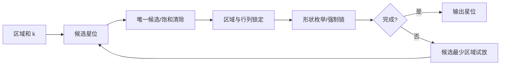

# Star Battle 策略说明

本页面向一般解谜玩家，说明 Star Battle 的目标、本 solver 实际使用的策略，以及人类常见但当前 solver 没有显式实现的技巧。

## 1. 问题定义

Star Battle 要在 `n x n` 棋盘上放星。每一行、每一列、每一个区域都必须正好放 `k` 颗星；任意两颗星不能相邻，包含上下左右和斜角相邻。

## 2. Solver 使用的策略

### 唯一候选

如果某个区域、某一行或某一列剩余候选数刚好等于还需要放的星数，solver 会把这些候选全部定为星。对应函数名是 `uniqueRegion`、`uniqueRow`、`uniqueCol`。

### 饱和清除

一颗星周围八格都不能再放星；已经放满 `k` 颗星的行、列、区域，其余格也不能再放星。solver 用 `saturationClear` 把这些格划掉。

### 区域锁定行列

如果某个还没放星的区域，所有候选都落在同一行或同一列，那么这条线上的其他区域格就不能放星。solver 用 `rowColRegionLock` 处理这类推理。

### 广义对

如果若干个区域的候选只覆盖同样数量的行或列，那么这些行或列上的其他区域格可以排除。solver 用 `generalizedPair` 处理这种跨区域锁定。

### 小区域形状枚举

在 `k=2` 的求解器中，`regionShapeEnum` 会枚举小区域内所有互不相邻的合法放法；所有放法都包含的格定星，所有放法都不包含的格划掉。

### 隐藏行列组

在 `k=1` 的求解器中，`hiddenRowGroup` 和 `hiddenColGroup` 会从行或列的角度寻找“这些线只能由这些区域贡献星”的组合，并排除相关区域在线外的候选。

### 强制链

`forcedChain` 会试放某个候选。如果这个假设会让其他区域没有合法候选，该候选就可以划掉；如果只剩一个可行候选，就定星。

### 搜索

当所有策略都推不动时，solver 选候选数最少的区域试放星，失败则回退。

## 3. 人类常用但当前未显式实现的策略

- 角落和边界模板：利用边角格的邻接限制快速排除。
- 区域形状库：识别 L 形、长条、窄腰、孤岛等常见区域图案。
- 星墙 / 空墙：把连续不能放星的格子视为屏障分析。
- 区域切分：把一个复杂区域按行列或瓶颈拆成几个局部块。
- 长链染色：沿候选之间的互斥关系做颜色或奇偶分析。
- 对称性观察：在人类题面中用对称区域或对称星位辅助判断。

这些技巧没有全部作为独立策略输出；solver 显式使用唯一候选、清除、锁定、枚举、强制链和回溯搜索。
