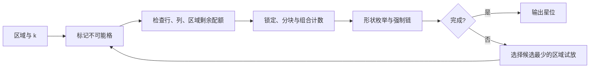
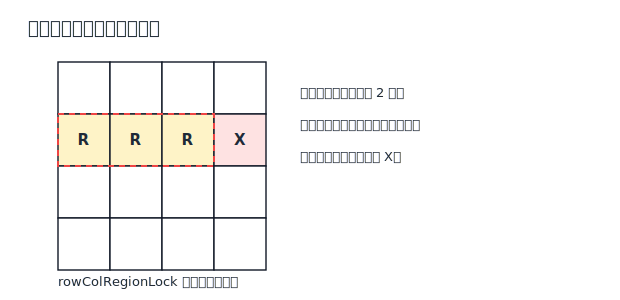

# Star Battle 策略说明

## 1. 问题定义

Star Battle 要在 `n × n` 棋盘上放置星星。每一行、每一列、每一个粗线围成的区域都必须恰好有 `k` 颗星；任意两颗星不能相邻，包括上下左右和斜角相邻。常见题型是每组 1 星或 2 星，当前 Solver 同时提供 `k=1`、`k=2` 特化入口和任意 `k` 的通用骨架。

解题时通常用 `★` 标记确定的星，用 `×` 标记不可能放星的格。下文说某格“能看见”一颗星，是指它与星在八邻域内相邻；行列相同本身并不违反不相邻规则，但仍受每行、每列的星数配额限制。



## 2. 策略详解

### 2.1 邻接排除与饱和清除（No-Touch Elimination and Saturation）

Solver 对应函数为 `saturationClear`，候选有效性同时由 `deriveCandidates` 检查。

确定一颗星后，它周围最多八格都必须划 `×`。当一行、一列或一个区域已经达到 `k` 颗星，其中所有其他格也必须划掉。这两条清除规则应在每次放星后立即执行，因为遗漏一个 `×` 会掩盖后面的唯一候选。

```text
× × ×
× ★ ×
× × ×
```

“饱和”指某个容器的星数配额已经用完。反过来，如果容器已出现超过 `k` 颗星，或两颗星互相相邻，当前假设已经矛盾。清除不是猜测星位，而是把规则的直接后果完整写到盘面上。

### 2.2 剩余候选等于剩余配额（Candidate Count Equals Remaining Quota）

Solver 对应函数为 `uniqueRegion`、`uniqueRow` 与 `uniqueCol`。

一行、一列或一区域还需要 `m` 颗星，而恰好只剩 `m` 个未排除候选时，这些候选全部是星。`k=1` 时就是熟悉的“只剩一个位置”；`k=2` 时，一个尚无星的区域若只剩两个互不相邻候选，也可同时定星。

使用前要先减去已经放置的星。例如一个 2 星区域已有 1 颗星、还剩 1 个候选，则该候选是第二颗星；如果还剩 2 个候选，就不能都放星，因为剩余配额只有 1。

候选数不足剩余配额则表示矛盾。人工解题时应同时检查行、列、区域三套容器，不能只盯区域边界。

### 2.3 共同邻格排除（Common-Neighbor Elimination）

如果已知某一小组候选中必有一颗星，那么任何与这组所有候选都相邻的外部格都不可能放星。最常见的是两个水平或垂直相邻候选承载一颗星：无论星落在哪个候选，它们共同一侧的格都会挨着星，因此可以划掉。

```text
候选：  ? ?     ← 两格中恰有一颗星
外部：  × ×     ← 同时邻接两个候选的格
```

证明的关键是“这组候选必含星”，而不只是“看起来可能放星”。这一结论可以来自行列配额、区域拆分或组合计数。候选组扩大后，共同邻域通常缩小，但原理不变。

### 2.4 四方格规则（Four-Square Rule）

任何 `2 × 2` 方块至多容纳一颗星，因为方块内任意两格都彼此相邻。如果一个 2 星区域的候选可以分成两个互不重叠的 `2 × 2` 子集，那么每个子集至多一星，而全区需要两星，所以两边都恰好各含一星。

四方格只是容量上限，不代表每个 `2 × 2` 都必须有星。只有当行列、区域或更大分组的剩余配额逼迫它达到上限时，才能继续排除。图解例子见 [Krazydad 的入门教程](https://krazydad.com/twonottouch/intro_tutorial/)。

### 2.5 边角容量（Edge and Corner Capacity）

边角并没有额外规则，但棋盘边界减少了候选向外延伸的空间，使不相邻约束更容易达到容量上限。若一个贴边子块必须容纳一星，所有同时邻接该子块全部候选的内侧格都可排除；角落子块的共同邻域通常比棋盘中央更大。

边角模板只能作为容量计算的快捷视角。区域形状、现有 `×` 或行列配额稍有变化，结论就可能不同；落子前仍应写清子块至少或至多需要几颗星。

### 2.6 连续候选格（Candidate Runs）

在同一行的三个连续候选中若必须放两颗星，唯一合法放法是两端放星、中间划掉：

```text
? ? ?   且需要 2 星
★ × ★
```

更长的窄条可以用同样的容量思想分析：长度 `L` 的连续单行候选至多容纳 `ceil(L/2)` 颗互不相邻的星。一旦“最多能放数”恰好等于“必须放数”，所有合法位置会呈交替结构；但若中间有缺口或候选分属不同配额，必须重新计算，不能套固定模板。

### 2.7 区域锁定行列（Region-to-Line Lock）

Solver 对应函数为 `rowColRegionLock`。

如果一个尚未放星的区域，其全部剩余候选都位于同一行，那么该区域所需的 `k` 颗星都会由这行承担。该行的星数配额也恰为 `k`，所以行内其他区域的格全部可以划掉；列方向完全对称。



对于 `k>1`，必须确认这个区域还没有在锁定线外放过星。若一个 2 星区域已经在线外有 1 颗星，它在线内只需再贡献 1 颗，不能据此占满整行的 2 星配额。当前 Solver 正是只让“区域已放星数为 0”的区域参与这项锁定。

反向推理也很常用：若一行剩余星只能来自某个区域与该行的交集，那么该区域在线外的候选可被排除。这种方向在 `k=1` 下尤其直接，在更大的 `k` 下要精确比较双方剩余配额。

### 2.8 区域拆分与局部容量（Region Splitting and Local Capacity）

复杂区域可以按几何容量拆成若干子块。假设一个 2 星区域的所有候选可分成两个子块，而每个子块都落在某个 `2 × 2` 范围内，因此各自至多放 1 星；整个区域必须放 2 星，于是两个子块都恰好各放 1 星。

一旦知道某子块必含一星，就能使用共同邻格排除；若子块后来只剩一格，该格直接定星。拆分不要求子块是题面正式区域，它只是为了计算容量而画出的临时集合。

可靠拆分需要同时证明三件事：所有区域候选都被子块覆盖、每块的最大容量已知、这些容量之和刚好等于区域所需星数。若容量之和大于需求，只能得到上界，不能断言每块都达到上限。

更复杂的拆分实例见 [Krazydad 的中级教程](https://krazydad.com/twonottouch/med_tutorial/)。

### 2.9 广义对与容器组计数（Generalized Pairs and Set Counting）

Solver 对应函数为 `generalizedPair`。

若 `m` 个尚未放星的区域的所有候选只覆盖 `m` 行，那么这些区域共需要 `m × k` 颗星，而这 `m` 行总容量也正好是 `m × k`。因此这些行的全部星位都被这些区域占用，同行其他区域的候选可划掉。列方向完全相同。

最小例子是两个区域只跨两行，常被称为广义对。区域 A 的候选可能散在第 3、5 行，区域 B 也只在第 3、5 行；两区域必须合计贡献两组配额，正好填满两行，所以其他区域不能在这两行放星。

这是一种集合版的“候选数等于配额”。区域数和行数相等只是表面形式，真正依据是两边需要与容量相等。已经放过星的区域若仍按完整配额计入，会破坏等式，因此当前 Solver 只组合尚无星的区域。

### 2.10 小区域形状枚举（Small-Region Shape Enumeration）

Solver 在 `k=2` 入口中由 `regionShapeEnum` 实现；它由 `makeRegionShapeEnum` 构造，并调用 `enumeratePlacements`。

对于候选不多的区域，可以列出所有满足不相邻规则、且放够剩余星数的局部方案。所有方案都包含的格必为星；没有任何方案包含的格必为 `×`。

例如某区域还需两星，候选为一条连续四格：

```text
位置：1 2 3 4
合法：★ × ★ ×
      ★ × × ★
      × ★ × ★
```

位置 2 与 3 并非必星，四格也都至少出现在一个方案中，因此仅靠局部枚举没有新增结论；但外部行列排除掉位置 1 后，只剩最后一种方案，位置 2、4 便确定。

当前 `k=2` Solver 只对至多 6 个候选的区域做这类枚举，以控制组合数量。它只检查区域内部星之间的不相邻性；全盘已有星、行列配额和排除格先由候选推导处理。

### 2.11 隐藏行列组（Hidden Line Groups）

Solver 在 `k=1` 入口中由 `hiddenRowGroup` 与 `hiddenColGroup` 实现，它们由 `makeHiddenLineGroup` 构造。

这项技巧从行列看区域。若 `m` 行的所有星候选只可能来自同样的 `m` 个区域，那么这 `m` 行与 `m` 区域在 `k=1` 下形成一一配额：这些区域的星都必须落在所选行内，因此区域位于这些行之外的候选可划掉。

它是广义对的对偶方向：广义对从“区域只占这些线”排除线内其他区域；隐藏行列组从“这些线只由这些区域供星”排除区域在线外的位置。

当前实现只在 `k=1` 使用该策略。`k≥2` 时，`m` 行共有 `m×k` 颗星，可能由多于 `m` 个区域共同贡献，简单的一一计数不再天然成立；若要推广，必须重新建立容量等式，不能照搬函数条件。

### 2.12 星墙、空墙与带状计数（Star/Empty Walls and Bands）

“墙”不是统一标准术语，通常指一串已经锁定星配额或已经排空的格，把盘面切成更易计数的两侧。比如连续两行的星全部被几个局部候选组占用，那么这两行对其他区域相当于空墙；跨过它们的区域只能把剩余星放在线外。

反过来，一条由 `×` 组成的带会把区域候选分成几个互不连通的部分，便于应用区域拆分与容量上限。星墙本身不产生新规则，真正的证明仍是：某组行列有固定总配额、某些候选组必含固定星数、剩余容量因此归零或达到下界。

使用这种视觉语言时，最好在旁边写出计数，例如“3 行需要 6 星，A/B/C 三个区域已在其中锁定 6 星”，避免把形似屏障的图案误当作逻辑条件。

### 2.13 强制链与短矛盾试探（Forced Chains）

Solver 对应函数为 `forcedChain`，由 `makeForcedChain` 按 `k=1` 或 `k=2` 的共存规则构造。

选取一个候选暂时放星，再检查其他区域是否还至少有一个能与它共存的候选。如果某个区域因此完全无处放星，这个试放候选必错，应划 `×`；如果一个区域的多个候选中只有一个不会立刻令其他区域无候选，该候选可定星。

当前实现是一层局部前瞻：它检查试放点会不会直接杀死另一个区域的所有候选，而不是展开任意深的链。在 `k=1` 中，同一行、同一列以及八邻域都不能与试放星共存；在 `k=2` 中，同行或同列的非相邻星可以共存，所以只按邻接关系排除。

人类的短矛盾试探也应保留清晰分支。假设后只使用确定规则；一旦找到“某行候选不足”“某区域无法放够星”或“出现相邻星”，就回到原局面，把最初候选排除。

### 2.14 长链与染色（Long Chains and Coloring）

把候选看成图：同一容器中争夺有限配额的候选之间有互斥关系，某个候选组必须含星则提供“至少一个成立”的关系。不停交替这些关系，可以形成比一层强制链更长的推理。

染色法给链上相反状态着两色。若同色最终导致两颗相邻星、某行超额，或某区域容量不足，该颜色阵营整体错误；若某个未着色候选无论哪种颜色成立都会冲突，也可排除。

Star Battle 的链不像标准 Sudoku 那样有高度统一的命名和候选记法。记录时应给每条边写出依据，例如“这两个格二选一”“这个 2×2 至多一星”“这两行还缺两星”，而不要只凭颜色传播。

### 2.15 对称性观察（Symmetry as a Heuristic）

有些题目的区域布局呈旋转或镜像对称，构造者也可能让答案保持某种美感。对称性可以提示先检查对应区域，或帮助发现漏标的同构结构，但普通规则并不保证星位对称。

除非题目明确把对称性写成附加规则，否则不能因为左上角有星就直接在右下角放星。每个落子仍需由邻接、行列区域配额、容量计数或矛盾证明。

### 2.16 最小候选区域搜索（Minimum-Candidate Region Search）

Solver 对应函数为 `search`，每个搜索节点先调用 `deduce` 反复应用已配置策略。

当所有确定性策略停止时，Solver 选择候选数最少的未完成区域，逐个候选试放星。假设后若出现相邻星、某容器星数超额或某区域没有候选，就回退；否则继续推导和递归。

最小候选优先能让错误假设更快暴露，但搜索找到一组星位不等于给出一条简短的人类解路，也不自动证明唯一性。当前 Star Battle Solver 返回找到的第一组解；若要验证题目唯一，必须继续探索其他分支或使用专门的多解检测。

## 3. 延伸变体

不同教程常用自定义名称描述相近的容量推理，常见名称包括：Four-Square Rule、Locked Candidates、Confined Regions、Clumps、Squeeze、Virtual Bands、Region/Line Fish、Constraint Pairs、Lookahead、Common-Neighborhood Elimination。遇到冷门名称时，应把它还原为“不相邻上限 + 行列区域配额 + 候选集合”再判断是否成立；更多分组实例可参考 [Krazydad 的高级教程](https://krazydad.com/twonottouch/adv_tutorial/)。

## 4. 参考资料

- [Krazydad：Two Not Touch 入门教程](https://krazydad.com/twonottouch/intro_tutorial/)——邻接清除、四方格、候选组共同邻格与区域—行列交互。
- [Krazydad：Two Not Touch 中级教程](https://krazydad.com/twonottouch/med_tutorial/)——区域拆分、局部容量和外部排除。
- [Krazydad：Two Not Touch 高级教程](https://krazydad.com/twonottouch/adv_tutorial/)——更复杂的分组与计数实例。
