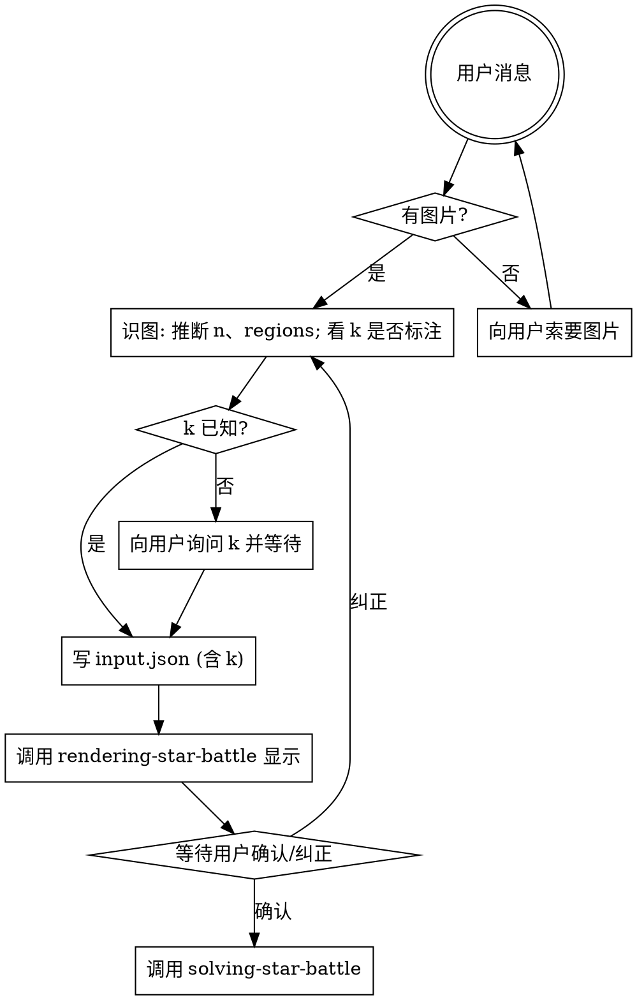

# Decoding Star Battle

把用户给的 Star Battle 谜题图片转成 `{regions, k}` JSON，**渲染给用户确认**后交给项目级 `solving-star-battle` skill 求解。求解本身不属于本 skill。

## 工作流（必须按顺序）



## 步骤详解

### 1. 接收图片

用户消息中如果**没有图片附件**，直接向用户索要图片并等待回复。不要假设、不要造测试盘。

### 2. 识图

用视觉能力直接读图：
- **n**：数行/列（方阵）
- **regions**：给每个单元格分配区域 id（从 0 开始的整数）。区域分割看**粗线**或**底色**：
  - 粗线版：同色边线分割同区，粗线分割不同区
  - 颜色版：同色 = 同区
  - 复杂图也可能两者并用
- **k**：题目通常会写"X stars per row, column and region"（中文"每行/列/区 X 颗星"）。**没有默认值** — 图中没标且未确认时，必须直接询问用户并等待回复。

**辅助工具：CV 特征提取**

如果颜色边界模糊（橙 vs 桃、淡蓝 vs 青），或区域用粗线/图案分割不易直读，先用 `references/extract-cells.ts` 拿到每格的结构化特征，再据此决策 regions：

先把 `<repo-root>`、`<package-root>` 和 `<skill-dir>` 解析为真实绝对路径；即使 skill 是从 `.agents/skills` 或 `.claude/skills` 的符号链接发现，也要使用其真实目录。首次运行会自动在项目内安装锁定依赖：

```bash
node <repo-root>/scripts/ensure-runtime.mjs star-battle
pnpm --dir <package-root> exec node --import tsx <skill-dir>/references/extract-cells.ts \
    "$IMG" --rect x,y,w,h --n N \
    > /tmp/sb-features.json
```

- `--rect`：棋盘在原图的像素矩形（x,y 是左上角，w,h 是宽高），由你看图估计
- `--n`：棋盘边长

输出每格三类特征：
- `color.meanRGB / medianRGB`：判断同色簇用
- `edges.{top,right,bottom,left} ∈ [0,1] 或 null`：判断粗线分割用（外框为 null）
- `pattern`：dHash 16 hex，判断同色不同图案用

脚本**只出特征，不出 regions**。你看完特征再决定每格归哪个区域。

输出一个二维整数数组 `regions[i][j]`（行优先）。

### 3. 写 input.json

```bash
cat > /tmp/sb-input.json <<'JSON'
{ "regions": [[...], ...], "k": 2 }
JSON
```

**必填**：`regions` 与 `k`。区域数必须等于 `n`（Star Battle 规则：n 区，每区 k 星）。

### 4. 渲染并请求确认

render 不再由本 skill 直接执行——加载并执行项目级 `rendering-star-battle` skill，让它读取 `/tmp/sb-input.json` 渲染。

```bash
调用 rendering-star-battle，输入 /tmp/sb-input.json
```

rendering 是**纯黑白 Unicode 盒线**，不使用 ANSI 颜色 — 终端调色板与原图色差会让用户误以为识别错；用粗细线区分区域更可靠。每格中央显示 region id，便于用户**逐格核对**哪些格被分到了哪一区。

打印后**主动询问用户**："识别如上，是否正确？如有错误请指出哪些格子的区域归属错了（例如'行 3 列 4 应归紫色'）。"等待确认/纠正。

如果用户指出错误，**回到第 2 步**重识，不要自己脑补修。

### 5. 交棒给 solving-star-battle

用户确认后，**必须调用项目级 `solving-star-battle` skill** 求解，不要自己跑 `solve-board.ts` 或心算给答案。solving skill 会再次渲染（带星位）展示最终解。

## 输入格式约定

```json
{
  "regions": [[0, 0, 1], [0, 2, 1], [2, 2, 1]],
  "k": 1
}
```

- `regions`：`n×n` 整数方阵，每个值是区域 id
- `k`：每行/列/区域的星数，**必填**（无默认值）
- 区域数必须等于 `n`

## 常见错误

| 错误 | 修正 |
|------|------|
| 还没看到图就开始造盘 | 停。先索要图片。 |
| 图里没写 k 就默认 2 | **错误**。无默认值，必须询问用户并等待回复。 |
| 把粗细线读反了（同区分割） | 粗线 = 区域**边界**，细线 = 区域内格分割。 |
| 区域数 ≠ n | Star Battle 规则：区域数必须等于 n。复查识图。 |
| 渲染看着差不多就调用 solving | **必须**等用户回话确认。 |
| 用户指错就自己脑补改 regions 重 render | **不可**，回第 2 步重识。 |
| 自己跑 solve-board.ts | 求解归 solving-star-battle，调用该 skill。 |

## 红旗 — 立即停止

- "图片肯定是 10×10 k=2 标准盘" → 不要假设，实际看图
- "用户没给图我就用一个示例盘" → 索要图片，不要替代
- "k 没写默认 2 吧" → **不可**，问用户
- "render 出来差不多直接调用 solving" → **必须**等用户确认
- "我直接读 input.json 心算给答案" → 不可。调用 solving-star-battle
