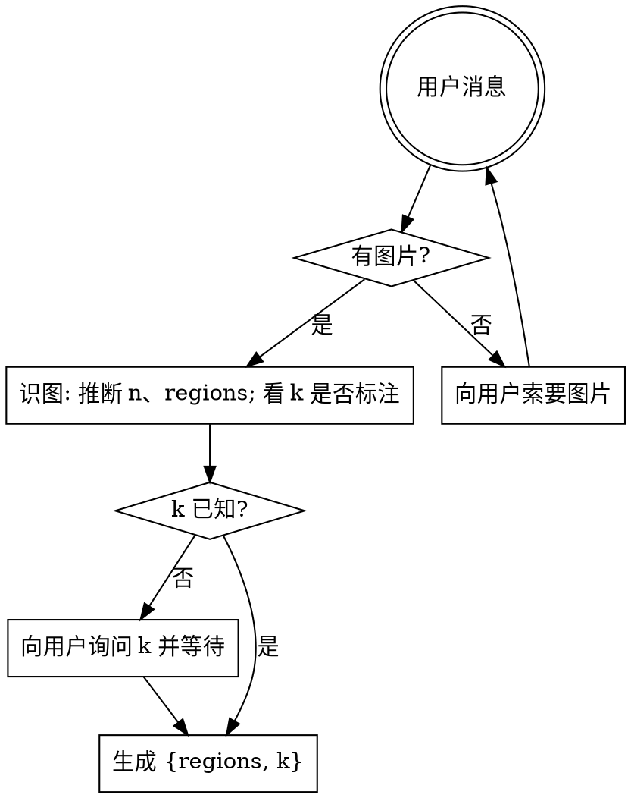

# Decoding Star Battle（解码 Star Battle）

把用户给的 Star Battle 谜题图片转成 `{regions, k}` JSON。确认、求解和最终展示由 `solve-star-battle` 编排；本 skill 只负责解码。

## 工作流



## 步骤

1. 用户消息中如果没有图片附件，直接向用户索要图片并等待回复。不要假设、不要造测试盘。
2. 用视觉能力直接读图，识别方阵边长 `n`。
3. 识别 `regions`：给每个单元格分配区域 id（从 0 开始的整数）。区域分割看粗线或底色：粗线版中粗线分割不同区，颜色版中同色表示同区。
4. 识别 `k`：题目通常会写 “X stars per row, column and region” 或“每行/列/区 X 颗星”。没有默认值；图中没标且未确认时，必须直接询问用户并等待回复。
5. 输出 `{ "regions": number[][], "k": number }`。数据可通过内存、stdin 或调用方选择的文件传递；不要要求固定文件名或 `/tmp` 路径。

## 辅助工具：CV 特征提取

如果颜色边界模糊（橙 vs 桃、淡蓝 vs 青），或区域用粗线/图案分割不易直读，先用 `references/extract-cells.ts` 拿到每格的结构化特征，再据此决策 regions。

先把 `<repo-root>`、`<package-root>` 和 `<skill-dir>` 解析为真实绝对路径；即使 skill 是从 `.agents/skills` 或 `.claude/skills` 的符号链接发现，也要使用其真实目录。首次运行会自动在项目内安装锁定依赖：

```bash
pnpm --dir <repo-root> run runtime:check -- star-battle
pnpm --dir <package-root> exec node --import tsx <skill-dir>/references/extract-cells.ts \
    "$IMG" --rect x,y,w,h --n N \
    > /tmp/sb-features.json
```

- `--rect`：棋盘在原图的像素矩形（x,y 是左上角，w,h 是宽高），由你看图估计。
- `--n`：棋盘边长。
- `color.meanRGB / medianRGB`：判断同色簇用。
- `edges.{top,right,bottom,left} ∈ [0,1] 或 null`：判断粗线分割用（外框为 null）。
- `pattern`：dHash 16 hex，判断同色不同图案用。

脚本只出特征，不出 regions。你看完特征再决定每格归哪个区域。

## 输出契约

```json
{
  "regions": [[0, 0, 1], [0, 2, 1], [2, 2, 1]],
  "k": 1
}
```

- `regions`：`n×n` 整数方阵，每个值是区域 id。
- `k`：每行/列/区域的星数，必填，无默认值。
- 区域数必须等于 `n`。

## 常见错误

| 错误 | 修正 |
|------|------|
| 还没看到图就开始造盘 | 停。先索要图片。 |
| 图里没写 k 就默认 2 | 错误。无默认值，必须询问用户并等待回复。 |
| 把粗细线读反了 | 粗线 = 区域边界，细线 = 区域内格分割。 |
| 区域数 ≠ n | Star Battle 规则：区域数必须等于 n。复查识图。 |
| 解码后继续求解 | 停。本 skill 只输出 `{regions, k}`；完整链路归 `solve-star-battle`。 |
| 用 solver 反推识别结果 | 不可。解码只看图片和用户明确补充。 |

## 红旗

- “图片肯定是 10×10 k=2 标准盘” → 不要假设，实际看图。
- “用户没给图我就用一个示例盘” → 索要图片，不要替代。
- “k 没写默认 2 吧” → 不可，问用户。
- “顺手 solve 一下” → 不可。本 skill 只解码。
