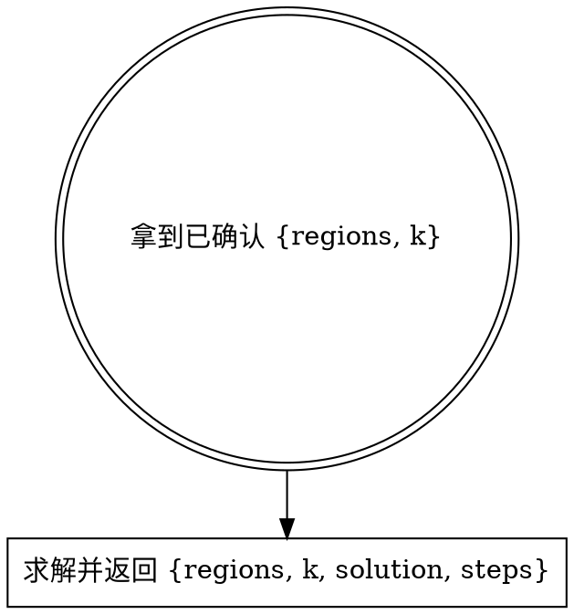

# Resolve Star Battle（解析 Star Battle 结果）

入口：一份调用方保证已确认的 `{regions, k}` 数据对象。传输方式可由调用方选择，不要求固定文件名或目录。

## 工作流



**前置**：本 skill 假定调用方已经确认 `regions` 和 `k` 正确。

## 解析

```bash
pnpm --dir <repo-root> run runtime:check -- star-battle
pnpm --dir <package-root> exec node --import tsx <skill-dir>/references/solve-board.ts path/to/input.json
# 如需持久化，再显式传入调用方选择的输出路径：
pnpm --dir <package-root> exec node --import tsx <skill-dir>/references/solve-board.ts path/to/input.json path/to/output.json
```

`<repo-root>`、`<package-root>` 和 `<skill-dir>` 必须解析为真实绝对路径，不依赖当前工作目录。

`solve-board.ts` 从同目录 `solver/` 加载求解器，按 `k` 路由：

- `k=1` → `solve.ts`（含 hiddenLineGroup）。
- `k=2` → `solve-2.ts`（含 regionShapeEnum / forcedChain）。
- 其他 → `solve-k.ts`（通用策略）。

stdout：求解器名 + 耗时 + 推导步骤列表。

结果 schema：

```json
{
  "regions": [[0, 0, 1], [0, 2, 1], [2, 2, 1]],
  "k": 1,
  "solution": [[0, 0, 1], [1, 0, 0], [0, 0, 0]],
  "steps": ["uniqueRegion: (0,2)"]
}
```

`solve-board` 不修改输入。未指定输出路径时把结果 JSON 写到 stdout；指定路径时才写文件。skill 契约只约束结果 schema，不约束存储位置。

## 输入契约

```json
{
  "regions": [[0, 0, 1], [0, 2, 1], [2, 2, 1]],
  "k": 1
}
```

- `regions`：`n×n` 整数方阵，每个值是区域 id。
- `k`：每行/列/区域的星数，必填，无默认值。
- 区域数必须等于 `n`（Star Battle 规则：n 区，每区 k 星，共 n×k 颗星）。

如果调用方给的 input.json 缺 k 或 k 非正整数，`solve-board.ts` 会以非零退出码报错；调用方应补全或修正输入，不要硬填默认值。

## 常见错误

| 错误 | 修正 |
|------|------|
| 直接对未确认的 regions 求解 | regions 错求解就废。调用方必须先确认。 |
| input.json 缺 k 就当 2 | 错误。无默认值，返回错误让调用方确认。 |
| 产出结果后继续渲染 | 不可。本 skill 只输出结构化结果，展示由 `solve-star-battle` 或调用方负责。 |
| 改 solver 后还去找 src/ 真源 | src/ 已废除。solver 真源就在 `references/solver/`，配套测试在 `references/__tests__/`。 |

## 红旗

- “input.json 没 k，按 k=2 跑一下试试” → 不可，返回错误让调用方确认。
- “用户没确认我先 solve 一下省得来回” → 不可，调用方必须先确认。
- “我顺手 render 一下” → 不可，本 skill 只产出结构化结果。
