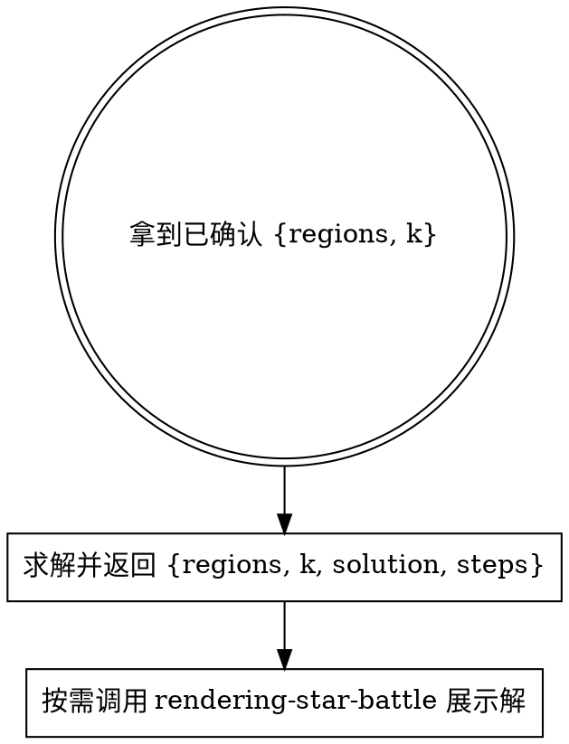

# Solving Star Battle

入口：一份经过 `decoding-star-battle → rendering-star-battle` 且**已被用户确认**的 `{regions, k}` 数据对象。传输方式可由调用方选择，不要求固定文件名或目录。

## 工作流（必须按顺序）



**前置**：本 skill 假定 `regions` 和 `k` **已经由 rendering-star-battle 展示并被用户确认**。

## 步骤详解

### 1. 求解

```bash
pnpm --dir <repo-root> run runtime:check -- star-battle
pnpm --dir <package-root> exec node --import tsx <skill-dir>/references/solve-board.ts path/to/input.json
# 如需持久化，再显式传入调用方选择的输出路径：
pnpm --dir <package-root> exec node --import tsx <skill-dir>/references/solve-board.ts path/to/input.json path/to/output.json
```

`<repo-root>`、`<package-root>` 和 `<skill-dir>` 必须解析为真实绝对路径，不依赖当前工作目录。

`solve-board.ts` 从同目录 `solver/` 加载求解器，按 `k` 路由：
- `k=1` → `solve.ts`（含 hiddenLineGroup）
- `k=2` → `solve-2.ts`（含 regionShapeEnum / forcedChain）
- 其他 → `solve-k.ts`（通用策略）

stdout：求解器名 + 耗时 + 推导步骤列表。
结果 schema：

```json
{
  "regions": [[...]],
  "k": 1,
  "solution": [[...]],
  "steps": ["uniqueRegion: (0,2)", "..."]
}
```

`solve-board` **不修改**输入。未指定输出路径时把结果 JSON 写到 stdout；指定路径时才写文件。skill 契约只约束结果 schema，不约束存储位置。

### 2. 渲染解

需要展示最终解时，调用项目级 `rendering-star-battle` skill，并传入 `{regions, k, solution, steps}` 数据。rendering 读 `regions + k + solution` 即可画带 ★ 的盘。

## 输入格式约定

```json
{
  "regions": [[0, 0, 1], [0, 2, 1], [2, 2, 1]],
  "k": 1
}
```

- `regions`：`n×n` 整数方阵，每个值是区域 id
- `k`：每行/列/区域的星数，**必填**（无默认值）
- 区域数必须等于 `n`（Star Battle 规则：n 区，每区 k 星，共 n×k 颗星）

如果调用方给的 input.json 缺 k 或 k 非正整数，`solve-board.ts` 会以非零退出码报错；这时回去补 k，不要硬填默认值。

## 常见错误

| 错误 | 修正 |
|------|------|
| 直接对未确认的 regions 求解 | regions 错求解就废。让调用方（或 decoding）先做识别确认。 |
| input.json 缺 k 就当 2 | **错误**。无默认值，回 decoding-star-battle 问用户。 |
| 自己跑 render-board 显示解 | **不可**。调用 rendering-star-battle，并传递求解结果数据。 |
| 改 solver 后还去找 src/ 真源 | src/ 已废除。solver 真源就在 `references/solver/`，配套测试在 `references/__tests__/`。 |

## 红旗 — 立即停止

- "input.json 没 k，按 k=2 跑一下试试" → **不可**，回 decoding 问用户
- "用户没确认我先 solve 一下省得来回" → **不可**，那是 decoding 的职责，让它先确认
- "我顺手 import 一下 rendering 的 render-board.ts" → **不可**，跨 skill 必须调用 skill；数据传输方式不作强制
