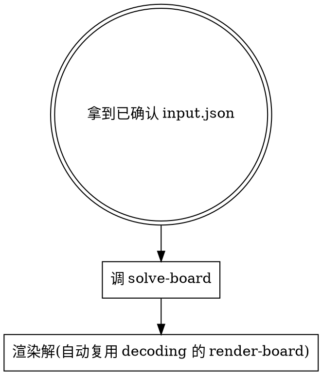

# Solving Star Battle

入口：一份**已被用户确认**的 `{regions, k}` JSON 文件路径（一般是 `/tmp/sb-input.json`，由 [[decoding-star-battle]] 写出并请用户核对过）。

工作流：调求解器输出推导步骤 → 复用 decoding 的 render-board 把解（带 ★）显示给用户。

## 工作流（必须按顺序）



**前置**：本 skill 假定 input.json 的 `regions` 和 `k` **已经被用户看过并确认**。如果调用方是 [[decoding-star-battle]]，那 skill 在交棒前已完成渲染+确认。如果是直接调用本 skill，调用方必须先自己确保 regions 是对的 — 本 skill **不再**做识别确认。

## 步骤详解

### 求解

```bash
node_modules/.bin/tsx skills/solving-star-battle/references/solve-board.ts /tmp/sb-input.json
```

`solve-board.ts` 从同目录 `solver/` 加载求解器，按 `k` 路由：
- `k=1` → `solve.ts`（含 hiddenLineGroup）
- `k=2` → `solve-2.ts`（含 regionShapeEnum / forcedChain）
- 其他 → `solve-k.ts`（通用策略）

输出包含：求解器名 + 耗时 + 推导步骤列表 + 带 ★ 的最终棋盘。

### 渲染解

`solve-board.ts` 会自动调用邻居 skill `decoding-star-battle/references/render-board.ts` 把解渲染出来（粗细线分区 + ★），不需要你额外处理。

## 文件清单

- `references/solve-board.ts` — 调 `references/solver/` 求解，打印步骤；末尾通过相对路径 `../../decoding-star-battle/references/render-board.ts` 复用渲染。
- `references/example-input.json` — 5×5 k=1 示例
- `references/solver/{solve.ts, solve-2.ts, solve-k.ts}` — 求解器副本，**单一来源真值是仓库根 `src/`**，本目录由 `pnpm sync-solver` 同步。

> render-board.ts 在 [[decoding-star-battle]] 的 `references/` 下 — 渲染逻辑在两个 skill 共享（decoding 用它做识别确认，solving 用它显示解）。

## 单一来源 + 同步约定

solver 的真源在仓库根 `src/`（配套 `tests/`）。`references/solver/` 是 plugin 自包含分发副本。修改 solver 时：

```bash
# 1. 改 src/ 下的 .ts 并跑测试
pnpm test
# 2. 同步到 skill 副本
pnpm sync-solver
# 3. 提交两份(src/ + skills/solving-star-battle/references/solver/)
```

CI / pre-commit 用 `pnpm check-solver` 检测 drift（skill 副本与 src 不一致时退出码 1）。

本仓库已配 husky + lint-staged：
- `src/{solve,solve-2,solve-k}.ts` 进入 staged → 自动 `pnpm sync-solver` 并把同步产生的 solver 副本一并 staged
- 任何 commit 都会跑一次 `pnpm check-solver` 兜底，杜绝绕过同步

## 输入格式约定

```json
{
  "regions": [[0, 0, 1], [0, 2, 1], [2, 2, 1]],
  "k": 1
}
```

- `regions`：`n×n` 整数方阵，每个值是区域 id
- `k`：每行/列/区域的星数，**必填**（无默认值）
- 区域数必须等于 `n`（Star Battle 规则：n 区，每区 k 星，共 n×k 颗星）

如果调用方给的 input.json 缺 k 或 k 非正整数，`solve-board.ts` 会以非零退出码报错；这时回去补 k，不要硬填默认值。

## 常见错误

| 错误 | 修正 |
|------|------|
| 直接对未确认的 regions 求解 | regions 错求解就废。让调用方（或 decoding）先做识别确认。 |
| input.json 缺 k 就当 2 | **错误**。无默认值，回 decoding-star-battle 问用户。 |
| 用户在仓库外的 cwd 运行，脚本找不到 solver/render-board | plugin 必须自带 `references/solver/` 与邻居 `decoding-star-battle/references/render-board.ts`；若缺失，从仓库 dev 时跑 `pnpm sync-solver`。 |
| 改了 src/ 但没 sync，plugin 用户拿到旧逻辑 | 修改 src/ 后跑 `pnpm sync-solver` 再提交；CI 用 `pnpm check-solver` 守门。 |

## 红旗 — 立即停止

- "input.json 没 k，按 k=2 跑一下试试" → **不可**，回 decoding 问用户
- "用户没确认我先 solve 一下省得来回" → **不可**，那是 decoding 的职责，让它先确认
