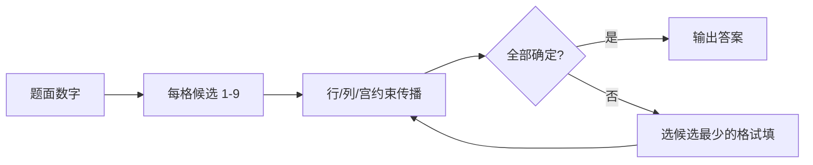

# Sudoku 策略说明

本页面向一般解谜玩家，说明标准数独的目标、本 solver 实际使用的策略，以及人类常见但当前 solver 没有显式实现的技巧。

## 1. 问题定义

标准数独是在 `9 x 9` 棋盘中填入 `1-9`。每一行、每一列、每一个 `3 x 3` 宫都必须刚好包含 `1-9` 各一次。题面中的数字是已知数，空格需要补全。

## 2. Solver 使用的策略

### 候选消除

当某格确定为数字 `d` 后，同一行、同一列、同一宫的其他格都不能再填 `d`。solver 用 `assign` 和 `eliminate` 反复传播这个约束。

### 裸单数

如果一个格子的候选只剩一个数字，这个格就必须填它。这个动作也会继续触发行、列、宫里的候选消除。

### 隐藏单数

如果某个数字在一行、一列或一宫中只剩一个可放位置，即使那个格子还有其他候选，也必须填这个数字。

### 最小候选搜索

当上面的逻辑推不动时，solver 使用 `search`：选择候选数最少的未解格，逐个候选试填；如果后续产生冲突，就回退尝试下一个候选。

## 3. 人类常用但当前未显式实现的策略

- 候选对 / 三数组：例如 naked pair、hidden pair、naked triple。
- 指向数 / 宫线交互：某宫内某数字的候选都在同一行或列时，排除该行或列其他宫里的同数字候选。
- X-Wing / Swordfish 等鱼形：利用多行多列中的候选排列做跨线排除。
- 唯一矩形、BUG、XY-Wing、XYZ-Wing：依赖较复杂候选图形的技巧。
- 链与染色：通过强弱链、颜色分组或矛盾链排除候选。

这些技巧没有作为单独步骤出现；solver 主要靠基础约束传播加回溯搜索保证能找到答案。
