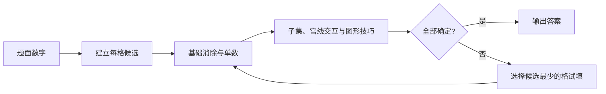
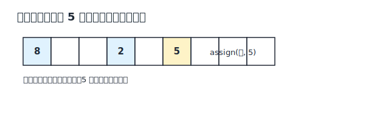

# Sudoku 策略说明

## 1. 问题定义

标准数独是在 `9 × 9` 棋盘中填入 `1–9`。每一行、每一列、每一个 `3 × 3` 宫都必须刚好包含 `1–9` 各一次。题面数字称为已知数；解题时通常给空格记录候选数，并不断证明某些候选不可能或必须成立。

下文用 `r4c7` 表示第 4 行第 7 列。行、列、宫统称为单元（unit）；与某格处在同一单元的其他格称为同伴格（peer）。



## 2. 策略详解

### 2.1 候选消除与约束传播（Candidate Elimination and Constraint Propagation）

Solver 对应函数为 `assign` 与 `eliminate`。

候选数是一个格在当前局面下仍可能填写的数字。若 `r4c7 = 6` 已经确定，那么第 4 行、第 7 列以及 `r4c7` 所在宫的其他格都不能再含候选 `6`。一次删除又可能让别的格只剩一个候选，或让某个数字在一个单元中只剩一个位置，因此消除不是孤立动作，而会形成连续传播。

可以把每格想成一个尚未缩到单值的集合。例如：

```text
r4c7 = {6}
r4c2 = {2,6,9}  →  {2,9}
r6c8 = {1,6}    →  {1}
```

第二次删除使 `r6c8` 成为确定值 `1`，随后还要从它的同伴格删除 `1`。严格传播同时检查两种矛盾：某格候选被删空，或某个数字在一个单元中无处可放。遇到任一种情况，当前推理分支都不可能成立。

这种实现方式可继续参看 [Peter Norvig 的约束传播与搜索说明](https://norvig.com/sudoku.html)。

### 2.2 裸单数（Naked Single）

Solver 没有独立的裸单数函数；这一推理由 `eliminate` 在候选缩减到一个时完成。

如果一个格只剩一个候选，它的答案已经“裸露”出来。例如 `r2c5 = {7}`，那么该格只能是 `7`。裸单数只观察一个格，不需要比较数字在整个单元中的分布。

实战中，裸单数往往是其他策略的落点：一次宫线排除、一组候选对或一条链先删掉某个候选，最后才把一个双候选格压缩成单值。填入后应立即扫描它的行、列、宫，因为新值经常触发下一批裸单数。

### 2.3 隐藏单数（Hidden Single）

Solver 没有独立的隐藏单数函数；`eliminate` 会检查数字在每个单元中的剩余位置，并通过 `assign` 赋值。

隐藏单数观察的是“一个数字能去哪里”。假设第 5 宫中只有 `r4c6` 仍含候选 `8`：

```text
第 5 宫中候选 8 的位置：r4c6
r4c6 自身候选：{2,5,8}
```

即使该格还有三个候选，`8` 在这个宫里也已无处可去，所以必须令 `r4c6 = 8`。它之所以叫“隐藏”，是因为答案藏在多个候选之中。行隐藏单数、列隐藏单数和宫隐藏单数原理完全相同。



### 2.4 裸对子（Naked Pair）

在同一单元中，如果两个格的候选并集恰好只有两个数字，那么这两个数字必须由这两个格占据，单元中其他格便不能再使用它们。例如：

```text
r3c2 = {2,7}
r3c8 = {2,7}
```

无论两个格最终怎样交换 `2` 和 `7`，第 3 行的其他格都不可能是 `2` 或 `7`。识别时不要求两个格的候选书写顺序相同，但两格候选都必须是这两个数字的子集，而且尚未成为单数。

结论只能作用于两格所在的共同单元。如果两格同时属于一行和一宫，就能分别在这两个单元中排除；若只共享一行，则不能影响其他宫。

### 2.5 裸三数组（Naked Triple）

裸三数组把计数推广为：同一单元中的三个格，其候选并集恰好只有三个数字。例如 `{1,4}`、`{1,6}`、`{4,6}` 共同锁定 `{1,4,6}`，所以单元中其他格可以删除 `1、4、6`。

三个格不必各自都有三个候选，也不必出现三个完全相同的集合；关键是所有候选都来自同一组三个数字。若其中一格还含第四个数字，就不能构成裸三数组。四格锁定四个数字称为裸四数组（Naked Quadruple），原理相同，但人工扫描成本更高。

### 2.6 隐藏对子（Hidden Pair）

隐藏子集把裸子集的视角反过来：若某两个数字在一个单元中只可能出现在同两个格，那么这两个格中的其他候选都可以删除。例如数字 `3` 与 `9` 在第 8 列都只出现在 `r2c8`、`r7c8`，即使两格原本分别是 `{1,3,6,9}` 和 `{2,3,8,9}`，也可以缩成 `{3,9}`。

隐藏对子与裸对子都锁定两个格和两个数字，但观察入口相反：裸对子先看格，隐藏对子先看数字在单元中的位置。一个单元中的隐藏对子，通常对应剩余格中的某个裸子集；实际解题时选择更容易看见的一面即可。

### 2.7 隐藏三数组（Hidden Triple）

若三个数字在一个单元中的所有候选位置只覆盖三个格，这三格便构成隐藏三数组，可以删除其中不属于这三个数字的其他候选。例如数字 `2、5、8` 在某宫中只出现在候选 `{1,2,5}`、`{2,6,8}`、`{3,5,8}` 的三格内，三格可分别缩成 `{2,5}`、`{2,8}`、`{5,8}`。

检查时要确认这三个数字在单元外没有第四个候选位置；只看到三个格都含相关数字还不够。更大的隐藏四数组（Hidden Quadruple）也成立，但候选标记密集、收益通常较低。子集的更多图例见 [HoDoKu 的 Hidden/Naked Subsets 目录](https://hodoku.sourceforge.net/en/techniques.php)。

### 2.8 指向数与区块排除（Pointing Pair/Triple）

如果某个数字在一个宫内的所有候选都落在同一行，那么该行在这个宫外的其他格不能再放这个数字。因为无论宫内候选最终落在哪一格，这一行都必定已经使用该数字。

例如第 1 宫的候选 `5` 只在 `r2c1`、`r2c3`，两格都位于第 2 行。于是可以删除第 2 行其余六格中的候选 `5`。候选落在两个格时常称指向对子，落在三个格时称指向三数组；证明只依赖“全部在同一条线”，并不要求候选数恰好是二或三。

### 2.9 宫线删减（Claiming Pair/Triple）

宫线删减是指向数的反向形式。如果某个数字在一行中的所有候选都位于同一个宫，那么这个宫内该行以外的格不能再放该数字。

例如第 6 行的候选 `4` 只出现在 `r6c4`、`r6c6`，而两格都属于第 5 宫。第 5 宫的 `4` 必定由第 6 行承担，因此可从 `r4c4`、`r4c5`、`r5c4` 等宫内非第 6 行格删除 `4`。列与宫之间也完全对称。

指向数和宫线删减合称锁定候选（Locked Candidates）或宫线交互（Box/Line Reduction）。两者都在“一个宫”和“一条行或列”的交集上搬运排他信息。

### 2.10 X-Wing

选择一个数字，例如 `7`。如果它在两行中都只可能位于相同的两列，那么四个候选形成一个矩形的四角；这两行各自必须在那两列之一放置 `7`，所以那两列中的其他行不能再放 `7`。

```text
        c2   c8
r3      7?   7?
r6      7?   7?
```

不必知道 `r3c2` 与 `r3c8` 哪一个为真：若第 3 行取 c2，第 6 行就只能取 c8；反之亦然。两种情况都会让 c2、c8 各占一个 `7`。也可以从“两列限定到相同两行”开始，结论完全对称。

X-Wing 只对同一个数字工作，并要求作为基底的两行（或两列）各自恰有两个相关候选。矩形外观相似但条件不完整时不能排除。

鱼形的统一术语和更多图例见 [HoDoKu 的 Fish 技巧目录](https://hodoku.sourceforge.net/en/techniques.php)。

### 2.11 Swordfish

Swordfish 是三阶鱼形。若某数字在三行中的候选总共只落在三列，那么这三行必定在这三列中各放一个该数字；因此三列的其他行可以删除该候选。

与 X-Wing 不同，每一行不必都正好出现三个候选，也可以只占其中两列。例如三行的位置集合分别为 `{c1,c4}`、`{c4,c9}`、`{c1,c9}`，并集仍是三列，计数已经闭合。识别时应先固定一个数字，再寻找“n 条基底线的候选只覆盖 n 条交叉线”的结构。

四阶版本称 Jellyfish。带有额外候选、但通过“鳍”仍能局部排除的版本称 Finned/Sashimi Fish；更高阶或变形鱼的逻辑相同，但图形更难人工确认。

### 2.12 唯一矩形（Unique Rectangle）

唯一矩形利用标准数独题通常承诺唯一解这一元条件。若两行、两列交叉的四格恰跨两个宫，并且四格最终都可能只在同一对数字间交换，就会产生两组可互换的答案，破坏唯一性。因此必须阻止这个“致命模式”完整形成。

最简单的 Type 1 中，三角已经都是 `{a,b}`，第四角是 `{a,b,c}`。若第四角也只剩 `{a,b}`，四角便可整体交换 `a`、`b`；因此第四角必须取额外候选，至少可以删除 `a`、`b`。

这项技巧的前提非常重要：题目必须保证唯一解，而且四格的宫分布必须满足矩形条件。若题目允许多解，唯一矩形的排除就不再是纯粹由行列宫规则推出的结论。

唯一矩形的不同类型可参看 [HoDoKu 的 Uniqueness Techniques](https://hodoku.sourceforge.net/en/tech_ur.php)。

### 2.13 BUG 与 BUG+1（Binary Universal Grave）

BUG 是唯一性推理的全盘版本：所有未解格都恰有两个候选，并且每个候选数字在它涉及的每个行、列、宫中都出现恰好两次。这种结构通常形成可整体翻转的两套完成方式，因此一个唯一解题不能停在纯 BUG 状态。

常见可用形态是 BUG+1：只有一个格有三个候选，其余格都符合 BUG。观察这个三候选格中的哪个数字在相关单元中出现了“三次而非两次”，该数字必须落在这个格里，否则剩余局面会退化成双解 BUG。

BUG 检查涉及全盘计数，容易漏掉某个三候选格或某个候选的第三次出现。它适合候选已经非常稀疏的残局，不适合在中盘凭外观猜测。

### 2.14 XY-Wing

XY-Wing 由三个双候选格组成：枢轴格为 `{x,y}`，两个翼格分别为 `{x,z}` 与 `{y,z}`；枢轴能看见两个翼，但两翼不必互相看见。

若枢轴取 `x`，`{x,z}` 翼不能取 `x`，所以它取 `z`；若枢轴取 `y`，另一个翼同理取 `z`。无论枢轴选哪一个值，两个翼至少有一个是 `z`，因此任何同时看见两个翼的格都不能含候选 `z`。

微型结构可写成：

```text
枢轴 P = {2,5}
翼 A   = {2,8}
翼 B   = {5,8}
结论：同时看见 A、B 的格删除 8
```

关键不是三个格组成某种固定几何形状，而是可见关系和候选连接满足条件。

### 2.15 XYZ-Wing

XYZ-Wing 与 XY-Wing 相似，但枢轴是三候选 `{x,y,z}`，两翼为 `{x,z}`、`{y,z}`，且三个格必须共享一个能看见它们的单元交集。

如果枢轴取 `z`，交集中的其他格显然不能取 `z`；如果枢轴取 `x` 或 `y`，对应翼会被迫取 `z`。所以同时看见枢轴和两个翼的格都可以删除 `z`。与 XY-Wing 相比，排除范围通常更小，因为目标格必须同时看见三个关键格。

### 2.16 强链与弱链（Strong and Weak Links）

对固定数字而言，如果一个单元中只剩两个候选位置，那么两者“至少一个为真”，构成强链；如果两个候选互为同伴，它们“至多一个为真”，构成弱链。把强弱关系交替连接，就能比较链首与链尾。

强链并不表示两端不能同时为真；弱链也不表示其中一定有一个为真。只有交替使用“至少一个”和“至多一个”，才可以沿链传递真假状态。XY-Wing 也可以视为一条短的强弱连接结构。

### 2.17 矛盾链（Forcing Chain）

矛盾链从一个候选的假设出发，沿确定的强弱关系传播。一种常见结论是：若链首为假会推出候选为空、同伴格同值或某数字在单元中无处可放，那么链首必须为真；若链首无论真假都能推出某个共同候选为真或为假，也可以保留这个共同结论。

人工使用时应把每次跳转的理由写清楚：是“该单元只剩两个位置”，还是“两个候选互斥”。只凭图形连线而不核对强弱关系，最容易产生错误排除。更系统的扩展包括 X-Chain、XY-Chain、交替推理链（AIC）、强制网（Forcing Net）和 Kraken Fish。

### 2.18 简单染色（Simple Coloring）

简单染色通常只追踪一个数字。把强链两端交替涂成两种颜色；同色候选代表同一真假阵营。若两个同色候选互相看见，该颜色不可能为真，另一颜色全部为真，这叫颜色冲突（Color Wrap）。

另一种结论是颜色陷阱（Color Trap）：某个未染色候选同时看见两种颜色。因为两种颜色必有一种为真，这个未染色候选无论如何都会冲突，所以可以删除。

多重染色（Multi-Coloring）、3D Medusa 等把同样思想扩展到多个链或多个数字；名称可以作为延伸阅读线索，但使用前需要更严格的连接规则。

### 2.19 最小剩余值搜索（Minimum Remaining Values Search）

Solver 对应函数为 `search`。

当约束传播停止而棋盘仍未完成时，Solver 选择候选数最少的未解格，逐个假设候选并递归传播。若某一假设使格子无候选，或让某个数字在单元中无位置，就回退到分叉点尝试下一个候选。这是深度优先回溯搜索；“优先选候选最少的格”称为最小剩余值（MRV）启发式。

搜索与人类的短矛盾试探共享逻辑基础，但目标不同：人类通常希望找到一条短、可解释的必然链；通用 Solver 可以系统探索更深的分支来保证找到答案。搜索得到一个完成盘并不自动证明题目唯一，若要验证唯一性还须继续寻找第二个解。

## 3. 延伸变体

以下技巧与上面的子集、鱼形、翼或链共享基本原理，较少作为入门必备项：锁定三数组（Locked Triple）、Skyscraper、2-String Kite、Empty Rectangle、W-Wing、Remote Pair、Jellyfish、Finned/Sashimi Fish、Franken/Mutant Fish、ALS-XZ、Sue de Coq、Death Blossom、3D Medusa、Grouped AIC、Forcing Net、Kraken Fish。可从 [HoDoKu 的技巧目录](https://hodoku.sourceforge.net/en/techniques.php) 按名称继续查阅。

## 4. 参考资料

- [Peter Norvig：Solving Every Sudoku Puzzle](https://norvig.com/sudoku.html)——候选传播、隐藏单数与 MRV 搜索。
- [HoDoKu：Human Style Solving Techniques](https://hodoku.sourceforge.net/en/techniques.php)——子集、锁定候选、鱼形、翼、链与染色的系统索引。
- [HoDoKu：Uniqueness Techniques](https://hodoku.sourceforge.net/en/tech_ur.php)——唯一矩形、BUG 与相关变体。
