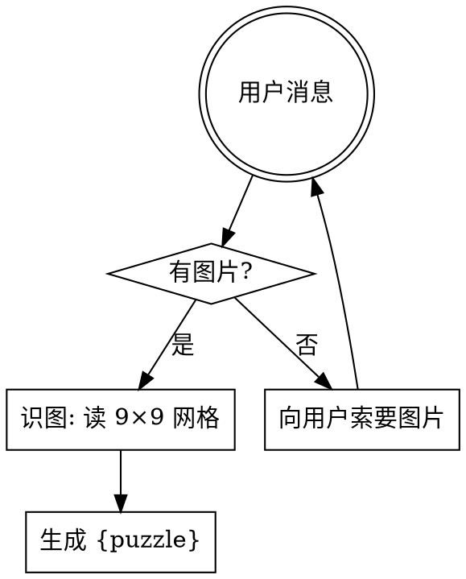

# Decoding Sudoku（解码数独）

把用户给的数独谜题图片转成 `{puzzle}` JSON。确认、求解和最终展示由 `solve-sudoku` 编排；本 skill 只负责解码。

## 工作流



## 步骤

1. 用户消息中如果没有图片附件，直接向用户索要图片并等待回复。不要假设、不要造测试盘。
2. 用视觉能力直接读图，识别 9×9 网格的 81 格。
3. 每格只允许三类：空白、已知数字 `1-9`、无法识别。
4. 逐行逐列读取（行优先：A1, A2, ..., A9, B1, ...）。
5. 看不清的格子按空格处理，输出 `0`；不要猜。
6. 输出 `{ "puzzle": number[][] }`。数据可通过内存、stdin 或调用方选择的文件传递；不要要求固定文件名或 `/tmp` 路径。

## 输出契约

```json
{
  "puzzle": [
    [5, 3, 0, 0, 7, 0, 0, 0, 0],
    [6, 0, 0, 1, 9, 5, 0, 0, 0],
    [0, 9, 8, 0, 0, 0, 0, 6, 0]
  ]
}
```

- `puzzle`：9×9 二维数字数组（`number[][]`）。
- `0`：空格。
- `1-9`：已知数。

## 常见错误

| 错误 | 修正 |
|------|------|
| 还没看到图就开始造盘 | 停。先索要图片。 |
| 看不清的格子瞎猜 | 输出 `0`。 |
| 解码后继续求解 | 停。本 skill 只输出 `{puzzle}`；完整链路归 `solve-sudoku`。 |
| 用 solver 反推识别结果 | 不可。解码只看图片。 |

## 红旗

- “图片肯定是 9×9 标准盘” → 不要假设，实际看图。
- “用户没给图我就用一个示例盘” → 索要图片，不要替代。
- “这一格看不太清就猜 5 吧” → 不可，输出 `0`。
- “顺手 solve 一下” → 不可。本 skill 只解码。
