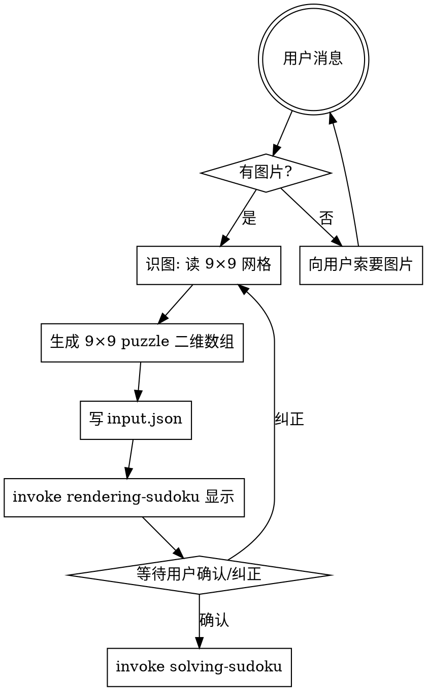

# Decoding Sudoku

把用户给的数独谜题图片转成 81 字符字符串的 JSON，**渲染给用户确认**后交棒给 [[solving-sudoku]] 求解。求解本身不属于本 skill。

## 工作流（必须按顺序）



## 步骤详解

### 1. 接收图片

用户消息中如果**没有图片附件**（消息里看不到 image content block），立即用 AskUserQuestion 索要。不要假设、不要造测试盘。

### 2. 识图

用视觉能力直接读图：
- 识别 9×9 网格的 81 格
- 每格：空白、已知数字（1-9），或无法识别
- 逐行逐列读取（行优先：A1, A2, ..., A9, B1, ...）

如果某些格难以识别（光线、模糊、角度），在 puzzle 字符串中用 `.` 标记为"待定/空格"，**不要猜**。

### 3. 生成 9×9 puzzle 二维数组

把识图结果按行输出为 `number[][]`，行优先：
- 已知数字 = 数字本身（1-9）
- 空格 = `0`

例：第一行 `5 3 0 0 7 0 0 0 0` 第二行 `6 0 0 1 9 5 0 0 0` ... 拼成 9×9 数组。

### 4. 写 input.json

```bash
cat > /tmp/sudoku-input.json <<'JSON'
{
  "puzzle": [
    [5, 3, 0, 0, 7, 0, 0, 0, 0],
    [6, 0, 0, 1, 9, 5, 0, 0, 0],
    [0, 9, 8, 0, 0, 0, 0, 6, 0],
    [8, 0, 0, 0, 6, 0, 0, 0, 3],
    [4, 0, 0, 8, 0, 3, 0, 0, 1],
    [7, 0, 0, 0, 2, 0, 0, 0, 6],
    [0, 6, 0, 0, 0, 0, 2, 8, 0],
    [0, 0, 0, 4, 1, 9, 0, 0, 5],
    [0, 0, 0, 0, 8, 0, 0, 7, 9]
  ]
}
JSON
```

### 5. 渲染并请求确认

render 由 [[rendering-sudoku]] skill 负责。input.json 中无 solution，rendering 会显示"无解/No solution" — 这是预期（用户用来确认 9×9 识别是否正确，不是看解）。

打印后**主动询问用户**："识别如上 9×9 盘面，是否正确？如有错误请指出哪些格的数字错了（例如'行 3 列 4 应为 5 而非 6'）。"等待确认/纠正。

如果用户指出错误，**回到第 2 步**重识，不要自己脑补修。

### 6. 交棒给 solving-sudoku

用户确认后，**必须 invoke** [[solving-sudoku]] 求解，不要自己跑 `solve-board.ts` 或心算给答案。

## 输入格式约定

```json
{
  "puzzle": [
    [5, 3, 0, 0, 7, 0, 0, 0, 0],
    [6, 0, 0, 1, 9, 5, 0, 0, 0],
    [0, 9, 8, 0, 0, 0, 0, 6, 0]
  ]
}
```

- `puzzle`：9×9 二维数字数组（`number[][]`）
- `0` = 空格
- `1-9` = 已知数

## 常见错误

| 错误 | 修正 |
|------|------|
| 还没看到图就开始造盘 | 停。先索要图片。 |
| 看不清的格子瞎猜 | 标 `.` 当空格。 |
| 渲染看着差不多就 invoke solving | **必须**等用户回话确认。 |
| 用户指错就自己脑补改 puzzle 重 render | **不可**，回第 2 步重识。 |
| 自己跑 solve-board.ts | 求解归 solving-sudoku，invoke 它。 |

## 红旗 — 立即停止

- "图片肯定是 9×9 标准盘" → 不要假设，实际看图
- "用户没给图我就用一个示例盘" → 索要图片，不要替代
- "这一格看不太清就猜 5 吧" → 不可，标 `.`
- "render 出来差不多直接 invoke solving" → **必须**等用户确认
