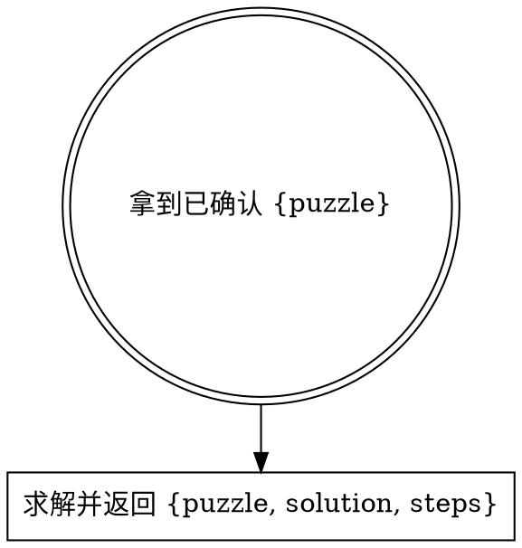

# Resolve Sudoku（解析数独结果）

入口：一份调用方保证已确认的 `{puzzle}` 数据对象。传输方式可由调用方选择，不要求固定文件名或目录。

## 工作流



**前置**：本 skill 假定调用方已经确认 `puzzle` 正确。

## 解析

```bash
pnpm --dir <repo-root> run runtime:check -- sudoku
pnpm --dir <package-root> exec node --import tsx <skill-dir>/references/solve-board.ts path/to/input.json
# 如需持久化，再显式传入调用方选择的输出路径：
pnpm --dir <package-root> exec node --import tsx <skill-dir>/references/solve-board.ts path/to/input.json path/to/output.json
```

`<repo-root>`、`<package-root>` 和 `<skill-dir>` 必须解析为真实绝对路径，不依赖当前工作目录。

`solve-board.ts` 调 `solver.ts` 中的 `solve()`：

- 解析 9×9 数字数组为候选数 Grid（Map<Cell, string>）。
- 约束传播：assign + eliminate + 两个传播启发式。
- 回溯搜索：候选最少格子分支。

输出 schema：

```json
{
  "puzzle": [[5, 3, 0, 0, 7, 0, 0, 0, 0]],
  "solution": [[5, 3, 4, 6, 7, 8, 9, 1, 2]],
  "steps": [
    { "type": "assign", "cell": "A1", "digit": "5", "detail": "A1 = 5" },
    { "type": "search", "cell": "C3", "digit": "4", "detail": "try C3 = 4" }
  ]
}
```

`puzzle` 字段与 `solution` 字段同型 `number[][]`。`solve-board` 不修改输入。未指定输出路径时把结果 JSON 写到 stdout；指定路径时才写文件。

## 输入契约

```json
{
  "puzzle": [
    [5, 3, 0, 0, 7, 0, 0, 0, 0],
    [6, 0, 0, 1, 9, 5, 0, 0, 0],
    [0, 9, 8, 0, 0, 0, 0, 6, 0],
    [8, 0, 0, 0, 6, 0, 0, 0, 3],
    [4, 0, 0, 8, 0, 3, 0, 0, 1],
    [7, 0, 0, 0, 2, 0, 0, 0, 6],
    [0, 6, 0, 0, 0, 0, 2, 8, 0],
    [0, 0, 0, 4, 1, 9, 0, 0, 5],
    [0, 0, 0, 0, 8, 0, 0, 7, 9]
  ]
}
```

- `puzzle`：9×9 二维数字数组，`number[][]`。
- `0` 表示空格，`1-9` 表示已知数。
- 行优先（`puzzle[0]` 是第 1 行）。

如果 `puzzle` 不是 9×9 数组或含越界值，`solve-board.ts` 会以非零退出码报错；调用方应重新确认输入数据。

## 常见错误

| 错误 | 修正 |
|------|------|
| 直接对未确认的 puzzle 求解 | puzzle 错求解就废。调用方必须先确认。 |
| 自己脑补修复 puzzle 字段 | 不可。返回错误，让调用方修正输入。 |
| 产出结果后继续渲染 | 不可。本 skill 只输出结构化结果，展示由 `solve-sudoku` 或调用方负责。 |

## 红旗

- “用户没确认我先 solve 一下省得来回” → 不可，调用方必须先确认。
- “我顺手 render 一下” → 不可，本 skill 只产出结构化结果。
