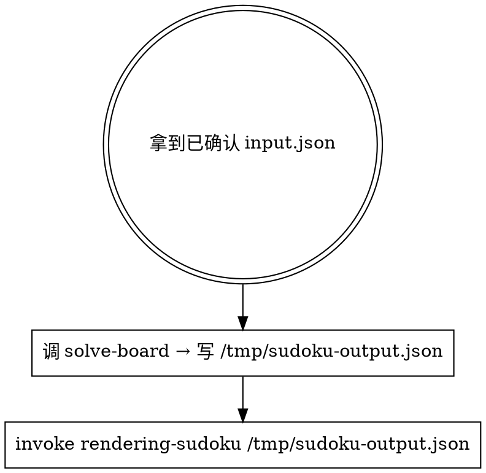

# Solving Sudoku

入口：一份**已被用户确认**的 `{puzzle}` JSON 文件路径（一般是 `/tmp/sudoku-input.json`，由 [[decoding-sudoku]] 写出并请用户核对过）。

## 工作流（必须按顺序）



**前置**：本 skill 假定 input.json 的 `puzzle` 字段**已经被用户看过并确认**。

## 步骤详解

### 1. 求解

```bash
# 在 puzzle-solver monorepo 中（dev）：
node --experimental-strip-types packages/sudoku/skills/solving-sudoku/references/solve-board.ts \
    /tmp/sudoku-input.json /tmp/sudoku-output.json

# 在已安装 plugin 中：
node --experimental-strip-types skills/solving-sudoku/references/solve-board.ts \
    /tmp/sudoku-input.json /tmp/sudoku-output.json
```

`solve-board.ts` 调 `solver.ts` 中的 `solve()`：
- 解析 81 字符字符串为候选数 Grid（Map<Cell, string>）
- 约束传播：assign + eliminate + 两个传播启发式
- 回溯搜索：候选最少格子分支

输出 schema：

```json
{
  "puzzle": "53..7....6..195....98....6.8...6...34..8.3..1..7...2...6.6....28....419..5....8..79",
  "solution": [[5,3,4,6,7,8,9,1,2], ...],
  "steps": [
    { "type": "assign", "cell": "A1", "digit": "5", "detail": "A1 = 5" },
    { "type": "search", "cell": "C3", "digit": "4", "detail": "try C3 = 4 (depth 3)" }
  ]
}
```

solve-board **不修改** input.json，结果一律写到 output.json（默认路径 `/tmp/sudoku-output.json`）。

### 2. 渲染解

不要直跑 render-board，**invoke** [[rendering-sudoku]]，把 output.json 路径传过去。

## 输入格式约定

```json
{ "puzzle": "53..7....6..195....98....6.8...6...34..8.3..1..7...2...6.6....28....419..5....8..79" }
```

- `puzzle`：81 字符字符串，`.` 或 `0` 表示空格，`1-9` 表示已知数
- 行优先，从左到右、从上到下
- 9×9 方阵

如果 puzzle 长度 ≠ 81 或含非法字符，`solve-board.ts` 会以非零退出码报错；这时回去让 decoding 重新生成 input.json。

## 常见错误

| 错误 | 修正 |
|------|------|
| 直接对未确认的 puzzle 求解 | puzzle 错求解就废。让调用方（或 decoding）先做识别确认。 |
| 自己脑补修复 puzzle 字段 | **不可**。回 decoding 重新生成。 |
| 自己跑 render-board 显示解 | **不可**。invoke rendering-sudoku，把 output.json 路径传给它。 |

## 红旗 — 立即停止

- "用户没确认我先 solve 一下省得来回" → **不可**，那是 decoding 的职责，让它先确认
- "我顺手 import 一下 rendering 的 render-board.ts" → **不可**，跨 skill 必须 invoke + 文件交换
