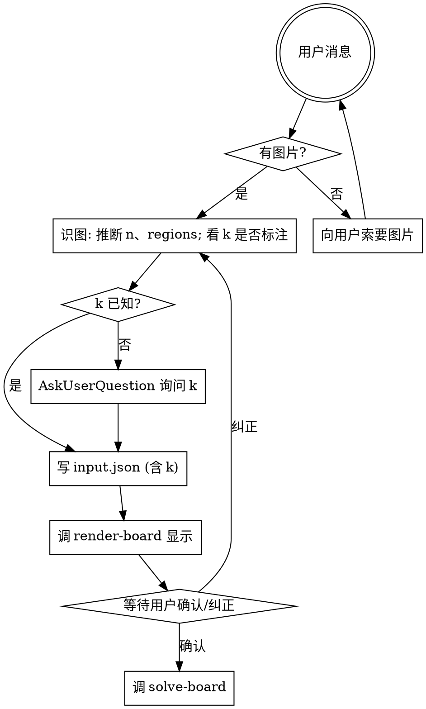

# Star Battle Solver

把用户给的 Star Battle 谜题图片转成 `regions` 二维数组,用 ANSI 彩色 + Unicode 粗细线在终端可视化,经用户确认后调用本仓库的 solver 输出步骤与解。

## 工作流(必须按顺序)



## 步骤详解

### 1. 接收图片

用户消息中如果**没有图片附件**(消息里看不到 image content block),立即用 AskUserQuestion 索要。不要假设、不要造测试盘。

### 2. 识图

用视觉能力直接读图:
- **n**: 数行/列(方阵)
- **regions**: 给每个单元格分配区域 id(从 0 开始的整数)。区域分割看**粗线**或**底色**:
  - 粗线版:同色边线分割同区,粗线分割不同区
  - 颜色版:同色 = 同区
  - 复杂图也可能两者并用
- **k**: 题目通常会写"X stars per row, column and region"(中文"每行/列/区 X 颗星")。**不再有默认值** — 图中没标且未确认时,必须用 AskUserQuestion 询问用户。

**辅助工具：CV 特征提取**

如果颜色边界模糊（橙 vs 桃、淡蓝 vs 青），或区域用粗线/图案分割不易直读，先用 `references/extract-cells.ts` 拿到每格的结构化特征，再据此决策 regions：

```bash
node --import tsx skills/star-battle-solver/references/extract-cells.ts \
    "$IMG" --rect x,y,w,h --n N \
    > /tmp/sb-features.json
```

- `--rect`：棋盘在原图的像素矩形（x,y 是左上角，w,h 是宽高），由你看图估计
- `--n`：棋盘边长

输出每格三类特征：
- `color.meanRGB / medianRGB`：判断同色簇用
- `edges.{top,right,bottom,left} ∈ [0,1] 或 null`：判断粗线分割用（外框为 null）
- `pattern`：dHash 16 hex，判断同色不同图案用

脚本**只出特征，不出 regions**。你看完特征再决定每格归哪个区域，再走第 3 步渲染让用户确认。

输出一个二维整数数组 `regions[i][j]`(行优先)。

### 3. 写 input.json,渲染并请求确认

```bash
cat > /tmp/sb-input.json <<'JSON'
{ "regions": [[...], ...], "k": 2 }
JSON
node_modules/.bin/tsx skills/star-battle-solver/references/render-board.ts /tmp/sb-input.json
```

打印彩色棋盘后,**主动询问用户**:"识别如上,是否正确?如有错误请指出哪些格子的区域归属错了。"等待确认/纠正。**不要在用户确认前求解** — 错误的 regions 只会浪费时间。

### 4. 求解

```bash
node_modules/.bin/tsx skills/star-battle-solver/references/solve-board.ts /tmp/sb-input.json
```

`solve-board.ts` 从同目录 `solver/` 加载求解器,按 `k` 路由:
- `k=1` → `solve.ts`(含 hiddenLineGroup)
- `k=2` → `solve-2.ts`(含 regionShapeEnum / forcedChain)
- 其他 → `solve-k.ts`(通用策略)

输出包含:推导步骤列表 + 带 ★ 的最终棋盘。

## 文件清单

- `references/render-board.ts` — 把 `{regions, k, solution?}` 渲染为终端彩色盒线图。调色板按黄金角(137.5°)从 ANSI 256 高饱和色环采样,相邻索引色相距离最大化。
- `references/solve-board.ts` — 调 `references/solver/` 求解,打印步骤 + 调 render-board 显示解
- `references/example-input.json` — 5×5 k=1 示例
- `references/solver/{solve.ts, solve-2.ts, solve-k.ts}` — 求解器副本,**单一来源真值是仓库根 `src/`**,本目录由 `pnpm sync-solver` 同步。

## 单一来源 + 同步约定

solver 的真源在仓库根 `src/`(配套 `tests/`)。`references/solver/` 是 plugin 自包含分发副本。修改 solver 时:

```bash
# 1. 改 src/ 下的 .ts 并跑测试
pnpm test
# 2. 同步到 skill 副本
pnpm sync-solver
# 3. 提交两份(src/ + skills/star-battle-solver/references/solver/)
```

CI / pre-commit 用 `pnpm check-solver` 检测 drift(skill 副本与 src 不一致时退出码 1)。

本仓库已配 husky + lint-staged:
- `src/{solve,solve-2,solve-k}.ts` 进入 staged → 自动 `pnpm sync-solver` 并把同步产生的 solver 副本一并 staged
- 任何 commit 都会跑一次 `pnpm check-solver` 兜底,杜绝绕过同步

## 输入格式约定

```json
{
  "regions": [[0, 0, 1], [0, 2, 1], [2, 2, 1]],
  "k": 1
}
```

- `regions`: `n×n` 整数方阵,每个值是区域 id(可任意整数,会按出现顺序分配颜色)
- `k`: 每行/列/区域的星数,**必填**(无默认值)
- 区域数必须等于 `n`(Star Battle 规则:n 区,每区 k 星,共 n×k 颗星)

## 常见错误

| 错误 | 修正 |
|------|------|
| 还没看到图就开始造盘 | 停。先索要图片。 |
| 跳过用户确认直接求解 | 停。先 render → 等用户回话。 |
| 图里没写 k 就默认 2 | **错误**。无默认值,必须 AskUserQuestion 询问。 |
| 把粗细线读反了(同区分割) | 粗线 = 区域**边界**,细线 = 区域内格分割。 |
| 区域数 ≠ n | Star Battle 规则:区域数必须等于 n。复查识图。 |
| 用户在仓库外的 cwd 运行,脚本找不到 solver | plugin 必须自带 `references/solver/`;若缺失,从仓库 dev 时跑 `pnpm sync-solver`。 |
| 改了 src/ 但没 sync,plugin 用户拿到旧逻辑 | 修改 src/ 后跑 `pnpm sync-solver` 再提交;CI 用 `pnpm check-solver` 守门。 |

## 红旗 — 立即停止

- "图片肯定是 10×10 k=2 标准盘" → 不要假设,实际看图
- "用户没给图我就用一个示例盘" → 索要图片,不要替代
- "render 看着差不多就直接 solve" → 必须等用户确认
- "k 没写默认 2 吧" → **不可**,问用户
